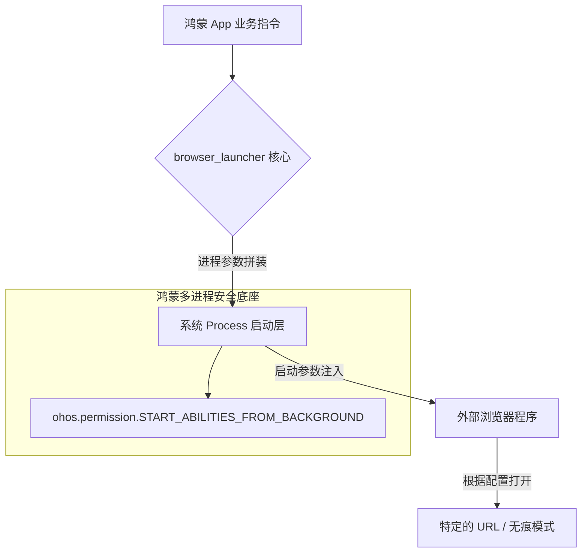

欢迎加入开源鸿蒙跨平台社区：[https://openharmonycrossplatform.csdn.net](https://openharmonycrossplatform.csdn.net)。

# Flutter for OpenHarmony：browser_launcher — 驱动网页之窗（跨进程连接底座）

## 前言

在华为鸿蒙（OpenHarmony）生态的进阶开发中，应用不仅要在自身的 WebComponent 中运行网页，有时更需要具备主动拉起、甚至细粒度控制外部系统浏览器的能力。无论是开发支持“开发者调试模式”的 IDE 工具、自动化的网页测试框架，还是需要特定浏览器权限支撑的复杂认证流程。

`browser_launcher` 是一款极其硬核的工具库。它不仅能拉起鸿蒙设备上的默认浏览器，还能通过指定可执行路径或特定的启动参数（Arguments）来启动特定的浏览器实例（如 Chrome 或鸿蒙内置浏览器内核）。对于正在适配鸿蒙桌面模式（Desktop Mode）或平板生产力工具的开发者而言，它是实现底层进程控制与外部内容联动的关键枢纽。

## 一、原理展示 / 概念介绍

### 1.1 基础概念

本库实现了 Dart 进程对系统浏览器进程的自动化调配。



### 1.2 核心要点解析

- **无痕模式支持**：支持通过参数启动浏览器的 `incognito` 模式，保护鸿蒙用户隐私。
- **特定二进制路径**：在桌面模式下，允许开发者显式指定浏览器 `.exe` 或可执行文件的绝对路径。
- **自动检测与回退**：如果找不到指定的浏览器，本库能平滑地回退到启动系统默认路径。

## 二、核心 API / 组件详解

### 2.1 依赖引入

在鸿蒙工程的 `pubspec.yaml` 中添加以下依赖：

```yaml
dependencies:
  browser_launcher: ^1.0.0 # 请参考最新合规版本
```

### 2.2 启动默认浏览器并打开 URL

在鸿蒙端最快捷的跳转方式：

```dart
import 'package:browser_launcher/browser_launcher.dart';

void launchHarmonyWeb() async {
  // ✅ 推荐做法：通过 Chrome 类的静态方法进行拉起
  // 虽然类名为 Chrome，但在大多数系统上能通用拉起
  await Chrome.start(['https://openharmonycrossplatform.csdn.net']);
}
```

### 2.3 以无痕模式启动（隐私适配）

💡 **技巧**：在鸿蒙端处理敏感的后台管理页面时使用。

```dart
void launchIncognito() async {
  // 💡 技巧：通过 args 注入浏览器特有的启动标记
  await Chrome.start(
    ['https://secret-service.com'],
    args: ['--incognito'], // 用于 Chrome 内核
  );
}
```

## 三、场景示例

### 3.1 场景一：鸿蒙端自动化测试助手

构建一个在手机端运行的测试 App，利用 `browser_launcher` 循环开启不同的目标页面进行连通性拨测。

### 3.2 场景二：桌面模式下的“专业级”阅读器

在鸿蒙 Pad 接上键盘后，点击文章链接不再使用内置 Webview，而是拉起功能更全的第三方独立浏览器，提供更接近 PC 的操作体验。

## 四、OpenHarmony 平台适配挑战

### 4.1 跨应用拉起的权限白名单

鸿蒙系统对“从后台启动 Ability”以及应用间的跳转有严格的安全管控。

✅ **适配策略建议**：
1. **申请 StartAbility 权限**：在 `module.json5` 中确保包含必要的权限。
2. **处理跳转反馈**：在尝试拉起时，务必捕获 `ProcessException`。如果鸿蒙设备中由于策略限制导致拉起失败，应引导用户在系统设置中允许本应用启动外部链接。

## 五、综合实战示例代码

以下是一个演示如何在鸿蒙端利用 `browser_launcher` 构建“浏览器启动控制器”的实战组件：

```dart
import 'package:flutter/material.dart';
import 'package:browser_launcher/browser_launcher.dart';

class BrowserLauncherLab extends StatelessWidget {
  const BrowserLauncherLab({super.key});

  void _openWeb(bool isIncognito) async {
    final url = 'https://openharmony.cn';
    // 💡 实战技巧：根据用户选择决定启动策略
    if (isIncognito) {
      await Chrome.start([url], args: ['--incognito']);
    } else {
      await Chrome.start([url]);
    }
  }

  @override
  Widget build(BuildContext context) {
    return Scaffold(
      appBar: AppBar(title: const Text('浏览器控制实验室')),
      body: Center(
        child: Padding(
          padding: const EdgeInsets.all(24),
          child: Column(
            mainAxisAlignment: MainAxisAlignment.center,
            children: [
              const Icon(Icons.open_in_browser, size: 80, color: Colors.blueGrey),
              const SizedBox(height: 30),
              const Text("选择启动鸿蒙外部浏览器的方式:", style: TextStyle(fontWeight: FontWeight.bold)),
              const SizedBox(height: 40),
              ElevatedButton.icon(
                onPressed: () => _openWeb(false),
                icon: const Icon(Icons.public),
                label: const Text('拉起默认系统浏览器'),
              ),
              const SizedBox(height: 10),
              OutlinedButton.icon(
                onPressed: () => _openWeb(true),
                icon: const Icon(Icons.private_connectivity),
                label: const Text('启动无痕隐私模式'),
              ),
            ],
          ),
        ),
      ),
    );
  }
}
```

## 六、总结

`browser_launcher` 是 OpenHarmony 跨进程交互的一把利剑。它打破了单应用内部 Webview 的孤岛，实现了与系统原生浏览器环境的高效对接。

✅ **核心建议**：
1. **不要硬编码路径**：在鸿蒙移动端，绝不要写死 `/system/bin/...` 等路径，让库自动探测环境。
2. **告知用户**：由于该操作会使应用置于后台，务必在 UI 上通过明显的图标（如带箭头的链接图标）告知用户即将离开当前应用。
3. **安全过滤 URL**：在调用启动接口前，务必对输入 URL 进行合规性检查，防止钓鱼网站的跨进程注入扫描。

📦 **完整代码已上传至 AtomGit**：[open-harmony-example/browser_launcher](https://atomgit.com/dragonbady/open-harmony-example/tree/main/examples/browser_launcher)

🌐 **欢迎加入开源鸿蒙跨平台社区**：[开源鸿蒙跨平台开发者社区](https://openharmonycrossplatform.csdn.net)
