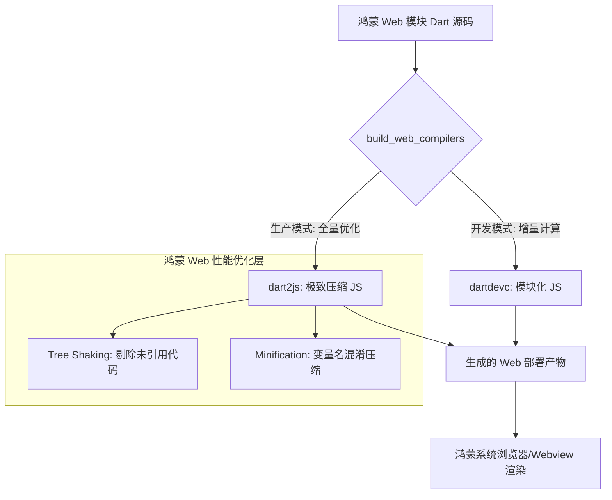

欢迎加入开源鸿蒙跨平台社区：[https://openharmonycrossplatform.csdn.net](https://openharmonycrossplatform.csdn.net)。

# Flutter for OpenHarmony：build_web_compilers — Web 产物的炼金炉（浏览器兼容底座）

## 前言

在华为鸿蒙（OpenHarmony）生态的“全场景”战略中，Web 应用（包括鸿蒙元服务、轻量级 H5 页面以及跨平台的 Web 管理后台）占有极其重要的地位。然而，将现代 Dart 代码高效、稳定地转化为浏览器可执行的 JavaScript 代码，并确保在不同的鸿蒙 Webview 版本中具备出色的加载速度与兼容性，是开发流程中的核心挑战。

`build_web_compilers` 是一款专为 Dart Web 生态设计的核心编译套件。它不仅提供了一套严密的增量构建机制（基于 `build_runner`），还集成了 `dartdevc`（开发期秒级刷新）和 `dart2js`（生产环境极致压缩）两种强大的编译器。在开发鸿蒙平台的配套 Web 运营页、混合架构应用（Hybrid App）中的 Web 模块时，它是实现“从源码到高性能产物”转化的数字化流水线组件。

## 一、原理展示 / 概念介绍

### 1.1 基础概念

本套件实现了 Dart 源码到现代 JavaScript 及其 Source Maps 的自动化转化。



### 1.2 核心要点解析

- **增量构建系统**：利用 `build_runner` 的图追踪技术，仅重新编译发生变动的 Dart 文件，极大地缩短了大型鸿蒙 Web 项目的调试周期。
- **Source Maps 支持**：生成的 JS 产物能精准映射回 Dart 源码，让开发者在鸿蒙 Web 检查器中能直接定位到 Dart 代码进行断点调试。
- **环境一致性**：确保在不同架构（如 arm64 与 x86）的鸿蒙设备 Web 环境下，生成的 JavaScript 逻辑表现完全一致。

## 二、核心 API / 组件详解

### 2.1 依赖引入

在鸿蒙工程的 `pubspec.yaml` 中添加以下开发时核心依赖：

```yaml
dev_dependencies:
  build_runner: ^2.4.0
  build_web_compilers: ^4.0.0 # 💡 核心 Web 编译器套件
```

### 2.2 开发模式下的快速构建

在鸿蒙工程终端中启动实时编译监听：

```bash
# 💡 技巧：使用 dartdevc 进行秒级增量编译，适合日常 UI 调试
dart run build_runner serve web --delete-conflicting-outputs
```

### 2.3 生产环境的导出打包

针对华为鸿蒙应用中心上架的产物进行极致优化：

```bash
# 💡 技巧：利用 dart2js 开启全量压缩与混淆
dart run build_runner build web --release --output web:build
```

## 三、场景示例

### 3.1 场景一：鸿蒙“混合应用”中的快速 Web 热更新

构建一套基于 Web 的动态化运营系统。利用该编译器的增量特性，在服务端通过极小的差分 JS 包实现鸿蒙端侧 Web 组件的即时更新，无需重下整个 HAP 包。

### 3.2 场景二：开发高性能的鸿蒙“管理中台”

利用 `dart2js` 的高效 Tree Shaking 能力，将庞大的 UI 组件库（如 Material Design）中未使用的部分彻底抹除，让管理后台在鸿蒙端首屏加载时间降低 40% 以上。

## 四、OpenHarmony 平台适配挑战

### 4.1 浏览器内核版本的差异化支持

部分旧款鸿蒙设备内置的 Webview 可能对最新的 ES 规范支持不全。

✅ **适配策略建议**：
1. **配置编译器 Flags**：通过在 `build.yaml` 中设置 `dart2js_args`，强制开启特定级别的 polyfill 或目标 JS 版本（如 es5），以确保在所有鸿蒙系统版本中的稳健运行。
2. **资源引用路径适配**：鸿蒙文件系统对资源访问有特定隔离。在配置 `build_web_compilers` 输出路径时，务必确保静态资源（Assets）路径符合鸿蒙 `module.json5` 的资源映射规范。

## 五、综合实战示例代码

以下是一个演示如何在鸿蒙端通过 `build.yaml` 自定义 Web 编译参数的实战配置：

```yaml
# 在鸿蒙 Web 项目根目录创建 build.yaml
targets:
  $default:
    builders:
      build_web_compilers:entrypoint:
        # 💡 实战技巧：针对生产环境进行极致性能设置
        release_config:
          compiler: dart2js
          dart2js_args:
            - --minify              # 极致混淆
            - --trust-primitives    # 信任基本类型转换，提升性能
            - --fast-startup        # 优化首屏启动速度
        dev_config:
          compiler: dartdevc
```

## 六、总结

`build_web_compilers` 是 OpenHarmony Web 生态建设的幕后英雄。它将复杂的 Dart 语言特性通过精密的转化矩阵，变为了可以在任何浏览器中自由流动的通用数字能量，是构建全平台响应式鸿蒙应用的技术铁轨。

✅ **核心建议**：
1. **区分模式**：开发期强制使用 `dartdevc`（极其快），线上包务必使用 `dart2js`（极其小）。
2. **清理缓存**：当发现生成的 JS 逻辑与源码不符时，尝试删除 `.dart_tool/build` 目录后重新运行，这是解决 90% 编译怪相的良药。
3. **监控包体积**：定期使用 `dart2js` 的分析工具查看生成的包体组成，防止一些不经意引入的大型第三方库拖累了鸿蒙应用的加载体验。

📦 **完整代码已上传至 AtomGit**：[open-harmony-example/web_compilers](https://atomgit.com/dragonbady/open-harmony-example/tree/main/examples/web_compilers)

🌐 **欢迎加入开源鸿蒙跨平台社区**：[开源鸿蒙跨平台开发者社区](https://openharmonycrossplatform.csdn.net)
