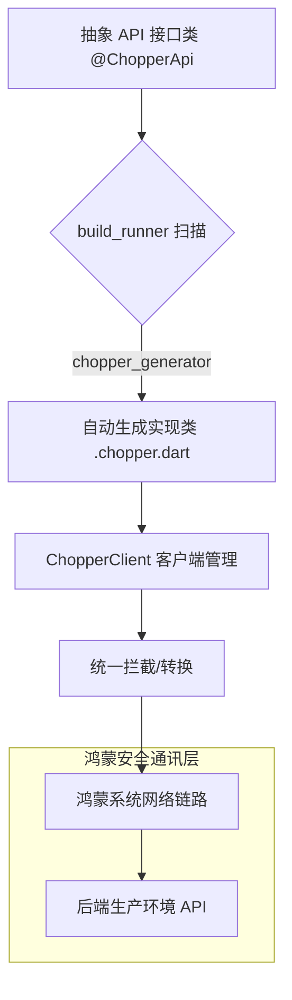

欢迎加入开源鸿蒙跨平台社区：[https://openharmonycrossplatform.csdn.net](https://openharmonycrossplatform.csdn.net)。

# Flutter for OpenHarmony：chopper_generator — 接口定义全自动引擎（网络通讯底座）

## 前言

在华为鸿蒙（OpenHarmony）大型分布式应用的开发中，后端接口的稳定接入与维护是项目的核心驱动力。如果手动编写每一个 `http` 请求方法、处理繁琐的 Header 拼接与 JSON 转换，不仅代码冗余度极高，更容易因后端 API 的微小变动引发难以追踪的运行时崩溃。

`chopper_generator` 是一款基于代码生成技术的网络库辅助工具，它将原本复杂的 HTTP 交互抽象为简单的 Dart 接口定义。在鸿蒙跨平台应用中，它通过生成高度优化的 `.chopper.dart` 绑定文件，自动处理拦截器逻辑、数据转换与错误捕获。在构建鸿蒙平台的政务协同、移动商城或大型社交应用时，它是你实现“类型安全”与“极致开发效率”的杀手锏。

## 一、原理展示 / 概念介绍

### 1.1 基础概念

本库通过注解（Annotations）驱动代码生成，实现逻辑与定义的彻底分离。



### 1.2 核心要点解析

- **声明式路由**：使用 `@Get`, `@Post`, `@Body` 等注解在接口中直接声明请求行为，代码如同文档般易读。
- **自动化生成**：结合 `build_runner`，所有底层的 HTTP 请求、响应体解析逻辑均由工具自动完成，杜绝手工拼写错误。
- **中间件扩展**：支持自定义全局拦截器，在鸿蒙端轻松实现全局 Token 注入或请求日志打印。

## 二、核心 API / 组件详解

### 2.1 依赖引入

在鸿蒙工程的 `pubspec.yaml` 中添加以下分工明确的配置：

```yaml
dependencies:
  chopper: ^6.0.0
  
dev_dependencies:
  chopper_generator: ^6.0.0
  build_runner: ^2.4.0
```

### 2.2 定义 API 接口服务

定义一个用于获取鸿蒙新闻资讯的服务：

```dart
import 'package:chopper/chopper.dart';

// ✅ 推荐做法：通过 part 引用自动生成的代码
part 'news_service.chopper.dart';

@ChopperApi(baseUrl: "/news")
abstract class NewsService extends ChopperService {
  @Get(path: "/latest")
  Future<Response> getLatestNews(@Query('limit') int limit);

  // 💡 技巧：利用 static 方法方便快速初始化
  static NewsService create([ChopperClient? client]) => _$NewsService(client);
}
```

### 2.3 生成代码

在 IDE 终端运行：
`flutter pub run build_runner build`

## 三、场景示例

### 3.1 场景一：鸿蒙多租户系统的全局鉴权

通过接入 `Authenticator` 拦截器，当检测到 401 状态码时，在鸿蒙端自动触发 Refresh Token 逻辑，用户无感完成重连。

### 3.2 场景二：复杂 JSON 响应的自动模型转换

配合 `json_serializable`，实现从底层网络包直接到底层 Model 类的“点对点”转换。

## 四、OpenHarmony 平台适配挑战

### 4.1 网络安全性测试（HTTPS/证书）

鸿蒙系统对不明证书的网络请求管控极其严格。

✅ **适配策略建议**：
1. **统一自定根证书**：如果后端处于内网测试环境，需在 `ChopperClient` 的底层 `http.Client` 适配层，正确加载鸿蒙端本地证书。
2. **连接池性能调优**：在大规模数据拉取时，合理配置 `ChopperClient` 的缓存机制，利用鸿蒙高效的系统级网络缓存（ohos.net.http 映射层），减少重复握手次数。

## 五、综合实战示例代码

以下是一个在鸿蒙端使用的完整 API 调用演示：

```dart
import 'package:flutter/material.dart';
import 'package:chopper/chopper.dart';

class ChopperLabPage extends StatefulWidget {
  const ChopperLabPage({super.key});

  @override
  State<ChopperLabPage> createState() => _ChopperLabPageState();
}

class _ChopperLabPageState extends State<ChopperLabPage> {
  late ChopperClient _client;
  String _response = "点击发起鸿蒙网络请求";

  @override
  void initState() {
    super.initState();
    // 💡 实战技巧：全局配置客户端，注入日志与转换器
    _client = ChopperClient(
      baseUrl: Uri.parse("https://api.harmony-news.com"),
      services: [ _$NewsService() ], // 这是由生成器产出的类
      converter: const JsonConverter(),
      interceptors: [ HttpLoggingInterceptor() ],
    );
  }

  void _fetchData() async {
    setState(() => _response = "请求发送中...");
    // 💡 获取自动生成的服务实例
    final service = _client.getService<NewsService>();
    final res = await service.getLatestNews(10);
    
    setState(() {
      _response = res.isSuccessful ? "✅ 获取资讯成功: ${res.body}" : "❌ 请求失败: ${res.error}";
    });
  }

  @override
  Widget build(BuildContext context) {
    return Scaffold(
      appBar: AppBar(title: const Text('Chopper 接口实验室')),
      body: SingleChildScrollView(
        padding: const EdgeInsets.all(20),
        child: Column(
          children: [
            const Icon(Icons.api, size: 80, color: Colors.blueAccent),
            const SizedBox(height: 30),
            Text(_response, style: const TextStyle(fontFamily: 'monospace')),
            const SizedBox(height: 50),
            ElevatedButton.icon(
              onPressed: _fetchData,
              icon: const Icon(Icons.send),
              label: const Text('从生成的代码发起 API 调用'),
            )
          ],
        ),
      ),
    );
  }
}
```

## 六、总结

`chopper_generator` 让 OpenHarmony 网络开发告别了原始的拼凑时代。它倡导的“定义即代码”理念，不仅保护了代码质量，更极大提升了团队的协同效率。

✅ **核心建议**：
1. **版本锁定**：在鸿蒙端生成代码工具链（build_runner 等）时，务必在团队内锁定版本，防止因生成器微小变动导致的大量文件变更。
2. **拦截器先行**：常用的日志打印、Header 注入等逻辑应封装为独立的拦截器，由 `ChopperClient` 统一托管。
3. **隔离生成文件**：将生成的 `.chopper.dart` 排除在静态代分析之外，减少 IDE 的报错噪音。

📦 **完整代码已上传至 AtomGit**：[open-harmony-example/chopper](https://atomgit.com/dragonbady/open-harmony-example/tree/main/examples/chopper)

🌐 **欢迎加入开源鸿蒙跨平台社区**：[开源鸿蒙跨平台开发者社区](https://openharmonycrossplatform.csdn.net)
