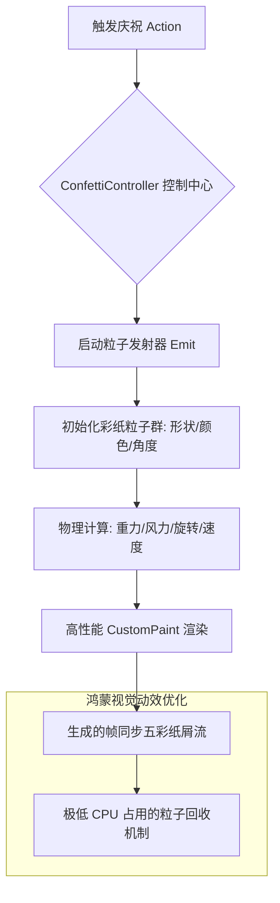

欢迎加入开源鸿蒙跨平台社区：[https://openharmonycrossplatform.csdn.net](https://openharmonycrossplatform.csdn.net)。

# Flutter for OpenHarmony：confetti — 欢乐的视觉盛宴（庆祝动效底座）

## 前言

在华为鸿蒙（OpenHarmony）生态的社交、电商（订单完成）、游戏以及教育类（通关奖励）应用开发中，如何通过细腻的视觉反馈给予用户即时的“成就感”和“惊喜感”，是提升产品活跃度的秘密武器。一个简单的弹窗提示已无法满足现代移动端的审美需求，开发者渴望一种像节日喷彩纸一样自然、灵动且具备物理质感的全屏庆祝动效。

`confetti` 是一款专为 Flutter 打造的、目前社区最流行的五彩纸屑爆发引擎。它支持高度自定义的发射方向、彩纸形状、重力加速度以及颜色组合，并针对移动端性能进行了极致优化。在鸿蒙跨平台应用的开发中，它能让你以极简的声明式代码，构建出足以媲美原生级流畅度的“庆祝瞬间”。在打造鸿蒙平台的订单支付成功页、运动达标奖章展示、或是节日活动入口时，它是实现“情绪共鸣交互”的核心动效组件。

## 一、原理展示 / 概念介绍

### 1.1 基础概念

本组件实现了基于 Canvas 绘制的粒子物理运动模拟。



### 1.2 核心要点解析

- **物理仿真引擎**：纸屑在下落过程中会自动旋转、在模拟风力下产生偏移，视觉效果极度逼真。
- **高性能粒子回收**：当纸屑飘出屏幕或生命周期结束时，后台会自动进行资源回收，确保在鸿蒙端长时间运行也不会产生内存累积。
- **全场景灵活发射**：支持 360 度全方向、特定弧度（如仅仅向上喷射）以及自定义彩纸形状。

## 二、核心 API / 组件详解

### 2.1 依赖引入

在鸿蒙工程的 `pubspec.yaml` 中添加以下依赖：

```yaml
dependencies:
  confetti: ^0.7.0 # 建议参考最新稳定版本
```

### 2.2 控制器初始化与绑定

在鸿蒙页面逻辑层中定义核心控制器：

```dart
import 'package:confetti/confetti.dart';

class _HarmonyGameState extends State<HarmonyGame> {
  // ✅ 推荐做法：通过控制器管理播放状态
  late ConfettiController _controller;

  @override
  void initState() {
    super.initState();
    _controller = ConfettiController(duration: const Duration(seconds: 3));
  }
  
  void _celebrate() => _controller.play(); // 💡 技巧：触发庆祝时刻
}
```

### 2.3 在 UI 中局部布置

💡 **技巧**：通常使用 `Align` 或 `Stack` 将纸屑层置于顶层。

```dart
ConfettiWidget(
  confettiController: _controller,
  blastDirectionality: BlastDirectionality.explosive, // 💡 技巧：爆炸式散开
  shouldLoop: false,
  colors: const [Colors.green, Colors.blue, Colors.pink, Colors.orange, Colors.purple], // 💡 定义鸿蒙多彩色板
  createParticlePath: drawStar, // 自定义形状
)
```

## 三、场景示例

### 3.1 场景一：鸿蒙“智慧校园”考试通过瞬间

当学生在鸿蒙平板上提交满分试卷时，屏幕中心瞬间爆发绚丽的彩色五星，配合鸿蒙系统的震动反馈，给予学生极强的荣誉感。

### 3.2 场景二：双 11 期间的“抢红包”成功反馈

在鸿蒙手机端的抢购活动中，成功领取大额优惠券后，全屏飘落红包雨和彩带，将购物气氛推向高潮。

## 四、OpenHarmony 平台适配挑战

### 4.1 高刷屏幕下的粒子同步与功耗

在鸿蒙 120Hz 刷新率下，绘制数以百计的实时运动粒子。

✅ **适配策略建议**：
1. **控制粒子密度**：通过 `numberOfParticles` 参数，在手机等窄屏设备上建议将粒子密度控制在 10-20 之间，既能保持丰富的视觉感，又能降低鸿蒙系统由于高频重绘带来的 GPU 功耗。
2. **适时销毁**：在鸿蒙端页面切换（Navigator.pop）时，务必在 `dispose` 中显式调用 `_controller.dispose()`，防止后台粒子动画持续运行导致线程被占用。

## 五、综合实战示例代码

以下是一个演示如何在鸿蒙端实现的“极简全屏庆祝体验”实战组件：

```dart
import 'package:flutter/material.dart';
import 'package:confetti/confetti.dart';

class ConfettiLabPage extends StatefulWidget {
  const ConfettiLabPage({super.key});

  @override
  State<ConfettiLabPage> createState() => _ConfettiLabPageState();
}

class _ConfettiLabPageState extends State<ConfettiLabPage> {
  late ConfettiController _controller;

  @override
  void initState() {
    super.initState();
    _controller = ConfettiController(duration: const Duration(seconds: 5));
  }

  @override
  void dispose() {
    _controller.dispose();
    super.dispose();
  }

  @override
  Widget build(BuildContext context) {
    return Scaffold(
      appBar: AppBar(title: const Text('彩色纸屑庆祝实验室')),
      body: Stack(
        children: [
          Center(
            child: Column(
              mainAxisAlignment: MainAxisAlignment.center,
              children: [
                const Icon(Icons.card_giftcard, size: 80, color: Colors.pinkAccent),
                const SizedBox(height: 30),
                ElevatedButton(
                  onPressed: () => _controller.play(),
                  child: const Text('启动鸿蒙端侧“全城欢庆”'),
                ),
              ],
            ),
          ),
          // 💡 实战技巧：将庆祝层放在 Stack 最外层
          Align(
            alignment: Alignment.topCenter,
            child: ConfettiWidget(
              confettiController: _controller,
              blastDirectionality: BlastDirectionality.explosive,
              shouldLoop: false,
              colors: const [Colors.red, Colors.yellow, Colors.blue, Colors.green],
            ),
          ),
        ],
      ),
    );
  }
}
```

## 六、总结

`confetti` 库为 OpenHarmony 跨平台应用注入了“情感色彩”。它用极低的性能代价，换取了极其昂贵的交互惊喜。在追求精品化、注重用户感官体验的今天，它是每一位鸿蒙开发者提升应用温度的得力助手。

✅ **核心建议**：
1. **不要过度滥用**：庆祝动效应出现在关键的奖励点，频繁出现会失去“惊喜感”并造成视觉疲劳。
2. **结合触觉与听觉**：在纸屑爆发的瞬间，调用鸿蒙系统的 `HapticFeedback` 产生微小震动，并播放一个轻快的提示音，能实现三位一体的沉浸感。
3. **色彩自适应**：在鸿蒙的“深色模式”下，建议调高彩纸的明度（Brightness），确其在深底色下依然具备鲜艳的饱和度。

📦 **完整代码已上传至 AtomGit**：[open-harmony-example/confetti](https://atomgit.com/dragonbady/open-harmony-example/tree/main/examples/confetti)

🌐 **欢迎加入开源鸿蒙跨平台社区**：[开源鸿蒙跨平台开发者社区](https://openharmonycrossplatform.csdn.net)
