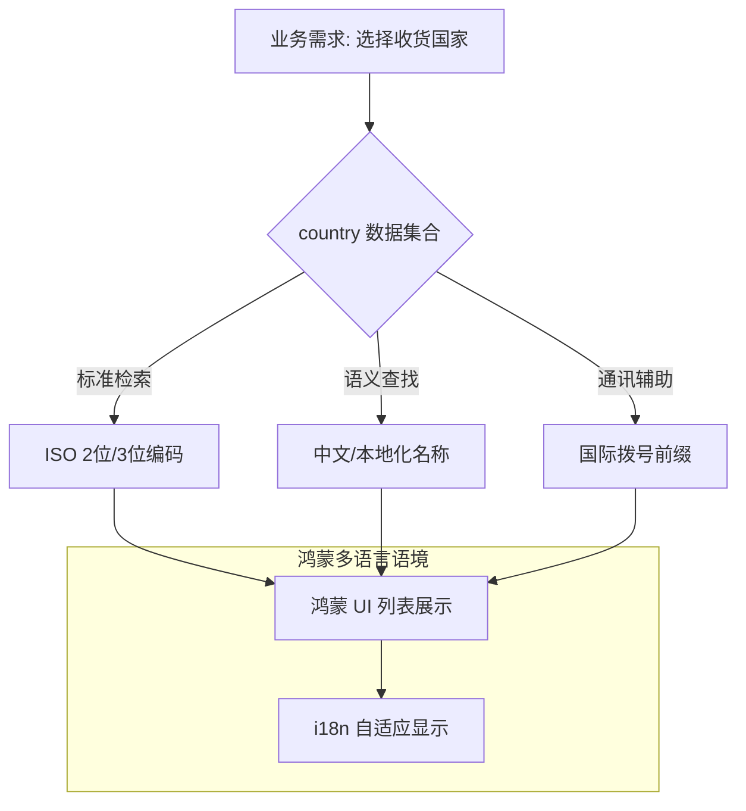

欢迎加入开源鸿蒙跨平台社区：[https://openharmonycrossplatform.csdn.net](https://openharmonycrossplatform.csdn.net)。

# Flutter for OpenHarmony：country — 鸿蒙应用的世界之窗（国际化标准底座）

## 前言

在华为鸿蒙（OpenHarmony）生态的全球化（Glocalization）战略中，应用必须具备深度的本地化能力。无论是构建国际支付系统的账单地址选择、跨国社交应用的区号设置，还是电商平台的物流国家分拣，开发者都需要一套权威、完整且易于检索的国家与地区元数据。

`country` 是一款专为 Flutter 设计的高质量国家信息库。它基于 ISO 3166-1 标准，涵盖了全球 240+ 个国家和地区的详细属性，包括中文/英文名称、ISO 编码、拨号代码（Dial Code）、国旗 Emoji 以及货币信息。在鸿蒙跨平台开发中，它能帮助你消除硬编码国家列表的维护负担，提供符合全球标准的业务逻辑支撑。

## 一、原理展示 / 概念介绍

### 1.1 基础概念

`country` 库通过标准化的数据结构提供全量地理信息模型。



### 1.2 核心要点解析

- **ISO 符合性**：严格遵循国际标准，确保在后端校验或第三方系统（如 Stripe, PayPal）对接时格式无误差。
- **高性能检索**：内置索引机制，支持通过代码或名称进行 O(1) 或 O(n) 级别的快速定位。
- **零配置**：开箱即用，无需额外配置本地 JSON 或 Assets。

## 二、核心 API / 组件详解

### 2.1 依赖引入

在鸿蒙工程的 `pubspec.yaml` 中添加以下依赖：

```yaml
dependencies:
  country: ^0.1.0 # 建议根据最新版本锁定
```

### 2.2 快速获取国家信息

获取中国及其相关属性：

```dart
import 'package:country/country.dart';

void getChinaInfo() {
  // ✅ 推荐做法：通过 ISO 代码精确定位
  final china = Countries.china;
  
  print('中文名: ${china.name}'); // 中国
  print('拨号代码: ${china.dialCode}'); // 86
  print('旗帜: ${china.flag}'); // 🇨🇳
}
```

### 2.3 模糊搜索与列表过滤

💡 **技巧**：在用户输入时进行实时下拉建议。

```dart
List<Country> searchCountries(String query) {
  return Countries.all.where((c) => 
    c.name.toLowerCase().contains(query.toLowerCase())
  ).toList();
}
```

## 三、场景示例

### 3.1 场景一：鸿蒙注册页面的手机号区号选择

利用 `dialCode` 属性，为鸿蒙端用户提供带旗帜的区号选择器，提升操作效率。

### 3.2 场景二：跨国汇款应用的货币自动匹配

根据选中的国家，自动带出对应的货币符号与汇率基准。

## 四、OpenHarmony 平台适配挑战

### 4.1 本地化名称的动态更新

尽管库中自带了名称，但在某些特定的鸿蒙系统语言包下，可能需要更符合当地阅读习惯的译名。

✅ **适配策略建议**：
1. **结合系统 i18n**：配合 Flutter 的 `Intl` 库，可以通过 `Countries.all` 作为 Key，在应用的资产文件中重写特定国家的显示名称。
2. **列表长加载性能优化**：全球共有两百多个条目。在鸿蒙端展示列表时，务必使用 `ListView.builder` 以便内存回收，防止因渲染两百多个 Emoji 旗帜导致低端鸿蒙机的滑动卡顿。

## 五、综合实战示例代码

以下是一个模拟鸿蒙手机“选择寄送目的地”的完整界面演示：

```dart
import 'package:flutter/material.dart';
import 'package:country/country.dart';

class CountryLabPage extends StatefulWidget {
  const CountryLabPage({super.key});

  @override
  State<CountryLabPage> createState() => _CountryLabPageState();
}

class _CountryLabPageState extends State<CountryLabPage> {
  Country _selected = Countries.china;

  void _showCountryPicker() {
    showModalBottomSheet(
      context: context,
      builder: (context) => ListView.builder(
        itemCount: Countries.all.length,
        itemBuilder: (context, index) {
          final c = Countries.all[index];
          return ListTile(
            leading: Text(c.flag, style: const TextStyle(fontSize: 24)),
            title: Text(c.name),
            onTap: () {
              setState(() => _selected = c);
              Navigator.pop(context);
            },
          );
        },
      ),
    );
  }

  @override
  Widget build(BuildContext context) {
    return Scaffold(
      appBar: AppBar(title: const Text('国家元数据实验室')),
      body: Center(
        child: Column(
          mainAxisAlignment: MainAxisAlignment.center,
          children: [
            Text(_selected.flag, style: const TextStyle(fontSize: 100)),
            const SizedBox(height: 20),
            Text("当前选择: ${_selected.name}", style: const TextStyle(fontSize: 24, fontWeight: FontWeight.bold)),
            const SizedBox(height: 10),
            Text("ISO 编码: ${_selected.isoCode} | 拨号区号: +${_selected.dialCode}"),
            const SizedBox(height: 50),
            ElevatedButton.icon(
              onPressed: _showCountryPicker,
              icon: const Icon(Icons.public),
              label: const Text('从鸿蒙全球数据库选择'),
            ),
          ],
        ),
      ),
    );
  }
}
```

## 六、总结

`country` 库是 OpenHarmony 应用走向全球的通行证之一。它通过标准化的地理信息描述，让你的应用在多语言、多地域的复杂业务中依然保持逻辑的简洁与正确。

✅ **核心建议**：
1. **优先使用 ISO 编码**：在与后端通讯时，务必传递 `isoCode` 而非中文名，防止翻译差异导致的业务逻辑解析失败。
2. **UI 细节优化**：Emoji 旗帜在不同鸿蒙版本下的显示细节可能有微调，必要时可结合自定义图标库进行增强。
3. **缓存搜索结果**：如果需要高频搜索，建议在鸿蒙端缓存一份按拼音/英文首字母排序的局部列表。

📦 **完整代码已上传至 AtomGit**：[open-harmony-example/country](https://atomgit.com/dragonbady/open-harmony-example/tree/main/examples/country)

🌐 **欢迎加入开源鸿蒙跨平台社区**：[开源鸿蒙跨平台开发者社区](https://openharmonycrossplatform.csdn.net)
