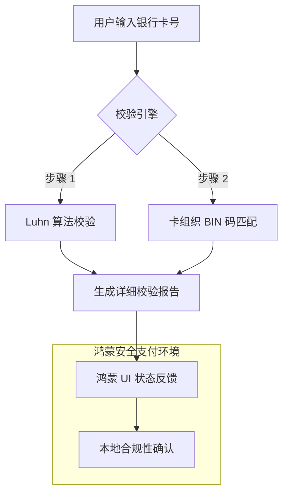

欢迎加入开源鸿蒙跨平台社区：[https://openharmonycrossplatform.csdn.net](https://openharmonycrossplatform.csdn.net)。

# Flutter for OpenHarmony：credit_card_validator — 支付安全守护者（金融校验底座）

## 前言

在华为鸿蒙（OpenHarmony）生态的电商、金融及各类服务类应用开发中，支付流程的顺畅与安全是业务的核心。如果用户输入了一个由于拼写错误而无效的银行卡号，却直到提交给后端支付网关后才返回错误，不仅极大地损耗了网络资源，更会让用户对应用的专业度产生质疑。

`credit_card_validator` 是一款轻量级、零依赖的银行卡号校验工具。它通过内置的 Luhn 算法（模 10 校验）以及对各大支付卡组织（Visa, MasterCard, JCB, UnionPay 等） BIN 码段的匹配，能够实时鉴定卡号的合法性。在构建鸿蒙平台的收银台页面、会员身份验证系统时，它是实现“前端第一道防线”的必备安全组件。

## 一、原理展示 / 概念介绍

### 1.1 基础概念

本库通过双重机制确保卡号的物理有效性。



### 1.2 核心要点解析

- **Luhn 算法执行**：自动对数字序列进行加权求和并取模，能有效过滤 90% 以上的手误录入。
- **卡品牌识别**：自动根据前 4-6 位数字判断是“中国银联”、“Visa”还是“运通卡”，以便鸿蒙端实时切换对应的卡组织 Logo。
- **详细错误说明**：不仅返回 true/false，还能指出是长度错误还是校验和错误，引导用户精准修正。

## 二、核心 API / 组件详解

### 2.1 依赖引入

在鸿蒙工程的 `pubspec.yaml` 中添加以下依赖：

```yaml
dependencies:
  credit_card_validator: ^1.2.0
```

### 2.2 执行卡号校验

在鸿蒙端的文本输入监听中快速校验：

```dart
import 'package:credit_card_validator/credit_card_validator.dart';

void validateCard(String cardNumber) {
  final CreditCardValidator validator = CreditCardValidator();
  
  // ✅ 推荐做法：调用 validate() 获取完整的 CCNumIdResults 对象
  var results = validator.validateCCNum(cardNumber);
  
  if (results.isPotentiallyValid) {
     print('💡 卡号初步合法，卡品牌是: ${results.cardType.brandName}');
  }
}
```

### 2.3 深度校验判定

💡 **技巧**：在正式提交支付前，检查 `isValid` 确保所有校验已通过。

## 三、场景示例

### 3.1 场景一：鸿蒙全球购物 App 收银台

当用户输入卡号时，UI 实时展示对应的银行卡图标，并在卡号无效时瞬间变红，提醒用户检查。

### 3.2 场景二：会员信用绑定

在鸿蒙分布式金融服务中，快速校验用户绑定的境外信用卡是否属于受支持的卡组织。

## 四、OpenHarmony 平台适配挑战

### 4.1 银联（UnionPay）的本土化支持

由于中国银联的卡号规则较为多样，部分旧版本库可能对其覆盖不全。

✅ **适配策略建议**：
1. **二次扩展正则**：结合 `credit_card_validator` 的结果，针对鸿蒙端常见的 16-19 位银联卡，可以额外增加自定义的辅助判断逻辑，确保兼容性。
2. **输入遮罩（Masking）优化**：由于鸿蒙系统对敏感数字显示的防窥要求，建议配合 `FilteringTextInputFormatter` 将卡号自动按 4 位一组进行空格分隔，防止用户因数字挤在一起产生视觉疲劳。

## 五、综合实战示例代码

以下是一个模拟鸿蒙手机“安全收银台”卡号输入与实时校验的实战组件：

```dart
import 'package:flutter/material.dart';
import 'package:credit_card_validator/credit_card_validator.dart';

class CreditCardLabPage extends StatefulWidget {
  const CreditCardLabPage({super.key});

  @override
  State<CreditCardLabPage> createState() => _CreditCardLabPageState();
}

class _CreditCardLabPageState extends State<CreditCardLabPage> {
  final _validator = CreditCardValidator();
  String _brand = "未知";
  String _status = "请输入卡号";
  bool _valid = false;

  void _onCardChanged(String val) {
    if (val.length < 4) return;
    
    // 💡 实战技巧：快速解析并反馈
    final res = _validator.validateCCNum(val);
    
    setState(() {
      _brand = res.cardType.brandName;
      _valid = res.isValid;
      _status = res.isValid ? "✅ 卡号校验通过" : "❌ 卡号格式有误";
    });
  }

  @override
  Widget build(BuildContext context) {
    return Scaffold(
      appBar: AppBar(title: const Text('安全支付校验实验室')),
      body: Padding(
        padding: const EdgeInsets.all(20),
        child: Column(
          children: [
            const Icon(Icons.credit_card, size: 80, color: Colors.blueAccent),
            const SizedBox(height: 30),
            TextField(
              onChanged: _onCardChanged,
              keyboardType: TextInputType.number,
              decoration: InputDecoration(
                labelText: '银行卡号',
                hintText: '按银联/Visa/MasterCard 规则输入',
                errorText: _valid ? null : (_status == "请输入卡号" ? null : _status),
                border: const OutlineInputBorder(),
              ),
            ),
            const SizedBox(height: 40),
            ListTile(
              tileColor: Colors.grey[100],
              title: const Text("识别卡组织"),
              trailing: Text(_brand, style: const TextStyle(fontWeight: FontWeight.bold, color: Colors.blue)),
            ),
            const Spacer(),
            ElevatedButton(
              onPressed: _valid ? () {} : null,
              style: ElevatedButton.styleFrom(minimumSize: const Size.fromHeight(50)),
              child: const Text('通过鸿蒙安全校验并提交'),
            )
          ],
        ),
      ),
    );
  }
}
```

## 六、总结

`credit_card_validator` 是鸿蒙应用支付安全链上的第一环。它以极致的性能和严谨的算法，确保了金融数据的源头质量。

✅ **核心建议**：
1. **不要存储完整卡号**：本库仅用于校验。在业务处理完成后，务必脱敏卡号（只留首尾），严禁在鸿蒙 Log 中打印明文卡号。
2. **结合系统键盘**：建议显式指定 `TextInputType.number`，调起鸿蒙系统的安全数字键盘。
3. **适时提醒**：对于多次校验失败的输入，应引导用户检查银行卡的有效期或发卡行限制。

📦 **完整代码已上传至 AtomGit**：[open-harmony-example/cc_validator](https://atomgit.com/dragonbady/open-harmony-example/tree/main/examples/cc_validator)

🌐 **欢迎加入开源鸿蒙跨平台社区**：[开源鸿蒙跨平台开发者社区](https://openharmonycrossplatform.csdn.net)
