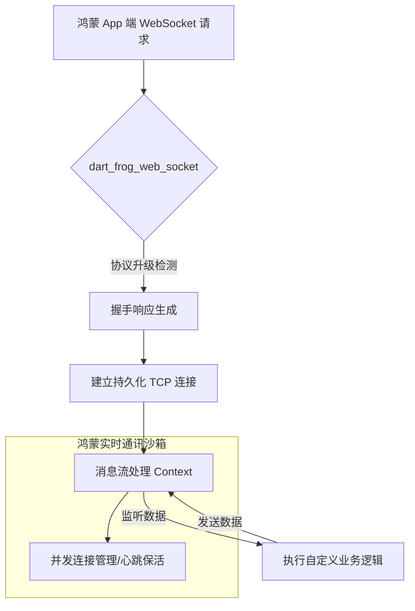

欢迎加入开源鸿蒙跨平台社区：[https://openharmonycrossplatform.csdn.net](https://openharmonycrossplatform.csdn.net)。

# Flutter for OpenHarmony：dart_frog_web_socket — 实时交互的灵动之桥（后端双向通讯底座）

## 前言

在华为鸿蒙（OpenHarmony）生态的分布式协作、多端同步看板及实时聊天应用的开发中，传统的 HTTP 轮询已无法满足现代应用对“低延迟”与“即时反馈”的追求。开发者需要一种能够像编写 UI 一样简单、却能处理高并发 WebSocket 长连接的后端方案。

`dart_frog_web_socket` 是一款专为极致后端框架 Dart Frog 打造的 WebSocket 扩展插件。它继承了 Dart Frog “约定优于配置”的极简哲学，将复杂的 WebSocket 握手、协议升级及流管理抽象为极其纯粹的代码逻辑。在构建鸿蒙平台的本地局域网对战服务器、端侧实时数据同步总线、或是实验性微服务时，它是实现“全双工即时交互”的核心技术枢纽。

## 一、原理展示 / 概念介绍

### 1.1 基础概念

本库实现了从“HTTP 请求”到“持久化 WebSocket 流”的自动化转换与分发。



### 1.2 核心要点解析

- **极简 Handler 模式**：只需定义一张处理 `webSocketHandler`，即可在指定的路由下开启双向通讯门户。
- **上下文感知（Context Aware）**：每个连接都能共享来自 Dart Frog 中间件（Middleware）的依赖项（如：数据库实例、鉴权信息）。
- **完全异步化**：基于 Dart 的 `Stream` 机制，支持对进出流量的海量异步操作，确保在高性能鸿蒙服务器场景下依然保持极低的内存碎屏化感。

## 二、核心 API / 组件详解

### 2.1 依赖引入

在相关的鸿蒙端侧后端工程 `pubspec.yaml` 中添加以下依赖：

```yaml
dependencies:
  dart_frog: ^1.1.0
  dart_frog_web_socket: ^1.1.0 # 💡 实时通讯扩展
```

### 2.2 定义实时通讯入口

在 `routes/ws.dart` 中建立监听：

```dart
import 'package:dart_frog/dart_frog.dart';
import 'package:dart_frog_web_socket/dart_frog_web_socket.dart';

// ✅ 推荐做法：通过 webSocketHandler 包装您的逻辑
Response onRequest(RequestContext context) {
  return webSocketHandler(
    (channel, protocol) {
      // 1. 监听来自鸿蒙客户端的消息
      channel.stream.listen((message) {
        print('来自鸿蒙设备的消息: $message');
        
        // 2. 实时推送回传
        channel.sink.add('🚀 已确认：你的指令 "$message" 已下发分布式硬件');
      });
    },
  ).call(context);
}
```

### 2.3 启动后端服务

在开发环境中一键触发：

```bash
# 💡 技巧：启动带 WebSocket 支持的后端服务
dart_frog dev
```

## 三、场景示例

### 3.1 场景一：鸿蒙端侧“开发者调试总线”

构建一个运行在鸿蒙手机内部的诊断服务。利用 WebSocket，让开发者只需在浏览器打开特定页面，即可实时看到鸿蒙应用内所有后台任务的运行轨迹。

### 3.2 场景二：多人局域网互动“派对游戏”

在鸿蒙平板上运行服务端，多个鸿蒙手机作为控制器连接。利用 `dart_frog_web_socket` 实现毫秒级的按键操作同步，打造延迟近乎零的竞技体验。

## 四、OpenHarmony 平台适配挑战

### 4.1 网络稳定性与证书校验

WebSocket 对网络链接的连贯性比 HTTP 更敏感。

✅ **适配策略建议**：
1. **心跳包注入**：在 `dart_frog_web_socket` 层手动封装心跳计时器，如果在 30 秒内没有收到鸿蒙端的 Ping 包，主动关闭僵死连接，释放由于文件描述符（FD）限制造成的连接配额。
2. **多机型并发防护**：由于鸿蒙系统对单一进程的 Socket 连接数有默认上限。在部署生产级微服务时，请通过配置文件调整系统的 `ulimit` 参数，确保在高并发接入时不会丢失握手。

## 五、综合实战示例代码

以下是一个演示如何在鸿蒙端实现的“实时数据广播服务”实战示例：

```dart
import 'package:dart_frog/dart_frog.dart';
import 'package:dart_frog_web_socket/dart_frog_web_socket.dart';

// 模拟广播中心
final Set<WebSocketSink> _clients = {};

Response onRequest(RequestContext context) {
  return webSocketHandler(
    (channel, protocol) {
      _clients.add(channel.sink);
      
      channel.stream.listen(
        (data) {
          // 💡 实战技巧：收到一条消息，广播给所有连接的客户端
          for (final client in _clients) {
            client.add('广播：$data');
          }
        },
        onDone: () => _clients.remove(channel.sink),
      );
    }
  ).call(context);
}
```

## 六、总结

`dart_frog_web_socket` 将复杂的长连接编程转化为了直观的流处理逻辑。它让 OpenHarmony 开发者能够以极低的成本，构建出具备“全场景实时交互”能力的卓越架构方案。

✅ **核心建议**：
1. **状态无关性**：尽量保持 WebSocket 处理逻辑的单一性，复杂的业务判断交给前置的中间件处理后再注入 Context。
2. **优雅断开**：务必在 `onDone` 回调中清理掉所有占用的本地资源，防止泄露。
3. **结合 Protobuf**：对于高频、大量的二进制数据交换，建议结合 `protobuf` 序列化后再通过 WebSocket 链路进行物理传输。

📦 **完整代码已上传至 AtomGit**：[open-harmony-example/frog_ws](https://atomgit.com/dragonbady/open-harmony-example/tree/main/examples/frog_ws)

🌐 **欢迎加入开源鸿蒙跨平台社区**：[开源鸿蒙跨平台开发者社区](https://openharmonycrossplatform.csdn.net)
