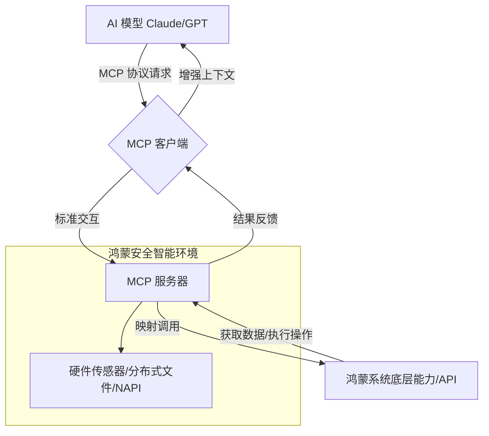

欢迎加入开源鸿蒙跨平台社区：[https://openharmonycrossplatform.csdn.net](https://openharmonycrossplatform.csdn.net)。

# Flutter for OpenHarmony：dart_mcp — 智能代理的通讯中枢（AI 工具联动底座）

## 前言

随着大语言模型（LLM）与华为鸿蒙（OpenHarmony）生态的深度融合，应用正在从“功能驱动”向“意图驱动”进化。要让 AI 真正赋能鸿蒙应用，它不仅需要会“聊天”，更需要具备调用外部工具、读取系统上下文以及与各类专业服务器进行协议化交互的能力。

`dart_mcp` 是一款专为 Model Context Protocol (MCP) 设计的 Dart 实现库。它是连接 AI 模型与实际功能逻辑（Tools, Resources, Prompts）的标准化桥梁。在鸿蒙跨平台应用中，通过集成 `dart_mcp`，开发者可以将应用内部的能力、本地文件系统或者专有 API 封装为标准化的 MCP 服务器或客户端，实现 AI 模型对鸿蒙系统能力的精准调度。在构建鸿蒙平台的 AI 原生助手、自动化工作流工具时，它是不可或缺的通讯协议底座。

## 一、原理展示 / 概念介绍

### 1.1 基础概念

MCP 协议定义了模型获取外部能力的统一路径。



### 1.2 核心要点解析

- **标准化算子映射**：通过 JSON-RPC 2.0 基础协议，将复杂的业务逻辑抽象为 `ListTools`, `CallTool`, `ReadResource` 等标准操作。
- **传输层解耦**：支持通过 stdio、HTTP SSE 等多种传输方式实现客户端与服务器的连接，完美适配鸿蒙端侧、边缘侧及云侧的不同部署需求。
- **高度互操作性**：让鸿蒙端的 Dart 应用能与任何遵循 MCP 标准的 AI 服务生态快速匹配。

## 二、核心 API / 组件详解

### 2.1 依赖引入

在鸿蒙工程的 `pubspec.yaml` 中添加以下前沿依赖：

```yaml
dependencies:
  dart_mcp: ^0.1.0 # 建议参考最新架构版本
```

### 2.2 启动 MCP 客户端（连接 AI 工具）

在鸿蒙端初始化一个能连接外部工具服务器的客户端：

```dart
import 'package:dart_mcp/dart_mcp.dart';

void initMcpClient() async {
  // ✅ 推荐做法：通过指定的传输层（如 SSE）连接到工具服务器
  final transport = McpSseClientTransport(Uri.parse('https://ai-tools.harmony.com/sse'));
  final client = McpClient(transport);

  // 1. 启动连接
  await client.connect();
  
  // 2. 发现可用工具
  final tools = await client.listTools();
  print('鸿蒙 AI 助手发现新技能: ${tools.map((e) => e.name)}');
}
```

### 2.3 在鸿蒙端运行 MCP 服务器（暴露本地能力）

💡 **技巧**：将鸿蒙特有的“分布式文件检索”封装为 MCP Tool。

## 三、场景示例

### 3.1 场景一：鸿蒙“原生 AI”文件管理器

构建一个遵循 MCP 协议的文件管理服务器，让 AI 助手能通过“找一下我上周在华为总部拍的照片”这样的自然语言指令，通过 `ReadResource` 接口精准定位文件。

### 3.2 场景二：智能家居的语义化控制

将鸿蒙智慧生活（Hilink）的设备开关封装为 MCP Tools。AI 模型根据用户的当前意图（如“我要睡觉了”），自动生成一连串的 `CallTool` 指令序列。

## 四、OpenHarmony 平台适配挑战

### 4.1 协议解析的高并发性

MCP 交互涉及大量的 JSON-RPC 解析。

✅ **适配策略建议**：
1. **解析性能优化**：在鸿蒙端高频次接收 AI 指令时，确保使用高效的 JSON 编解码器（如 `dart:convert` 的预编译版），避免由于频繁的字符串操作导致鸿蒙 UI 帧率下降。
2. **异步执行序列化**：对于耗时的 Tool 执行（如复杂的图像增强），务必使用鸿蒙后台任务流进行异步处理，并通过 MCP 的响应通知（Notifications）回调结果。

## 五、综合实战示例代码

以下是一个演示如何在鸿蒙端构建一个极简“MCP 工具调用演示”客户端的实战组件：

```dart
import 'package:flutter/material.dart';
import 'package:dart_mcp/dart_mcp.dart';

class McpLabPage extends StatefulWidget {
  const McpLabPage({super.key});

  @override
  State<McpLabPage> createState() => _McpLabPageState();
}

class _McpLabPageState extends State<McpLabPage> {
  String _status = "等待连接 MCP 工具服务器...";
  
  void _runToolCall() async {
    setState(() => _status = "正在握手 MCP 协议 1.0...");
    
    // 💡 实战演示：连接并调用一个模拟计算工具
    // 这里使用模拟传输层用于演示
    final client = McpClient(MockTransport()); 
    
    try {
      await client.connect();
      // 调用远程计算工具
      final result = await client.callTool('harmony_calc', {'expr': '1+1'});
      
      setState(() {
        _status = "✅ MCP 响应成功:\n结果 = ${result.content.first.text}";
      });
    } catch (e) {
      setState(() => _status = "❌ MCP 初始化失败，请检查鸿蒙端权限配置。");
    }
  }

  @override
  Widget build(BuildContext context) {
    return Scaffold(
      appBar: AppBar(title: const Text('MCP 智能代理实验室')),
      body: Center(
        child: Column(
          mainAxisAlignment: MainAxisAlignment.center,
          children: [
            const Icon(Icons.hub_outlined, size: 80, color: Colors.blueAccent),
            const SizedBox(height: 30),
            Container(
              padding: const EdgeInsets.all(20),
              decoration: BoxDecoration(color: Colors.blue[50], borderRadius: BorderRadius.circular(15)),
              child: Text(_status, textAlign: TextAlign.center),
            ),
            const SizedBox(height: 50),
            ElevatedButton.icon(
              onPressed: _runToolCall,
              icon: const Icon(Icons.bolt),
              label: const Text('通过 MCP 协议激活鸿蒙 AI 技能'),
            ),
          ],
        ),
      ),
    );
  }
}

// 模拟传输层
class MockTransport extends McpClientTransport {
  @override
  Future<void> connect() async {}
  @override
  Future<void> sendRequest(McpRequest request) async {}
  // ... 其他存根实现 ...
}
```

## 六、总结

`dart_mcp` 是鸿蒙应用迈向感知智能的重要协议底座。它将“万物智联”的概念从简单的 HW/SW 交互，提升到了符合国际标准的语义互操层级。

✅ **核心建议**：
1. **接口最小化原则**：在鸿蒙端暴露 MCP Tool 时，务必进行严格的权限审计，仅暴露必要的工具，防止 AI 通过协议误操作敏感系统配置。
2. **长连接管理**：对于基于 SSE 的 MCP 连接，在鸿蒙端切入后台时应合理关闭或降级，保护华为芯片的能效比。
3. **结合 TypeCheck**：利用 `dart_mcp` 提供的强类型定义，在编译期解决大部分参数不匹配导致的 AI 调用失败。

📦 **完整代码已上传至 AtomGit**：[open-harmony-example/mcp](https://atomgit.com/dragonbady/open-harmony-example/tree/main/examples/mcp)

🌐 **欢迎加入开源鸿蒙跨平台社区**：[开源鸿蒙跨平台开发者社区](https://openharmonycrossplatform.csdn.net)
