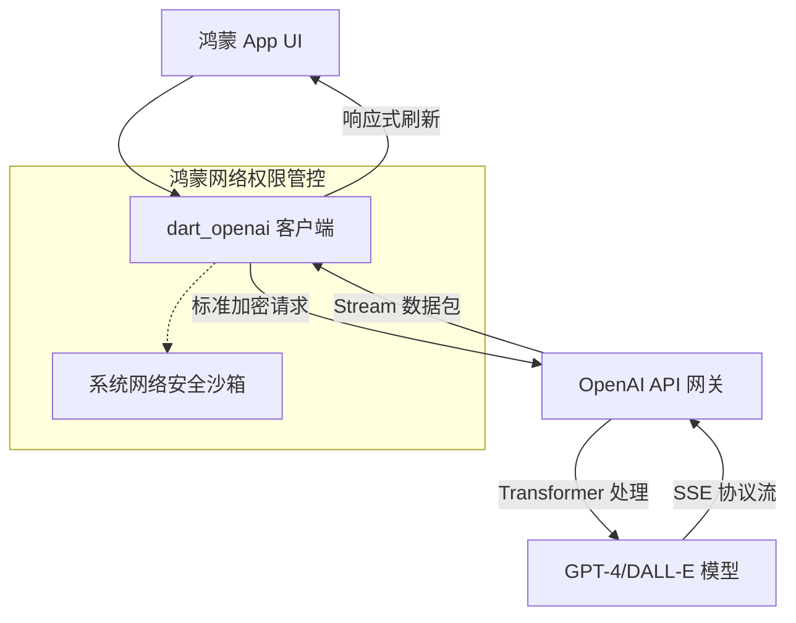

欢迎加入开源鸿蒙跨平台社区：[https://openharmonycrossplatform.csdn.net](https://openharmonycrossplatform.csdn.net)。

# Flutter for OpenHarmony：dart_openai — 智能化转型底座（AI 赋能引擎）

## 前言

随着华为鸿蒙（OpenHarmony）生态迈入原生智能（HarmonyOS Intelligence）时代，应用不仅需要精美的界面，更需要强大的 AI 逻辑处理能力。无论是构建智能客服、自动化文案生成，还是开发具有上下文理解能力的个人助手，大语言模型（LLM）的接入已成为现代应用的刚需。

`dart_openai` 是一款极其优雅且功能完备的 OpenAI API 封装库。它完全支持包括 Chat (ChatGPT)、Embeddings、DALL-E、Whisper 等在内的全线模型，并原生支持流式输出（Streaming）。在构建鸿蒙跨平台 AI 应用时，它不仅能让你摆脱繁琐的 HTTP 协议封装，更能通过强类型的接口保障业务逻辑的一致性，助力应用快速进化为“智能原生”。

## 一、原理展示 / 概念介绍

### 1.1 基础概念

本库实现了 Dart 应用与 OpenAI 云端大脑的稳定连接。



### 1.2 核心要点解析

- **单一实例管理**：通过配置全局 API Key 快速初始化，支持设置组织 ID 与不同模型前缀。
- **流式响应支持**：利用 Dart `Stream` 机制实现打字机式效果，避免鸿蒙端 UI 长时间无响应造成的死板体验。
- **类型安全模型**：为请求体和返回体提供了详尽的类定义，支持智能提示。

## 二、核心 API / 组件详解

### 2.1 依赖引入

在鸿蒙工程的 `pubspec.yaml` 中添加以下依赖：

```yaml
dependencies:
  dart_openai: ^5.0.0 # 请参考最新版本
```

### 2.2 基础初始化

💡 **技巧**：建议在应用入口处的 `main()` 方法中进行初始化。

```dart
import 'package:dart_openai/dart_openai.dart';

void initAI() {
  // ✅ 推荐做法：通过环境变量或安全加密存储获取 Key
  OpenAI.apiKey = "YOUR_OPENAI_KEY";
  // 如果使用代理服务器或中转站（国内开发者常用）
  OpenAI.baseUrl = "https://your-proxy-api.com";
}
```

### 2.3 发起对话请求

```dart
Future<void> askGPT() async {
  OpenAIChatCompletionModel chat = await OpenAI.instance.chat.create(
    model: "gpt-4",
    messages: [
      OpenAIChatCompletionChoiceMessageModel(
        content: "请解释一下什么是 OpenHarmony 的分布式软总线？",
        role: OpenAIChatMessageRole.user,
      ),
    ],
  );
  print(chat.choices.first.message.content);
}
```

## 三、场景示例

### 3.1 场景一：鸿蒙智能随身助手

通过接入 Chat API，在鸿蒙通知栏或负一屏动态生成今日行程建议的简报。

### 3.2 场景二：DALL-E 图像生成实验室

用户在鸿蒙端输入一段文字描述，App 实时生成高质量数字艺术作品并自动保存到鸿蒙系统相册。

## 四、OpenHarmony 平台适配挑战

### 4.1 网络稳定性与安全沙箱

鸿蒙系统对网络访问有严格的域控要求。

✅ **适配策略建议**：
1. **网络权限配置**：确保在鸿蒙应用的 `module.json5` 中正确申请了 `ohos.permission.INTERNET` 权限。
2. **连接超时处理**：由于 AI 响应较慢且依赖跨国链路，务必为库设置合理的超时时间或配合 `cancellation_token` 手动中断不再需要的会话，节省鸿蒙设备的功耗。

## 五、综合实战示例代码

以下是一个在鸿蒙应用中实现的“打字机”式智能对话组件演示：

```dart
import 'package:flutter/material.dart';
import 'package:dart_openai/dart_openai.dart';

class OpenAILabPage extends StatefulWidget {
  const OpenAILabPage({super.key});

  @override
  State<OpenAILabPage> createState() => _OpenAILabPageState();
}

class _OpenAILabPageState extends State<OpenAILabPage> {
  final List<String> _messages = [];
  String _typingMessage = "";

  void _sendQuestion() {
    // 💡 实战技巧：使用 Stream 实现流式输出展示
    final chatStream = OpenAI.instance.chat.createStream(
      model: "gpt-3.5-turbo",
      messages: [
        const OpenAIChatCompletionChoiceMessageModel(
          content: "用简洁的语言描述 Flutter 在鸿蒙端运行的优势。",
          role: OpenAIChatMessageRole.user,
        ),
      ],
    );

    chatStream.listen(
      (streamChatCompletion) {
        final content = streamChatCompletion.choices.first.delta.content;
        if (content != null) {
          setState(() {
            _typingMessage += content;
          });
        }
      },
      onDone: () {
        setState(() {
          _messages.add(_typingMessage);
          _typingMessage = "";
        });
      },
    );
  }

  @override
  Widget build(BuildContext context) {
    return Scaffold(
      appBar: AppBar(title: const Text('OpenAI 智能实验室')),
      body: Column(
        children: [
          Expanded(
            child: ListView.builder(
              itemCount: _messages.length + (_typingMessage.isNotEmpty ? 1 : 0),
              itemBuilder: (context, index) {
                final isTyping = index == _messages.length;
                return ListTile(
                  title: Align(
                    alignment: Alignment.centerLeft,
                    child: Container(
                      padding: const EdgeInsets.all(12),
                      decoration: BoxDecoration(color: Colors.blue[50], borderRadius: BorderRadius.circular(15)),
                      child: Text(isTyping ? _typingMessage : _messages[index]),
                    ),
                  ),
                );
              },
            ),
          ),
          Padding(
            padding: const EdgeInsets.all(16.0),
            child: ElevatedButton.icon(
              onPressed: _sendQuestion,
              icon: const Icon(Icons.psychology),
              label: const Text('咨询鸿蒙跨平台之道'),
            ),
          )
        ],
      ),
    );
  }
}
```

## 六、总结

`dart_openai` 为鸿蒙应用装上了“大脑”。在 AI 普惠的今天，这种快速集成云端强力模型的能力，是开发者建立竞争优势的关键。

✅ **核心建议**：
1. **安全第一**：切勿将 API Key 明文硬编码，建议通过鸿蒙系统提供的 `Security SafeStorage` 进行加密加载。
2. **用户预期管理**：AI 响应通常有秒级的延迟，在界面上务必展示鸿蒙风格的加载动效，防止用户误以为应用假死。
3. **结合混合模型**：复杂的逻辑请求云端 GPT 解决，简单的交互可以结合华为鸿蒙端侧模型（MindSpore Lite）实现离线智能。

📦 **完整代码已上传至 AtomGit**：[open-harmony-example/openai](https://atomgit.com/dragonbady/open-harmony-example/tree/main/examples/openai)

🌐 **欢迎加入开源鸿蒙跨平台社区**：[开源鸿蒙跨平台开发者社区](https://openharmonycrossplatform.csdn.net)
