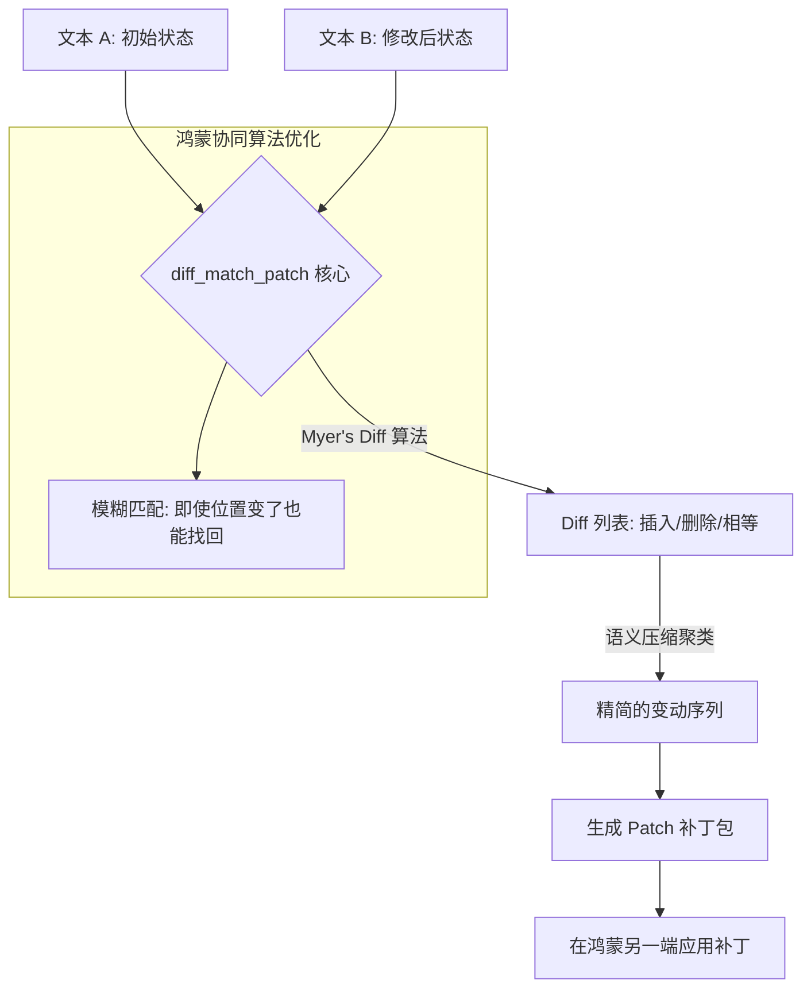

欢迎加入开源鸿蒙跨平台社区：[https://openharmonycrossplatform.csdn.net](https://openharmonycrossplatform.csdn.net)。

# Flutter for OpenHarmony：diff_match_patch — 文本的时光机（差异处理底座）

## 前言

在华为鸿蒙（OpenHarmony）生态的协同办公（多端同步预览）、代码编辑器以及具备“历史版本”功能的文档应用开发中，如何高效地计算两段文本之间的变动信息，是技术架构的关键。如果每次改动都全量传输数万字的文本，不仅会造成鸿蒙设备带宽的浪费，更无法实现精准的“冲突合并”和“改动高亮”。

`diff_match_patch` 是一款由 Google 开发、久经沙场的顶级算法库。它提供了一套极其严密的算法体系，涵盖了差异计算（Diff）、模糊匹配（Match）以及补丁生成（Patch）。在鸿蒙跨平台应用的开发中，它能让你以极高的效率，计算出“删除了哪些字”、“增加了哪些段落”。在构建鸿蒙平台的实时多人协作编辑器、内容对比工具、或者是轻量级版本管理系统时，它是实现“数据增量同步”的核心算法枢纽。

## 一、原理展示 / 概念介绍

### 1.1 基础概念

本库实现了从“原始文本”到“结构化变动集”的高级数学映射。



### 1.2 核心要点解析

- **毫秒级全量 Diff**：即便面对数十万字符的长文，其优化的算法也能在鸿蒙端瞬时输出差异报告，且保证差异的最小化（Most Compact）。
- **语义清洁化（Semantic Cleanup）**：不同于原始的字符对比，它提供了“语义清理”算子，确保输出的长句差异更符合人类阅读习惯，而非琐碎的字符碎片。
- **容错型补丁（Fuzzy Patching）**：允许在目标文本已被小范围修改的情况下，依然能精准地将补丁应用到正确的位置，对抗高并发冲突。

## 二、核心 API / 组件详解

### 2.1 依赖引入

在鸿蒙工程的 `pubspec.yaml` 中添加以下分工明确的依赖：

```yaml
dependencies:
  diff_match_patch: ^0.4.0 # 建议参考最新稳定版本
```

### 2.2 计算两段文字的差异

对比鸿蒙文档的两个版本：

```dart
import 'package:diff_match_patch/diff_match_patch.dart';

void compareHarmonyTexts() {
  String text1 = "OpenHarmony 是分布式操作系统。";
  String text2 = "OpenHarmony 是先进的分布式国产操作系统。";

  // ✅ 推荐做法：通过 diff 函数获取变动列表
  List<Diff> diffs = diff(text1, text2);
  
  // 💡 技巧：进行语义优化，让对比结果更容易读
  diffCleanupSemantic(diffs);

  for (var d in diffs) {
    print('状态: ${d.operation}, 内容: ${d.text}');
  }
}
```

### 2.3 生成并应用增量补丁

💡 **技巧**：仅同步 1KB 的补丁而非 1MB 的全量文档。

```dart
// 1. 生成补丁
List<Patch> patches = patchMake(text1, text2);
String patchString = patchToText(patches); // 💡 进行传输的数据流

// 2. 远端应用补丁
var result = patchApply(patches, remoteText);
String finalContent = result[0];
```

## 三、场景示例

### 3.1 场景一：鸿蒙端“文档历史”差异高亮视图

在笔记应用的“版本历史”页，利用 `diff` 结果，用红色删除线展现移除内容，用绿色背景展示新增内容，提供直观的编辑回溯体验。

### 3.2 场景二：极低带宽下的协同配置同步

在工业鸿蒙（OpenHarmony for Industry）场景中，传感器配置参数较多。当参数发生微调时，仅通过 `patch` 发送变更位，大幅提升在窄带通讯链路下的响应效率。

## 四、OpenHarmony 平台适配挑战

### 4.1 大规模 Diff 对 CPU 的集中消耗

虽然算法高效，但在进行百万级字符的比对时，会瞬间占满单核 CPU。

✅ **适配策略建议**：
1. **时间片限制（Timeout）**：利用 API 提供的 `diffTimeout` 参数。如果在指定时间内（如 500ms）未计算出最小差异，则返回当前已找到的最优解，防止由于计算过久导致鸿蒙主线程掉帧。
2. **后台计算（Isolate）**：针对文字量巨大的比对任务（如全文 Diff），务必开启鸿蒙的 `JobScheduler` 或在 Dart `Isolate` 中运行，渲染层仅展示加载动画，待结果算出后再进行 UI 更新。

## 五、综合实战示例代码

以下是一个演示如何在鸿蒙端实现的“文本变动可视化对比”实战组件：

```dart
import 'package:flutter/material.dart';
import 'package:diff_match_patch/diff_match_patch.dart';

class DiffLabPage extends StatefulWidget {
  const DiffLabPage({super.key});

  @override
  State<DiffLabPage> createState() => _DiffLabPageState();
}

class _DiffLabPageState extends State<DiffLabPage> {
  final _text1 = "HarmonyOS 是万物互联的基石";
  final _text2 = "HarmonyOS 是赋能万物互联的神奇基石系统";
  List<Diff> _result = [];

  void _runDiff() {
    // 💡 实战技巧：计算并做语义级优化
    final d = diff(_text1, _text2);
    diffCleanupSemantic(d);
    setState(() => _result = d);
  }

  @override
  Widget build(BuildContext context) {
    return Scaffold(
      appBar: AppBar(title: const Text('文本差异比对实验室')),
      body: Padding(
        padding: const EdgeInsets.all(24),
        child: Column(
          children: [
            const Icon(Icons.compare_arrows, size: 80, color: Colors.blueAccent),
            const SizedBox(height: 30),
            RichText(
              text: TextSpan(
                children: _result.map((d) {
                  // 根据变动类型应用不同样式
                  if (d.operation == DIFF_INSERT) {
                    return TextSpan(text: d.text, style: const TextStyle(backgroundColor: Colors.greenAccent, color: Colors.black));
                  } else if (d.operation == DIFF_DELETE) {
                    return TextSpan(text: d.text, style: const TextStyle(decoration: TextDecoration.lineThrough, color: Colors.red));
                  }
                  return TextSpan(text: d.text, style: const TextStyle(color: Colors.black));
                }).toList(),
              ),
            ),
            const Spacer(),
            ElevatedButton(onPressed: _runDiff, child: const Text('启动鸿蒙端侧差异分析')),
          ],
        ),
      ),
    );
  }
}
```

## 六、总结

`diff_match_patch` 库将复杂的字符串变动逻辑抽象为了纯粹的数学美感。它赋予了鸿蒙应用在处理内容演进时，具备极其高效、精准且稳健的操作能力。

✅ **核心建议**：
1. **语义清理（Cleanup）必选**：除非是在做代码对比，否则对于人类可读的文档比对，务必加上 `diffCleanupSemantic`。
2. **控制输入限制**：对于超过 2MB 的文本，在鸿蒙端建议分段（Chunks）进行比对，防止单次内存分配过大。
3. **结合 CRDT 思想**：虽然补丁算法很强，但在面临数十人同时实时编辑鸿蒙文档时，建议配合更高级的冲突解决策略（如 Operational Transformation）。

📦 **完整代码已上传至 AtomGit**：[open-harmony-example/diff_patch](https://atomgit.com/dragonbady/open-harmony-example/tree/main/examples/diff_patch)

🌐 **欢迎加入开源鸿蒙跨平台社区**：[开源鸿蒙跨平台开发者社区](https://openharmonycrossplatform.csdn.net)
