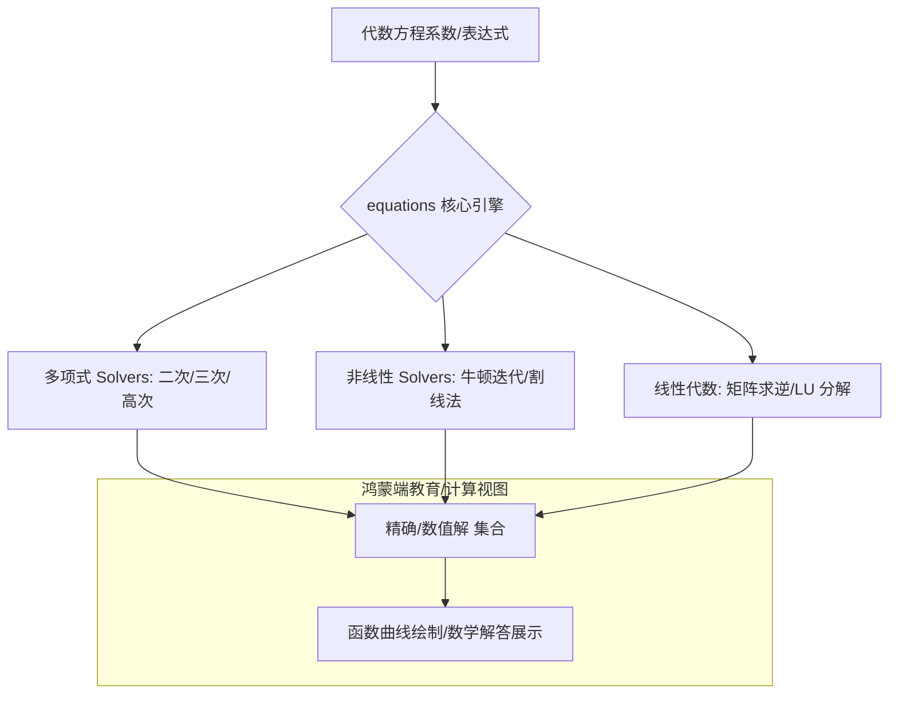

欢迎加入开源鸿蒙跨平台社区：[https://openharmonycrossplatform.csdn.net](https://openharmonycrossplatform.csdn.net)。

# Flutter for OpenHarmony：equations — 求解数学难题的精密芯片（数科建模底座）

## 前言

在华为鸿蒙（OpenHarmony）生态的教育类应用、金融精算工具以及工程仿真软件的开发中，对复杂代数方程的自动化求解是核心痛点。无论是解决一元二次方程的根、求解线性方程组的高斯消元法，还是进行复杂的数值分析插值，如果完全依赖手写逻辑，不仅极易出现浮点精度误差，更难以处理复数（Complex Numbers）域的特殊情况。

`equations` 是一款极致专业且功能纯粹的 Dart 数学库。它专注于各类多项式方程、非线性方程以及线性代数系统的数值求解。在鸿蒙跨平台开发中，它通过提供一套严谨的数学模型，让开发者能够以零成本在手机、平板端实现原本需要 Matlab 或专业数学终端才能完成的计算任务。在构建鸿蒙平台的智慧教室工具、工程参数计算器时，它是支撑专业性逻辑的核心基座。

## 一、原理展示 / 概念介绍

### 1.1 基础概念

本库实现了数学定义到算法算子的精准转化。



### 1.2 核心要点解析

- **多项式支持**：覆盖了从简单线性到四次方程的全解析解法，并能生成对应图像的顶点信息。
- **复数域运算**：原生支持 `Complex` 类，能处理判别式小于零时的所有情况，完美适配高等数学教学需求。
- **高性能迭代**：内置了包括 Brent 算法在内的多种高效非线性搜索算法，在鸿蒙端实现快速收敛。

## 二、核心 API / 组件详解

### 2.1 依赖引入

在鸿蒙工程的 `pubspec.yaml` 中添加以下依赖：

```yaml
dependencies:
  equations: ^5.0.0 # 请参考最新生产版本
```

### 2.2 求解一元二次方程

解决经典的抛物线焦点问题：

```dart
import 'package:equations/equations.dart';

void solveQuadratic() {
  // ✅ 推荐做法：通过 Quadratic 构造函数传入系数 a, b, c
  const eqn = Quadratic(
    a: Complex.fromReal(1),
    b: Complex.fromReal(-5),
    c: Complex.fromReal(6),
  );
  
  // 💡 技巧：调用 solutions 获取所有根
  final roots = eqn.solutions();
  print('方程的根为: ${roots[0]} 和 ${roots[1]}'); // 输出 2 和 3
}
```

### 2.3 求解复杂的线性方程组

💡 **技巧**：利用 `GaussianElimination` 处理工程中的力学平衡计算。

## 三、场景示例

### 3.1 场景一：鸿蒙“智慧校园”作业助手

通过输入题目系数，利用 `equations` 库自动生成详细的方程解析步骤和二次函数图像的关键点（顶点、对称轴、交点）。

### 3.2 场景二：金融理财应用的内含报酬率（IRR）计算

利用非线性迭代算子（如 `Newton` 法），根据现金流折现公式快速寻找复杂的利率根。

## 四、OpenHarmony 平台适配挑战

### 4.1 数值溢出与精度控制

复杂的代数运算中，极小的数值由于浮点表示（Double）可能会产生累积误差。

✅ **适配策略建议**：
1. **统一精度展示**：在鸿蒙端 UI 展示解时，建议结合 `num_extensions` 或自定义工具类对 `Complex` 返回的实部和虚部进行定点截断。
2. **长计算后台化**：对于需要高频迭代、搜索大量根的任务，务必在鸿蒙端的后台 `Isolate` 中执行，保护 UI 线程 120Hz 的动画流畅度。

## 五、综合实战示例代码

以下是一个演示如何在鸿蒙端利用 `equations` 实现一个在线“二次函数求解器”的实战：

```dart
import 'package:flutter/material.dart';
import 'package:equations/equations.dart';

class EquationsLabPage extends StatefulWidget {
  const EquationsLabPage({super.key});

  @override
  State<EquationsLabPage> createState() => _EquationsLabPageState();
}

class _EquationsLabPageState extends State<EquationsLabPage> {
  String _result = "输入系数 a, b, c 开始求解";

  void _calculateRoots() {
    // 💡 实战技巧：求解 x^2 - 3x + 2 = 0
    try {
      final quad = Quadratic(
        a: Complex.fromReal(1),
        b: Complex.fromReal(-3),
        c: Complex.fromReal(2),
      );
      
      final roots = quad.solutions();
      final discriminant = quad.discriminant();

      setState(() {
        _result = "解 1: ${roots[0]}\n解 2: ${roots[1]}\n判别式 Δ: $discriminant";
      });
    } catch (e) {
      setState(() => _result = "❌ 方程无解或输入无效");
    }
  }

  @override
  Widget build(BuildContext context) {
    return Scaffold(
      appBar: AppBar(title: const Text('高级代数方程实验室')),
      body: Center(
        child: Padding(
          padding: const EdgeInsets.all(24),
          child: Column(
            mainAxisAlignment: MainAxisAlignment.center,
            children: [
              const Icon(Icons.functions, size: 80, color: Colors.deepOrange),
              const SizedBox(height: 30),
              Container(
                width: double.infinity,
                padding: const EdgeInsets.all(20),
                decoration: BoxDecoration(color: Colors.orange[50], borderRadius: BorderRadius.circular(15)),
                child: Text(_result, textAlign: TextAlign.center, style: const TextStyle(fontSize: 18, height: 1.5)),
              ),
              const SizedBox(height: 50),
              ElevatedButton.icon(
                onPressed: _calculateRoots,
                icon: const Icon(Icons.calculate),
                label: const Text('立即执行鸿蒙端方程解析'),
              ),
            ],
          ),
        ),
      ),
    );
  }
}
```

## 六、总结

`equations` 赋予了 OpenHarmony 应用处理硬核数学问题的能力。它不仅是一款库，更是连接抽象数学理论与具象工程应用的数字化纽带。

✅ **核心建议**：
1. **异常健壮性**：数学运算中极其容易出现除零（Division by Zero）或不收敛的情况，务必使用 `try-catch` 包裹算法入口。
2. **结合可视化**：孤立的数字没有灵魂，建议配合 `scidart` 生成数据点并结合 `fl_chart` 绘制方程图像。
3. **理解算法边界**：识别什么时候使用解析解（精确），什么时候使用数值解（近似），这对高性能鸿蒙应用至关重要。

📦 **完整代码已上传至 AtomGit**：[open-harmony-example/equations](https://atomgit.com/dragonbady/open-harmony-example/tree/main/examples/equations)

🌐 **欢迎加入开源鸿蒙跨平台社区**：[开源鸿蒙跨平台开发者社区](https://openharmonycrossplatform.csdn.net)
