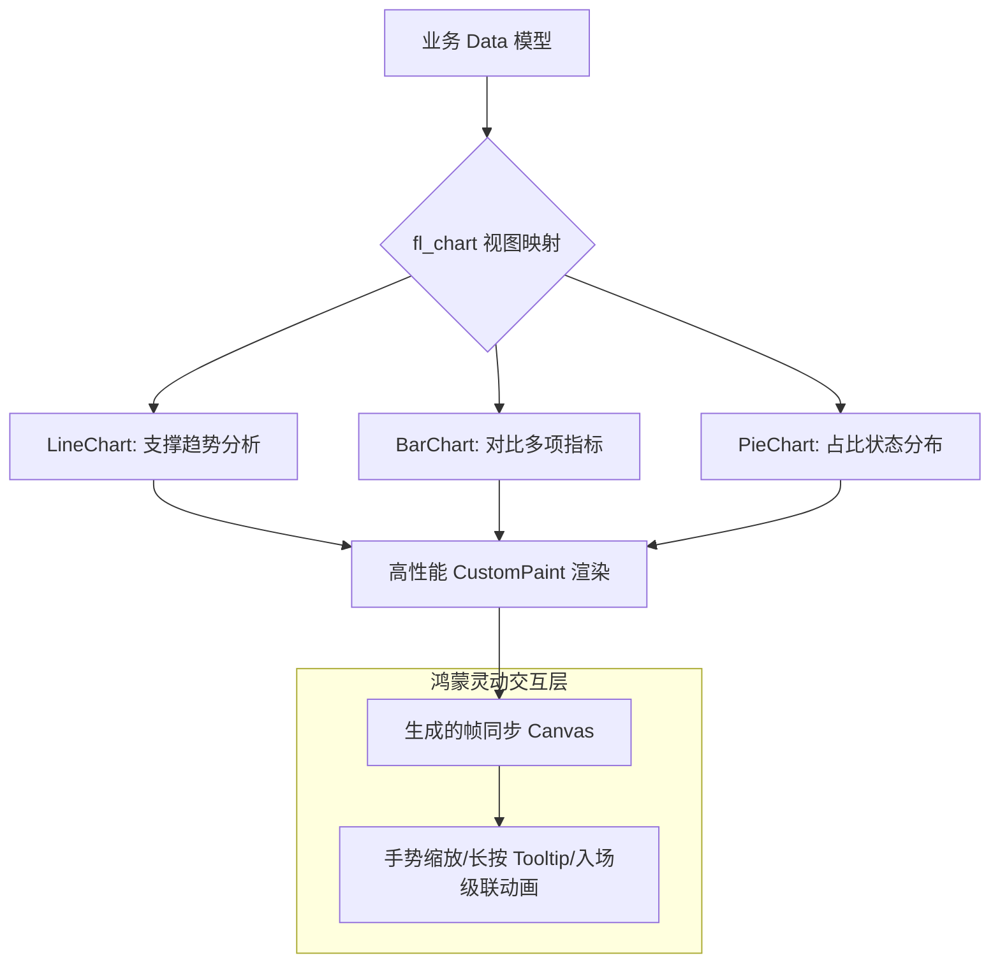

欢迎加入开源鸿蒙跨平台社区：[https://openharmonycrossplatform.csdn.net](https://openharmonycrossplatform.csdn.net)。

# Flutter for OpenHarmony：fl_chart — 数据视觉的魔法画卷（全场景图表底座）

## 前言

在华为鸿蒙（OpenHarmony）生态的运动健康监控、智慧能源看板以及个人金融管家应用的开发中，如何让枯燥的数据“动”起来，是提升应用格调的关键。一个合格的移动端图表不仅需要展示准确的数值，更需要具备优雅的入场动画、丝滑的手势触控反馈以及符合现代手机审美的视觉设计。

`fl_chart` 是一款专为 Flutter 打造的、目前社区最受欢迎的开源图表库。它不同于传统晦涩的商业图表，采用完全响应式的 Widget 架构，支持极其细腻的动画定制。在鸿蒙跨平台应用的开发中，它能让你以极简的 DSL（领域特定语言）定义，构建出足以媲美系统原生审美的高性能折线图、柱状图、饼图、雷达图及散点图。在打造鸿蒙平台的个性化数据看板或智慧生活趋势图时，它是实现“颜值即正义”的核心交互组件。

## 一、原理展示 / 概念介绍

### 1.1 基础概念

本库实现了“声明式”绘图与“高性能” Canvas 渲染的完美平衡。



### 1.2 核心要点解析

- **触控反馈系统（Touch System）**：内置了完善的点击（Touch）与悬停监测，支持在鸿蒙屏幕上实时精准地定位数据点并显示自定义 Tooltip。
- **极致的风格化**：支持渐变色填充、阴影散射、虚线配置以及自定义 Axis 图形，完全匹配鸿蒙系统特有的微卡片设计语言。
- **平滑的动画序列**：所有数据的变动都支持自动的平滑过渡动效，让鸿蒙应用展示数据时呈现出一种“液态流动”的视觉感。

## 二、核心 API / 组件详解

### 2.1 依赖引入

在鸿蒙工程的 `pubspec.yaml` 中添加以下分工明确的依赖：

```yaml
dependencies:
  fl_chart: ^0.63.0 # 请参考最新生产版本
```

### 2.2 绘制高颜值折线图

展示鸿蒙设备 7 天内的运动心率起伏：

```dart
import 'package:fl_chart/fl_chart.dart';

// ✅ 推荐做法：使用 LineChart 包裹 LineChartData
LineChart(
  LineChartData(
    gridData: FlGridData(show: false), // 💡 技巧：隐藏背景网格，追求极简视觉
    titlesData: FlTitlesData(show: true), // 坐标轴文案
    borderData: FlBorderData(show: false),
    lineBarsData: [
      LineChartBarData(
        spots: [FlSpot(0, 3), FlSpot(2, 5), FlSpot(5, 4)],
        isCurved: true, // 💡 技巧：开启曲线平滑模式
        color: Colors.blueAccent,
        barWidth: 4,
        belowBarData: BarAreaData(show: true, color: Colors.blueAccent.withOpacity(0.2)),
      ),
    ],
  ),
)
```

### 2.3 饼图的高级交互（Selection）

💡 **技巧**：在鸿蒙端实现点击扇区自动放大效果，增强反馈感。

## 三、场景示例

### 3.1 场景一：鸿蒙“运动健康”App 步数月统计

利用 `BarChart` 展示一个月 30 天的步数分布。配合 `fl_chart` 的大数据模式，确保多柱位排布下依然保持滑动流畅。

### 3.2 场景二：智慧电力“用能比例”分析

通过 `PieChart` 的中心孔（Center Hole）模式，展示各类电器的功耗占比，并在圆心处实时显示当前总负载。

## 四、OpenHarmony 平台适配挑战

### 4.1 高刷屏幕的任务冲突

由于 `fl_chart` 的交互实时重绘频率较高，在鸿蒙 120Hz 刷新率下，频繁的 Canvas 重绘可能会触发鸿蒙系统的过热降频保护。

✅ **适配策略建议**：
1. **控制重绘精度**：在非交互期间，锁定绘制状态。仅在手势发生时开启高频计算。
2. **利用 `RepaintBoundary`**：将复杂的图表放置在独立的重绘边界内，避免图表的变动导致整个鸿蒙页面的无效重绘，保护系统的能效比。

## 五、综合实战示例代码

以下是一个演示如何在鸿蒙端实现的“动感折线趋势看板”实战：

```dart
import 'package:flutter/material.dart';
import 'package:fl_chart/fl_chart.dart';

class FlChartLabPage extends StatefulWidget {
  const FlChartLabPage({super.key});

  @override
  State<FlChartLabPage> createState() => _FlChartLabPageState();
}

class _FlChartLabPageState extends State<FlChartLabPage> {
  @override
  Widget build(BuildContext context) {
    return Scaffold(
      appBar: AppBar(title: const Text('数据视觉魔法实验室')),
      body: Container(
        height: 300,
        padding: const EdgeInsets.all(24),
        child: LineChart(
          LineChartData(
            lineTouchData: LineTouchData(
              touchTooltipData: LineTouchTooltipData(
                tooltipBgColor: Colors.blueGrey.withOpacity(0.8),
              ),
            ),
            // 💡 实战技巧：开启主趋势线配置
            lineBarsData: [
              LineChartBarData(
                spots: const [
                  FlSpot(0, 1.2), FlSpot(1, 2.5), FlSpot(2, 5.0),
                  FlSpot(3, 4.2), FlSpot(4, 3.1), FlSpot(5, 6.8),
                ],
                isCurved: true,
                gradient: const LinearGradient(colors: [Colors.cyan, Colors.blue]),
                barWidth: 5,
                dotData: const FlDotData(show: false),
                belowBarData: BarAreaData(
                   show: true, 
                   gradient: LinearGradient(colors: [Colors.cyan.withOpacity(0.1), Colors.blue.withOpacity(0.1)])
                ),
              ),
            ],
          ),
        ),
      ),
    );
  }
}
```

## 六、总结

`fl_chart` 让数据不再是冷冰冰的数字，而是一场跳跃在鸿蒙屏幕上的交互盛宴。在追求极致审美和技术底层深度打磨的今天，它是鸿蒙跨平台应用在可视化领域最强有力的支点。

✅ **核心建议**：
1. **极简主义**：在小屏幕上尽量隐藏不必要的轴线和网格线，让数据本身成为主角。
2. **配合异步加载**：由于图表绘制涉及坐标转换，大量原始数据建议在鸿蒙端异步处理后再转换成 `FlSpot` 集合。
3. **颜色心理学**：合理利用鸿蒙系统的主题色板，确保在深色模式（Dark Mode）下，图表的对比度和阅读感依然卓越。

📦 **完整代码已上传至 AtomGit**：[open-harmony-example/fl_chart](https://atomgit.com/dragonbady/open-harmony-example/tree/main/examples/fl_chart)

🌐 **欢迎加入开源鸿蒙跨平台社区**：[开源鸿蒙跨平台开发者社区](https://openharmonycrossplatform.csdn.net)
