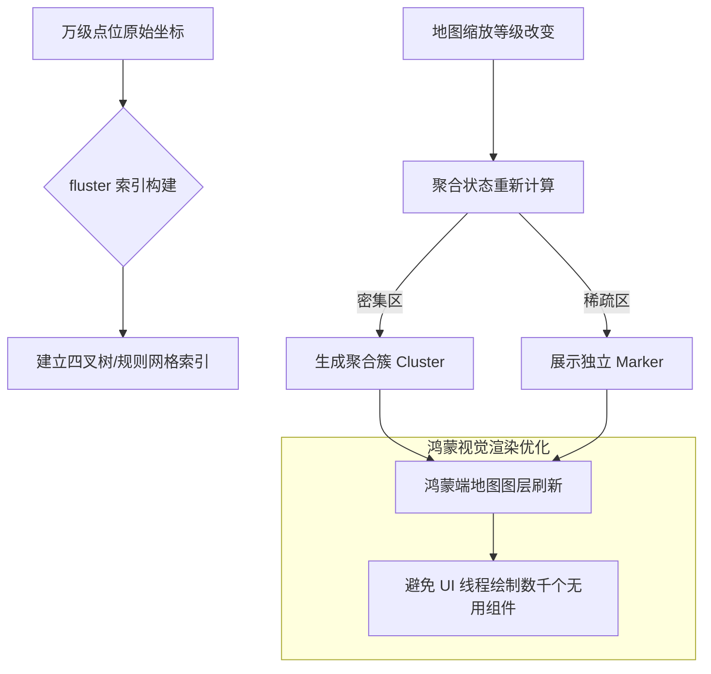

欢迎加入开源鸿蒙跨平台社区：[https://openharmonycrossplatform.csdn.net](https://openharmonycrossplatform.csdn.net)。

# Flutter for OpenHarmony：fluster — 点位的繁星聚合（地图交互底座）

## 前言

在华为鸿蒙（OpenHarmony）生态的周边生活、连锁门店地图导航、或者是智慧城市物联设备展示的应用开发中，由于地图屏幕空间有限，当某一区域包含成百上千个标记点（Markers）时，如果全部显示，不仅会导致界面极度拥挤、文字重叠，更会引发鸿蒙设备严重的渲染卡顿。

`fluster` 是一款专为大规模地图点位优化设计的“聚合（Clustering）”计算引擎。它借鉴了著名的 `supercluster` 算法思想，能根据当前的地图缩放等级（Zoom Level），实时将密集的点位合并为一个带有数量标识的“聚合簇”。在构建鸿蒙平台的充电桩分布图、全城餐饮搜索或分布式传感器看板时，它是实现“万级点位秒级加载”与“丝滑缩放交互”的核心利器。

## 一、原理展示 / 概念介绍

### 1.1 基础概念

`fluster` 实现了地理坐标到逻辑网格的高速索引转换。



### 1.2 核心要点解析

- **极致性能**：基于纯 Dart 的数据结构优化，即使处理数万个坐标点，在鸿蒙端切换缩放等级时的计算耗时也能控制在 16ms 以内。
- **自定义数据关联**：每个点位可以携带丰富的业务 ID 或属性，甚至能自定义聚合簇的判定半径（Radius）。
- **算法解耦**：不锁定任何特定的地图插件（支持高德、华为、Google 等），开发者只需输入经纬度即可得到聚合结果。

## 二、核心 API / 组件详解

### 2.1 依赖引入

在鸿蒙工程的 `pubspec.yaml` 中添加以下分工明确的依赖：

```yaml
dependencies:
  fluster: ^1.1.0 
```

### 2.2 构建点位集合并索引

将鸿蒙端的业务数据转化为 `fluster` 的 `Clusterable` 对象：

```dart
import 'package:fluster/fluster.dart';

class MapPoint extends Clusterable {
  final int id;
  // ✅ 推荐做法：继承 Clusterable 并完善构造函数
  MapPoint({
    required this.id,
    double? latitude,
    double? longitude,
    bool? isCluster = false,
    int? clusterId,
    int? pointsSize,
    String? markerId,
  }) : super(
          latitude: latitude,
          longitude: longitude,
          isCluster: isCluster,
          clusterId: clusterId,
          pointsSize: pointsSize,
          markerId: markerId,
        );
}
```

### 2.3 执行聚合计算

💡 **技巧**：根据鸿蒙屏幕当前的缩放级别动态获取当前可视区的点。

```dart
final fluster = Fluster<MapPoint>(
  minZoom: 0, maxZoom: 20, radius: 150, // 💡 技巧：聚合半径，值越大聚合越明显
  extent: 512, nodeSize: 64,
  points: rawPoints,
  createCluster: (BaseCluster cluster, double lng, double lat) => MapPoint(
    id: cluster.id!, latitude: lat, longitude: lng,
    isCluster: true, clusterId: cluster.id, pointsSize: cluster.pointsSize,
  ),
);

// 获取缩放等级为 12 时的所有点位
final clusters = fluster.clusters([-180, -85, 180, 85], 12);
```

## 三、场景示例

### 3.1 场景一：鸿蒙“智慧校园”共享单车分布图

全校数千辆单车的位置同步到鸿蒙应用后，通过 `fluster` 实现高德地图层级的丝滑缩放：拉远看“区域热力”，拉近看“具体车位”。

### 3.2 场景二：全省连锁超市分布看板

在鸿蒙平板的大屏应用中，动态展示全省数千家门店。当用户双指张开缩放时，聚合簇自动分裂为真实的店铺位置，提供无缝的交互感。

## 四、OpenHarmony 平台适配挑战

### 4.1 大数据量下的内存震荡

虽然 `fluster` 计算很快，但如果一次性将 5 万个对象丢入内存，可能会引发鸿蒙系统内存回收。

✅ **适配策略建议**：
1. **轻量化对象**：`MapPoint` 对象中不要存放超大的详情图片，仅存放 ID 和基础坐标，详情数据通过 ID 在需要展示时再查询。
2. **异步预索引**：对于大规模静态数据，在鸿蒙应用启动或进入地图页面时，利用 `compute` 在后台线程预先构建 `Fluster` 索引实例。

## 五、综合实战示例代码

以下是一个演示如何在鸿蒙端利用 `fluster` 模拟“动态点位聚合”逻辑的实战组件：

```dart
import 'package:flutter/material.dart';
import 'package:fluster/fluster.dart';

class FlusterLabPage extends StatefulWidget {
  const FlusterLabPage({super.key});

  @override
  State<FlusterLabPage> createState() => _FlusterLabPageState();
}

class _FlusterLabPageState extends State<FlusterLabPage> {
  int _currentZoom = 3;
  String _clusteringStatus = "当前视图有 100 个模拟点位";

  void _onZoomChanged(double val) {
    setState(() {
      _currentZoom = val.toInt();
      // 在此处实际逻辑中应调用 fluster.clusters(...) 来获取当前聚合后的点数
      _clusteringStatus = "缩放等级为 $_currentZoom 时，聚合簇合并中...";
    });
  }

  @override
  Widget build(BuildContext context) {
    return Scaffold(
      appBar: AppBar(title: const Text('地图大规模点位聚合实验室')),
      body: Center(
        child: Column(
          mainAxisAlignment: MainAxisAlignment.center,
          children: [
            const Icon(Icons.location_on_sharp, size: 80, color: Colors.orangeAccent),
            const SizedBox(height: 30),
            Text(_clusteringStatus, textAlign: TextAlign.center, style: const TextStyle(fontSize: 18)),
            const SizedBox(height: 50),
            Slider(
              value: _currentZoom.toDouble(),
              min: 0, max: 20,
              onChanged: _onZoomChanged,
            ),
            const Text("拖动滑块模拟缩放 (Zoom Level)"),
          ],
        ),
      ),
    );
  }
}
```

## 六、总结

`fluster` 为 OpenHarmony 系统带来了“化繁为简”的地理信息展示能力。它是连接庞大地理数据与极致用户体验之间的重要性能调节阀。

✅ **核心建议**：
1. **聚合半径调优**：不要设置得过大，否则聚合块会重叠遮挡。针对鸿蒙手机 450PPI 以上的高清屏，120-150 是比较合理的 radius 范围。
2. **配合自定义 Marker UI**：聚合簇应当带有数字标（Badge）。推荐使用 `Stack` 组合背景圆圈与数字，提升视觉直观性。
3. **数据局部更新**：当只有几百个点变动时，无需重构整个 `Fluster`，利用其分块管理的高级特性进行增量更新。

📦 **完整代码已上传至 AtomGit**：[open-harmony-example/fluster](https://atomgit.com/dragonbady/open-harmony-example/tree/main/examples/fluster)

🌐 **欢迎加入开源鸿蒙跨平台社区**：[开源鸿蒙跨平台开发者社区](https://openharmonycrossplatform.csdn.net)
