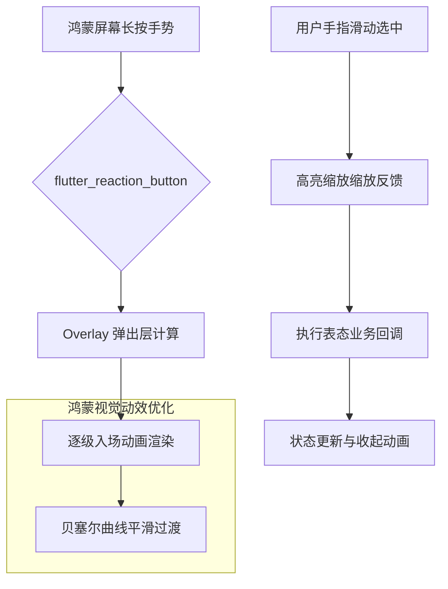

欢迎加入开源鸿蒙跨平台社区：[https://openharmonycrossplatform.csdn.net](https://openharmonycrossplatform.csdn.net)。

# Flutter for OpenHarmony：flutter_reaction_button — 指尖的情绪引擎（灵动交互底座）

## 前言

在华为鸿蒙（OpenHarmony）生态的社交、内容社区以及协作办公应用中，用户交互已经不再满足于简单的“点赞”或“转发”。当代应用更倾向于让用户通过长按弹出一组生动的 Emoji（赞、爱、哭、怒）来精准表达情绪反馈。这种交互不仅能显著提升应用的用户黏性，更是现代移动端审美的重要组成部分。

`flutter_reaction_button` 是一款专为打造多维表态（Reaction）功能而生的顶级 UI 组件库。它支持高度自定义的弹出动效、平滑的选中触发以及完善的事件回调。在鸿蒙跨平台应用的开发中，它完美适配了鸿蒙设备的高灵敏度触控反馈。在构建鸿蒙平台的动态流（Feed）系统、团队协作工具的即时回复、或是个性化电商评价体系时，它是实现“情绪交互升级”的核心视觉插件。

## 一、原理展示 / 概念介绍

### 1.1 基础概念

本组件实现了从“长按触发”到“多态面元（Reactions）呈现”的交互闭环。



### 1.2 核心要点解析

- **分层弹出机制（Overlay）**：所有的 Emoji 或图片均渲染在独立图层，不会受到父级组件裁剪（Clip）的影响，确保展示效果的完整性。
- **完善的手势追踪**：精确识别用户的滑动轨迹，在鸿蒙曲面屏或折叠屏上依然能拥有丝滑的选中确定感。
- **全场景适配**：支持不仅仅是 Emoji，还可以是任何 Widget（图表、文字、本地图片），给予开发者极大的创作空间。

## 二、核心 API / 组件详解

### 2.1 依赖引入

在鸿蒙工程的 `pubspec.yaml` 中添加以下依赖：

```yaml
dependencies:
  flutter_reaction_button: ^2.1.0 # 建议参考最新稳定版本
```

### 2.2 定义表态数据源

在鸿蒙工程中初始化你需要的“情绪列表”：

```dart
import 'package:flutter_reaction_button/flutter_reaction_button.dart';

final harmonyReactions = [
  Reaction<String>(
    id: '1', title: Text('爱了'),
    previewIcon: Image.asset('assets/love.png'), // 展示图
    icon: Image.asset('assets/love_active.png'), // 选中后图
    value: 'LOVE',
  ),
  Reaction<String>(
    id: '2', title: Text('赞一个'),
    previewIcon: Image.asset('assets/like.png'),
    value: 'LIKE',
  ),
];
```

### 2.3 构建 ReactionButton

💡 **技巧**：将按钮放入列表中使用，并监听回调。

```dart
ReactionButton<String>(
  onReactionChanged: (reaction) {
    print('用户在鸿蒙端做出了表态: ${reaction?.value}');
  },
  reactions: harmonyReactions,
  initialReaction: harmonyReactions.first,
  boxColor: Colors.white.withOpacity(0.9), // 💡 技巧：半透明毛玻璃质感
)
```

## 三、场景示例

### 3.1 场景一：鸿蒙端“高品质”社交动态

在朋友圈或动态列表底部，通过该组件替换传统的“心形”点赞，为用户提供多样化的情感表达，显著增加互动的趣味性。

### 3.2 场景二：企业内协作工具（IM）的消息回复

在消息气泡上长按，弹出一组常用的业务状态（已读、处理中、加急），提升鸿蒙端协同效率。

## 四、OpenHarmony 平台适配挑战

### 4.1 复杂动效下的内存占位与帧率抖动

在列表（ListView）中大量使用带有动效的 Reaction 按钮时，不恰当的图层管理会导致内存激增。

✅ **适配策略建议**：
1. **控制预览图质量**：弹出预览的 Emoji 图片建议在鸿蒙端配合 `ResizeImage` 进行尺寸裁剪，无需加载 100% 分辨率的原图。
2. **手势优先级控制**：在鸿蒙的全屏手势与组件的长按逻辑发生冲突时，通过 `InteractionManager` 调优，确保弹出层的优先级高于侧滑返回手势，避免误触。

## 五、综合实战示例代码

以下是一个演示如何在鸿蒙端实现的“极简灵动表态”页面示例：

```dart
import 'package:flutter/material.dart';
import 'package:flutter_reaction_button/flutter_reaction_button.dart';

class ReactionLabPage extends StatelessWidget {
  const ReactionLabPage({super.key});

  @override
  Widget build(BuildContext context) {
    return Scaffold(
      appBar: AppBar(title: const Text('指尖情绪实验室')),
      body: Center(
        child: Column(
          mainAxisAlignment: MainAxisAlignment.center,
          children: [
            const Icon(Icons.face_retouching_natural, size: 80, color: Colors.blueAccent),
            const SizedBox(height: 30),
            const Text("长按下方按钮解锁鸿蒙社交互动"),
            const SizedBox(height: 50),
            // 💡 实战演示：构造一个 ReactionButton
            ReactionButton<String>(
              onReactionChanged: (r) => ScaffoldMessenger.of(context).showSnackBar(
                SnackBar(content: Text('👍 鸿蒙用户已表态：${r?.id}'))
              ),
              reactions: [
                Reaction(id: '🔥', previewIcon: _buildIcon('🔥'), icon: _buildIcon('🔥')),
                Reaction(id: '❤️', previewIcon: _buildIcon('❤️'), icon: _buildIcon('❤️')),
                Reaction(id: '😂', previewIcon: _buildIcon('😂'), icon: _buildIcon('😂')),
              ],
            ),
          ],
        ),
      ),
    );
  }

  Widget _buildIcon(String text) => Text(text, style: const TextStyle(fontSize: 24));
}
```

## 六、总结

`flutter_reaction_button` 为 OpenHarmony 跨平台应用赋予了更加细腻的人机交互层级。它将原本枯燥的一对一反馈转化为了充满生机、富有情感节奏的视觉体验，是提升应用精品感的不二选择。

✅ **核心建议**：
1. **适配系统色彩**：弹出框的背景色建议联动鸿蒙系统的亮/暗色模式，并开启 Subtle Shadow（微妙投影）。
2. **配合触感反馈**：在弹出开始时触发一次轻微的系统级震动（Haptics），会让用户感到交互非常有“质感”。
3. **内容精炼**：表态项不宜超过 6 个，否则在窄屏鸿蒙设备上会引发 UI 布局超出（Overflow）。

📦 **完整代码已上传至 AtomGit**：[open-harmony-example/reaction](https://atomgit.com/dragonbady/open-harmony-example/tree/main/examples/reaction)

🌐 **欢迎加入开源鸿蒙跨平台社区**：[开源鸿蒙跨平台开发者社区](https://openharmonycrossplatform.csdn.net)
