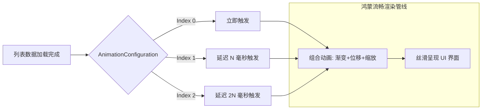

欢迎加入开源鸿蒙跨平台社区：[https://openharmonycrossplatform.csdn.net](https://openharmonycrossplatform.csdn.net)。

# Flutter for OpenHarmony：flutter_staggered_animations — 灵动级联动画引擎（UI 动效底座）

## 前言

在华为鸿蒙（OpenHarmony）生态的交互设计规范中，“感知灵动”是其核心美学。当用户打开一个包含大量数据的页面时，如果列表项是瞬间死板地弹出来，会给人一种生硬的技术冰冷感。

`flutter_staggered_animations` 能够轻松为你的列表组件注入“呼吸感”。它通过自动计算每个子项的动画延迟（Delay），实现了如同涟漪般扩散的级联加载效果（Staggered Effects）。在构建鸿蒙平台的系统设置项、新闻流、应用市场列表或数据大盘时，它能以极低的代码侵入性，瞬间提升整个 App 的流畅质感与高级动效体验。

## 一、原理展示 / 概念介绍

### 1.1 基础概念

交错动画的核心在于“时间差”的自动化分配。



### 1.2 核心要点解析

- **AnimationConfiguration**：全局动画配置器，负责根据子项的索引自动派发时间延迟。
- **动画算子（Animators）**：提供 `FadeInAnimation` (淡入), `SlideAnimation` (滑动), `ScaleAnimation` (缩放) 等多种原子动效。
- **高阶控制**：支持自定义插值器（Curves）与持续时间，完美匹配鸿蒙系统特有的弹性动画风格。

## 二、核心 API / 组件详解

### 2.1 依赖引入

在鸿蒙工程的 `pubspec.yaml` 中添加以下依赖：

```yaml
dependencies:
  flutter_staggered_animations: ^1.0.0
```

### 2.2 为 ListView 注入级联生命力

实现一个经典的渐进式淡入滑动列表：

```dart
import 'package:flutter_staggered_animations/flutter_staggered_animations.dart';

// ✅ 推荐做法：在 ListView.builder 中使用 AnimationLimiter 包装
AnimationLimiter(
  child: ListView.builder(
    itemCount: 20,
    itemBuilder: (context, index) {
      return AnimationConfiguration.staggeredList(
        position: index,
        duration: const Duration(milliseconds: 375),
        child: const SlideAnimation(
          verticalOffset: 50.0, // 💡 技巧：从底部向上滑入 50 像素
          child: FadeInAnimation(child: YourItemWidget()),
        ),
      );
    },
  ),
)
```

### 2.3 动画组合技巧

💡 **技巧**：可以将 `ScaleAnimation` 与 `FadeInAnimation` 嵌套，产生从中心向四周扩散的灵动感，非常适合鸿蒙平板的 Grid 布局。

## 三、场景示例

### 3.1 场景一：鸿蒙多任务管理中心

当用户切换任务卡片时，通过 `flutter_staggered_animations` 赋予卡片列表从侧边依次弹出的跃动交互。

### 3.2 场景二：智能家居控制面板

在鸿蒙手机上点击进入“智慧生活”页面，所有的家居状态卡片自顶向下级联显现。

## 四、OpenHarmony 平台适配挑战

### 4.1 高帧率屏幕下的抖动表现

鸿蒙旗舰设备普遍支持 120Hz 刷新。如果默认的持续时间太短，由于动画曲线的陡峭度，可能会显得突兀。

✅ **适配策略建议**：
1. **采用标准的 `Curves.easeOutQuart`**：这种曲线具有“快启缓停”的特性，符合华为鸿蒙官方推荐的动效物理学。
2. **限制渲染数量**：如果列表非常长，由于每一项都在执行动画，JS/Dart 虚拟机会有瞬时负担。建议将动画应用于屏幕首屏可见的前 10-15 项，后续由于快速滑动产生的元素则无需反复触发级联动效，保护鸿蒙系统的功耗。

## 五、综合实战示例代码

以下是一个演示如何为鸿蒙系统“发现”页面列表添加高级级联动画的实战组件：

```dart
import 'package:flutter/material.dart';
import 'package:flutter_staggered_animations/flutter_staggered_animations.dart';

class StaggeredLabPage extends StatelessWidget {
  const StaggeredLabPage({super.key});

  @override
  Widget build(BuildContext context) {
    return Scaffold(
      appBar: AppBar(title: const Text('级联动画实验室')),
      body: AnimationLimiter(
        child: ListView.builder(
          padding: const EdgeInsets.all(16),
          itemCount: 10,
          itemBuilder: (context, index) {
            // 💡 实战技巧：综合使用多重动画算子
            return AnimationConfiguration.staggeredList(
              position: index,
              duration: const Duration(milliseconds: 500),
              child: SlideAnimation(
                horizontalOffset: 80.0, // 💡 从右侧水平滑入
                child: FadeInAnimation(
                  child: Card(
                    margin: const EdgeInsets.only(bottom: 16),
                    elevation: 2,
                    shape: RoundedRectangleBorder(borderRadius: BorderRadius.circular(15)),
                    child: ListTile(
                      leading: CircleAvatar(backgroundColor: Colors.blue[100], child: Text("${index + 1}")),
                      title: Text("鸿蒙跨平台特性 $index"),
                      subtitle: const Text("感受极致流畅的级联动效"),
                      trailing: const Icon(Icons.chevron_right),
                    ),
                  ),
                ),
              ),
            );
          },
        ),
      ),
    );
  }
}
```

## 六、总结

`flutter_staggered_animations` 深刻践行了“无动画，不设计”的理念。在 OpenHarmony 这样追求高级审美与丝滑感的平台上，它是你打动用户视觉、彰显细腻体验的最轻量化手段。

✅ **核心建议**：
1. **克制使用**：动效虽好，切莫贪杯。只有在主层级跳转或核心列表加载时才使用级联动画，防止过多的视觉干扰导致用户疲劳。
2. **性能基准测试**：在不同的鸿蒙设备上测试，确保在 120Hz 屏幕上没有掉帧现象。
3. **搭配加载状态**：建议在骨架屏（Shimmer）数据填充后，立即接上级联动画，形成完美的加载逻辑闭环。

📦 **完整代码已上传至 AtomGit**：[open-harmony-example/staggered](https://atomgit.com/dragonbady/open-harmony-example/tree/main/examples/staggered)

🌐 **欢迎加入开源鸿蒙跨平台社区**：[开源鸿蒙跨平台开发者社区](https://openharmonycrossplatform.csdn.net)
