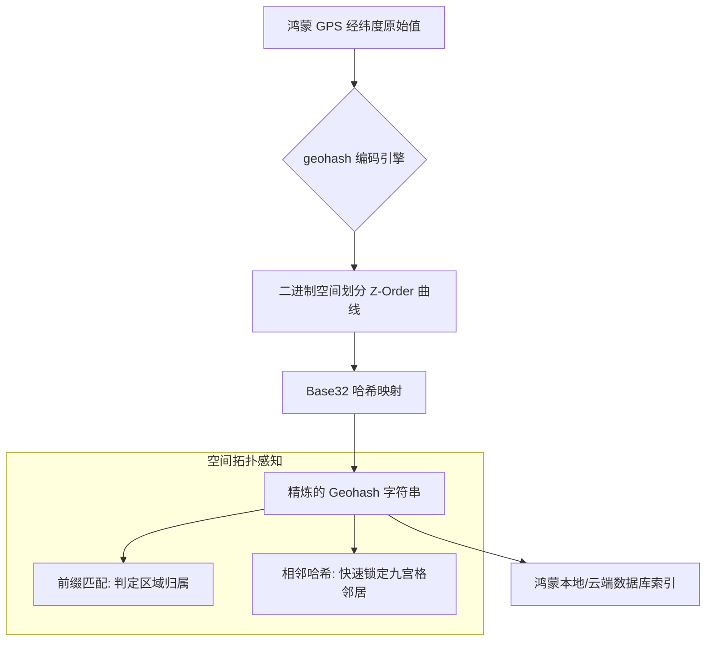

欢迎加入开源鸿蒙跨平台社区：[https://openharmonycrossplatform.csdn.net](https://openharmonycrossplatform.csdn.net)。

# Flutter for OpenHarmony：geohash — 坐标的魔法指纹（地理索引底座）

## 前言

在华为鸿蒙（OpenHarmony）生态的本地生活服务、同城配送以及基于地理位置的社交应用中，如何对大规模的经纬度数据进行快速检索和排序是核心痛点。直接对比成千上万个浮点数坐标点不仅计算量巨大，也无法有效利用数据库的 B-Tree 索引进行范围查询。

`geohash` 是一款极致轻量的地理编码算法库。它能将复杂的二维经纬度坐标（如 [31.23, 121.47]）压缩成一个简短且具备前缀匹配特性的字符串（如 `wtw3sjv`）。在鸿蒙跨平台应用的开发中，它凭借其高度压缩和易于比较的特性，让开发者能够实现“附近的人”、“周围 1km 的商铺”等核心功能的极速响应。在构建鸿蒙平台的智慧城市监测点、加油站导航或实时位置聚合展示时，它是实现“高性能空间查询”的底层数学基座。

## 一、原理展示 / 概念介绍

### 1.1 基础概念

Geohash 是一种将多维地理数据降维为一维字符串的分形算法。



### 1.2 核心要点解析

- **空间邻近性保证**：字符串前缀越长，代表两个地理点离得越近。这让鸿蒙应用能通过简单的字符串前缀查询（`LIKE 'wtw3%'`）瞬间拉取出某个街区的全部数据。
- **高压缩率**：一个 12 位的 Geohash 字符串即可提供 19 毫米级的定位精度，极大节省了鸿蒙设备间同步坐标时的带宽。
- **邻域快速生成**：内置了获取目标 Geohash 周围 8 个邻居单元（九宫格）的能力，完美适配所有“附近服务”的开发模型。

## 二、核心 API / 组件详解

### 2.1 依赖引入

在鸿蒙工程的 `pubspec.yaml` 中添加以下依赖：

```yaml
dependencies:
  dart_geohash: ^1.0.0 # 建议参考最新稳定版本
```

### 2.2 坐标到哈希的一键转换

获取当前鸿蒙设备位置的“地理指纹”：

```dart
import 'package:dart_geohash/dart_geohash.dart';

void encodeLocation(double lat, double lon) {
  // ✅ 推荐做法：通过 GeoHasher 进行编解码
  var hasher = GeoHasher();
  
  // 1. 编码：经纬度 -> 字符串
  String hash = hasher.encode(lon, lat, precision: 7); // 💡 技巧：指定精度（7 位约 150m）
  print('鸿蒙坐标指纹: $hash');
}
```

### 2.3 获取邻域（九宫格）查询范围

💡 **技巧**：在构建鸿蒙端“地图大头针”加载逻辑时，获取周围 8 个区域。

```dart
// 获取当前位置周围的 8 个相连区域
Map<String, String> neighbors = hasher.getNeighbors(hash);
```

## 三、场景示例

### 3.1 场景一：鸿蒙“社区团购”提货点检索

用户打开鸿蒙 App 自动定位后，利用 `geohash` 快速筛选出数据库中符合前置字符串匹配的数个提货点，实现零延迟列表展示。

### 3.2 场景二：海量物流车辆的分布式监测

在鸿蒙平板端的物流指挥看板上，将成千上万个车辆点位按 Geohash 等级聚合展示。不再逐一渲染 Marker，而是以此为基础构建点位聚合逻辑。

## 四、OpenHarmony 平台适配挑战

### 4.1 字符串匹配的性能上限

虽然 Geohash 检索很快，但如果由于鸿蒙端本地数据库（如 `sqlite`）索引未正确建立，全表 LIKE 查询依然会导致卡顿。

✅ **适配策略建议**：
1. **建立索引优化**：在鸿蒙端创建地理信息表时，务必为 `geohash` 字段建立 `INDEX`，确保存储引擎能直接从磁盘快速定位数据区间。
2. **精度分层存储**：如果应用需要同时支持“同城”和“同街道”缩放级，建议在鸿蒙端数据库中存储不同精度的 Geohash（如 5 位和 9 位），以适配不同的地图显示级别。

## 五、综合实战示例代码

以下是一个演示如何在鸿蒙端实现的“地理指纹采集器”实战组件示例：

```dart
import 'package:flutter/material.dart';
import 'package:dart_geohash/dart_geohash.dart';

class GeohashLabPage extends StatefulWidget {
  const GeohashLabPage({super.key});

  @override
  State<GeohashLabPage> createState() => _GeohashLabPageState();
}

class _GeohashLabPageState extends State<GeohashLabPage> {
  final _hasher = GeoHasher();
  String _currentHash = "等待定位输入...";
  List<String> _neighbors = [];

  void _generateHash(double lat, double lon) {
    // 💡 实战技巧：精确到街道级 (9位)
    final h = _hasher.encode(lon, lat, precision: 9);
    final n = _hasher.getNeighbors(h).values.toList();
    
    setState(() {
      _currentHash = h;
      _neighbors = n;
    });
  }

  @override
  Widget build(BuildContext context) {
    return Scaffold(
      appBar: AppBar(title: const Text('地理指纹实验室')),
      body: Padding(
        padding: const EdgeInsets.all(24),
        child: Column(
          children: [
            const Icon(Icons.location_on_sharp, size: 80, color: Colors.blueAccent),
            const SizedBox(height: 30),
            Text("📍 当前 Geohash: $_currentHash", style: const TextStyle(fontSize: 18, fontWeight: FontWeight.bold)),
            const SizedBox(height: 40),
            const Text("🧭 周围邻居网格:"),
            Wrap(
              spacing: 12,
              children: _neighbors.map((n) => Chip(label: Text(n))).toList(),
            ),
            const Spacer(),
            ElevatedButton(
              onPressed: () => _generateHash(31.23, 121.47), // 模拟上海坐标
              icon: const Icon(Icons.auto_fix_high),
              label: const Text('模拟鸿蒙端地理编码转换'),
              style: ElevatedButton.styleFrom(minimumSize: const Size.fromHeight(50)),
            ),
          ],
        ),
      ),
    );
  }
}
```

## 六、总结

`geohash` 库将复杂的地理经纬度转换为简单的字符串，赋予了鸿蒙应用处理“亿级位置点”的高性能可能。它不仅是 LBS 算法的基础，更是打造智能化、响应式空间交互体验的技术支柱。

✅ **核心建议**：
1. **统一精度标准**：项目内部应统一 Geohash 精度。通常 7-8 位足以应对大多数城市内的检索场景（误差约 20-100 米）。
2. **结合缓存机制**：对于不经常移动的商铺位置，计算出的 Geohash 应持久化存储，避免在鸿蒙 UI 渲染循环中反复重复计算。
3. **距离兜底**：哈希前缀相同不代表距离一定比前缀略有不同的点近（存在网格边缘效应）。建议通过 Geohash 初筛出候选列表后，在鸿蒙端再利用 Haversine 算法进行一次精准的距离计算。

📦 **完整代码已上传至 AtomGit**：[open-harmony-example/geohash](https://atomgit.com/dragonbady/open-harmony-example/tree/main/examples/geohash)

🌐 **欢迎加入开源鸿蒙跨平台社区**：[开源鸿蒙跨平台开发者社区](https://openharmonycrossplatform.csdn.net)
