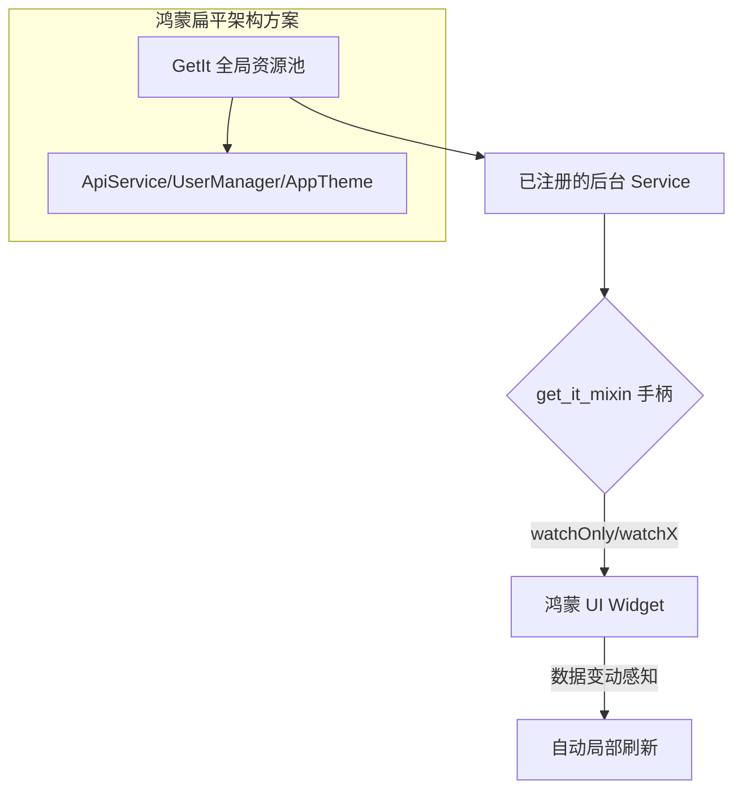

欢迎加入开源鸿蒙跨平台社区：[https://openharmonycrossplatform.csdn.net](https://openharmonycrossplatform.csdn.net)。

# Flutter for OpenHarmony：get_it_mixin — 资源的直达电梯（状态联动底座）

## 前言

在华为鸿蒙（OpenHarmony）生态的复杂业务开发中，如何优雅地访问全局单例 service（如：用户服务、配置管理、API 客户端）并让 UI 能够感知到这些 service 中特定数据的变动，是架构设计的恒久课题。传统的 `Provider` 或 `Bloc` 有时因为层级嵌套过深或样板代码过多，在处理一些简单的全局状态时显得略重。

`get_it_mixin` 是一款基于经典的 `get_it` 依赖注入库而设计的极简状态扩展。它通过 Mixin 的方式，让 Widget 能够直连到服务定位器（Service Locator）中的对象，并提供了一种极其轻量级的“监听”机制。在鸿蒙跨平台应用的开发中，它能让你以几行代码的代价，实现 UI 对 Service 内部数据的实时动态感知。在构建鸿蒙平台的系统设置页、轻量级购物车、或者是需要频繁跨组件共享数据的应用时，它是实现“极致扁平化”架构的核心。

## 一、原理展示 / 概念介绍

### 1.1 基础概念

本库实现了“服务定位”与“响应式渲染”的一站式链路整合。



### 1.2 核心要点解析

- **零上下文依赖**：无需通过 `context` 寻找依赖（没有 `InheritedWidget` 的重绘开销），让 Widget 与业务服务的耦合度降到最低。
- **颗粒度监听**：支持通过 `watchOnly` 函数，仅在服务类中某个特定字段（字段 A）改变时才刷新 UI，极大提升了鸿蒙高刷屏下的渲染性能。
- **全能适配**：原生支持对 `ValueNotifier`, `Stream`, `Future` 以及普通的普通类进行观察，适配所有主流的异步通讯场景。

## 二、核心 API / 组件详解

### 2.1 依赖引入

在鸿蒙工程的 `pubspec.yaml` 中添加以下分工明确的依赖：

```yaml
dependencies:
  get_it: ^7.2.0
  get_it_mixin: ^4.3.0 # 💡 状态扩展
```

### 2.2 注册并观察全局状态

在鸿蒙工程初始化层注册一个用户偏好服务：

```dart
// user_service.dart
class UserService {
  final nameNotifier = ValueNotifier<String>("鸿蒙游客");
}

// ✅ 推荐做法：在 main.dart 或初始化处注册
final getIt = GetIt.instance;
void setup() {
  getIt.registerSingleton<UserService>(UserService());
}
```

### 2.3 在 Widget 中直接使用

💡 **技巧**：在 Widget 定义中混入 `GetItMixin`。

```dart
class ProfilePage extends StatelessWidget with GetItMixin {
  @override
  Widget build(BuildContext context) {
    // 💡 技巧：watchX 自动监听 ValueNotifier 的变动
    final userName = watchX((UserService s) => s.nameNotifier);

    return Text("当前登录: $userName");
  }
}
```

## 三、场景示例

### 3.1 场景一：鸿蒙多端全量“主题一键切换”

将“明暗色模式”标志位放在 `ThemeService` 中，所有混入了 `GetItMixin` 的 Widget 都可以通过 `watchOnly` 直连该标志，实现全局 UI 的实时刷新，无需逐层传递 `ThemeData`。

### 3.2 场景二：实时“全局消息气泡”

当后端通过 WebSocket 推送紧急系统通知时，单例 Service 里的 `Stream` 发生变动，利用 `watchStream` 让鸿蒙状态栏组件立刻弹窗告知用户，逻辑链路极简。

## 四、OpenHarmony 平台适配挑战

### 4.1 内存安全与状态泄露

由于 `GetIt` 是全局常驻内存的。如果将带有 UI 状态的控制器直接丢入 `GetIt` 且在 Widget 销毁后没有清理（Disposal），可能会导致鸿蒙应用的内存水位持续升高。

✅ **适配策略建议**：
1. **明确生命周期**：对于仅在特定业务模块（如 5 分钟的支付流程）使用的 Service，在鸿蒙页退出后尝试调用 `getIt.unregister` 进行显式销毁。
2. **避免过度监听**：在极其复杂的鸿蒙页面中，不要让 100 个小 Widget 同时 `watch` 同一个大数据服务，建议采用“中间层 ViewModel”进行二次降噪处理。

## 五、综合实战示例代码

以下是一个演示如何在鸿蒙端实现的“极简响应式个人中心”实战组件：

```dart
import 'package:flutter/material.dart';
import 'package:get_it/get_it.dart';
import 'package:get_it_mixin/get_it_mixin.dart';

// 定义业务层
class GlobalState {
  final count = ValueNotifier<int>(0);
}

class GetItLabPage extends StatelessWidget with GetItMixin {
  GetItLabPage({super.key});

  @override
  Widget build(BuildContext context) {
    // 💡 实战技巧：直接从定位器中监听数据项
    final counter = watchX((GlobalState s) => s.count);
    
    return Scaffold(
      appBar: AppBar(title: const Text('GetItMix 响应式实验室')),
      body: Center(
        child: Column(
          mainAxisAlignment: MainAxisAlignment.center,
          children: [
            const Icon(Icons.hub, size: 80, color: Colors.indigoAccent),
            const SizedBox(height: 30),
            Text("鸿蒙单例状态: $counter", style: const TextStyle(fontSize: 28)),
            const SizedBox(height: 50),
            ElevatedButton(
              onPressed: () => GetIt.I<GlobalState>().count.value++, 
              child: const Text('更新全局 Service 数据'),
            ),
          ],
        ),
      ),
    );
  }
}
```

## 六、总结

`get_it_mixin` 提供了一种“打破层级”的全新状态同步思路。它将开发者的注意力从繁复的 Provider 树中抽离，通过一种直接、确定且高性能的服务定位方式，为鸿蒙应用实现了真正的逻辑与视觉解耦。

✅ **核心建议**：
1. **组合优于继承**：不要在所有的 Widget 里都写 `GetItMixin`。对于简单的 UI 组件，依然保持“由父组件传入”的原则，只在真正需要跨模块状态的场景调用。
2. **配合调试工具**：由于 `GetIt` 是全局的，建议在鸿蒙端配合 `get_it` 的监听器打印出资源注册的耗时，优化启动时间。
3. **保持纯净性**：Service 类应该保持纯 Dart 逻辑，绝不要在里面引用 `BuildContext` 或 `Widget` 相关库，确其具备 100% 的可测试性。

📦 **完整代码已上传至 AtomGit**：[open-harmony-example/get_it_mixin](https://atomgit.com/dragonbady/open-harmony-example/tree/main/examples/get_it_mixin)

🌐 **欢迎加入开源鸿蒙跨平台社区**：[开源鸿蒙跨平台开发者社区](https://openharmonycrossplatform.csdn.net)
