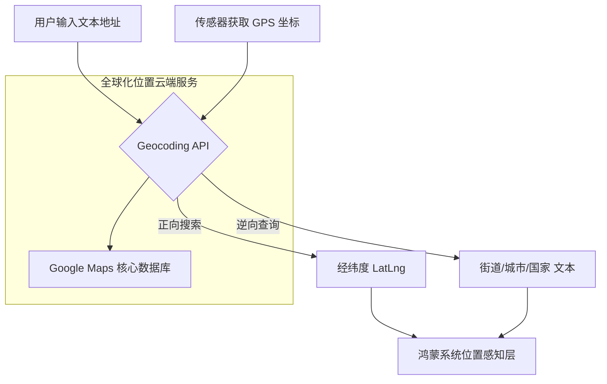

欢迎加入开源鸿蒙跨平台社区：[https://openharmonycrossplatform.csdn.net](https://openharmonycrossplatform.csdn.net)。

# Flutter for OpenHarmony：google_geocoding_api — 全球地理坐标引擎（位置服务底座）

## 前言

在华为鸿蒙（OpenHarmony）生态的全球化（Glocalization）进程中，地理位置服务（LBS）应用正呈现爆发式增长。无论是构建跨国物流应用的精准派送地址定位、旅游应用的景点位置搜索，还是通过拍摄照片的 GPS 信息自动反查拍摄地点，开发者都需要一套可靠、全球覆盖的地理编码与逆编码能力。

`google_geocoding_api` 是一款专为 Flutter 设计的高质量 Google Maps Geocoding 封装库。它能将人类可读的地址（如“伦敦塔桥”）精确转换为经纬度坐标，反之亦然。在鸿蒙跨平台出海应用的开发中，它凭借 Google 覆盖全平台的权威数据库，为开发者提供了极具竞争力的位置解析能力。

## 一、原理展示 / 概念介绍

### 1.1 基础概念

地理编码（Geocoding）是文本地址与数学坐标间的双向转换过程。



### 1.2 核心要点解析

- **正向地理编码**：支持通过地址前缀、城市、邮编过滤等多种方式，获取地点的精确坐标及地点 ID。
- **逆地理编码**：根据设备上传的经纬度，反推出所在的具体街道门牌号、行政区划以及对应的国家 ISO 编码。
- **丰富的元数据**：返回结果包含地点的几何中心、包络面、地点类型（如“餐饮”、“政府”）等。

## 二、核心 API / 组件详解

### 2.1 依赖引入

在鸿蒙工程的 `pubspec.yaml` 中添加以下依赖：

```yaml
dependencies:
  google_geocoding_api: ^1.1.0 # 请参考最新版本
```

### 2.2 定义 API 客户端

💡 **技巧**：务必在环境变量中保护你的 API Key。

```dart
import 'package:google_geocoding_api/google_geocoding_api.dart';

// ✅ 推荐做法：通过 AccessKey 进行安全初始化
final api = GoogleGeocodingApi('YOUR_GOOGLE_MAPS_API_KEY');
```

### 2.3 逆地理编码获取地址名

将鸿蒙设备获取的坐标转化为可读地址：

```dart
Future<void> reverseLookup(double lat, double lng) async {
  final response = await api.reverse(
    '$lat,$lng',
    language: 'zh-CN', // 💡 技巧：指定返回结果语言
  );
  
  if (response.results.isNotEmpty) {
    print('当前鸿蒙设备所在地: ${response.results.first.formattedAddress}');
  }
}
```

## 三、场景示例

### 3.1 场景一：鸿蒙出海电商的收货地址自动填充

当用户在搜索框输入模糊地址时，系统利用 API 进行实时建议，并自动带出邮编和城市信息，极大降低输入成本。

### 3.2 场景二：智能相册的“足迹”分析

利用照片自带的经纬度数据，通过逆编码接口在鸿蒙端生成基于地理位置（如“我在马德里”）的分组摘要。

## 四、OpenHarmony 平台适配挑战

### 4.1 网络访问与政策合规

在中国境内环境（Mainland China）下，直连 Google 域名可能面临连接超时或服务解析失败。

✅ **适配策略建议**：
1. **采用统一代理网关**：对于纯出海应用，建议在应用层或鸿蒙端通过配置全局请求镜像，将 API 请求引流至合规的海外中转节点。
2. **多源位置融合**：针对鸿蒙原生应用，可以先尝试调用高德/华为 Petal Maps 的国产地理编码。如果检测到用户当前位于海外（基于 SIM 卡或基站信息），则动态切换至 `google_geocoding_api`。

## 五、综合实战示例代码

以下是一个演示如何实现“根据经纬度反查鸿蒙办公点”的实战组件：

```dart
import 'package:flutter/material.dart';
import 'package:google_geocoding_api/google_geocoding_api.dart';

class GeocodingLabPage extends StatefulWidget {
  const GeocodingLabPage({super.key});

  @override
  State<GeocodingLabPage> createState() => _GeocodingLabPageState();
}

class _GeocodingLabPageState extends State<GeocodingLabPage> {
  final _api = GoogleGeocodingApi('PASTE_YOUR_API_KEY');
  String _address = "等待反查...";

  void _runGeocoding() async {
    setState(() => _address = "正在连接 Google 全球节点...");
    
    try {
      // 💡 实战演示：将深圳腾讯大厦坐标进行逆编码
      final res = await _api.reverse('22.540,113.934', language: 'zh-CN');
      
      setState(() {
        _address = res.results.isNotEmpty 
          ? "📍 精确地址:\n${res.results.first.formattedAddress}" 
          : "无法解析该位置坐标";
      });
    } catch (e) {
      setState(() => _address = "❌ 解析失败，请检查网络权限。");
    }
  }

  @override
  Widget build(BuildContext context) {
    return Scaffold(
      appBar: AppBar(title: const Text('全球地理编码实验室')),
      body: Center(
        child: Padding(
          padding: const EdgeInsets.all(24),
          child: Column(
            mainAxisAlignment: MainAxisAlignment.center,
            children: [
              const Icon(Icons.map_outlined, size: 80, color: Colors.indigo),
              const SizedBox(height: 30),
              Container(
                width: double.infinity,
                padding: const EdgeInsets.all(20),
                decoration: BoxDecoration(color: Colors.indigo[50], borderRadius: BorderRadius.circular(15)),
                child: Text(_address, textAlign: TextAlign.center, style: const TextStyle(fontSize: 16)),
              ),
              const SizedBox(height: 50),
              ElevatedButton.icon(
                onPressed: _runGeocoding,
                icon: const Icon(Icons.gps_fixed),
                label: const Text('执行鸿蒙全球位置采样分析'),
              ),
            ],
          ),
        ),
      ),
    );
  }
}
```

## 六、总结

`google_geocoding_api` 是鸿蒙应用连接全球位置信息的窗口。它将冰冷的经纬度数字转化为了生动且具备商业价值的文本地址。

✅ **核心建议**：
1. **缓存机制**：地理编码数据相对静态。对于同一个坐标的请求，建议在鸿蒙端缓存 24~48 小时，节省 API 配额成本。
2. **异常捕获**：鉴于跨境网络的复杂性，务必为 API 请求设置严格的 `Timeout` 拦截，防止在弱网下阻塞鸿蒙应用的启动流。
3. **安全审计**：在 UI 展示地址前，建议进行敏感地名过滤或根据业务合规性进行地址屏蔽。

📦 **完整代码已上传至 AtomGit**：[open-harmony-example/geocoding](https://atomgit.com/dragonbady/open-harmony-example/tree/main/examples/geocoding)

🌐 **欢迎加入开源鸿蒙跨平台社区**：[开源鸿蒙跨平台开发者社区](https://openharmonycrossplatform.csdn.net)
