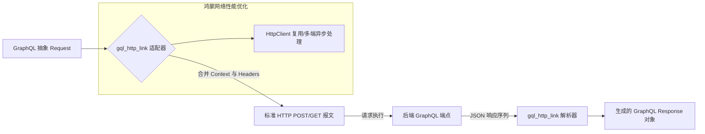

欢迎加入开源鸿蒙跨平台社区：[https://openharmonycrossplatform.csdn.net](https://openharmonycrossplatform.csdn.net)。

# Flutter for OpenHarmony：gql_http_link — 数据的物理传送带（GraphQL 传输底座）

## 前言

在华为鸿蒙（OpenHarmony）生态的后端协作中，即便应用采用了先进的 GraphQL 架构，最终的物理传输绝大多数仍然承载在 HTTP 协议之上。如果开发者直接使用通用的 `http` 库来手动拼装 GraphQL 的 `query`, `variables` 以及处理特定的 `application/graphql+json` 报文头部，不仅代码繁琐，更容易在处理文件上传（Multipart）或复杂的鉴权上下文（Context）时踩坑。

`gql_http_link` 是一款专为 GraphQL 设计的物理传输层库。它是 `gql_link` 协议簇中最常用的实现插件，能将符合 GraphQL 规范的 `Request` 对象自动转换为标准的 HTTP 调用。在鸿蒙跨平台应用的开发中，它提供了精细化的 Headers 管控、灵活的异步请求处理以及对 JSON-RPC 风格响应的完美解析。在构建鸿蒙平台的数字化办公系统、大型商城或实时资讯流应用时，它是实现“高性能、工业级 GraphQL 传输”的核心构件。

## 一、原理展示 / 概念介绍

### 1.1 基础概念

本库实现了从“GraphQL 抽象操作”到“物理 HTTP 报文”的转化。



### 1.2 核心要点解析

- **自动序列化**：自动将复杂的 GraphQL 定义（Document）转为符合 API 规范的字符串，并管理对应的变量（Variables）映射。
- **动态 Context 控制**：允许在每一次请求时动态注入特定的 HTTP Header（如：针对鸿蒙系统的特定 UA 标识）。
- **标准兼容**：完全遵循 Apollo 和 GraphQL Spec 规范，确保与 Node.js, Go, Java 等主流 GraphQL 后端无缝对接。

## 二、核心 API / 组件详解

### 2.1 依赖引入

在鸿蒙工程的 `pubspec.yaml` 中添加以下分工明确的依赖：

```yaml
dependencies:
  gql_http_link: ^1.0.0
  gql: ^1.0.0 # 核心协议
```

### 2.2 初始化 HTTP 链路

在鸿蒙工程初始化网络模块时进行配置：

```dart
import 'package:gql_http_link/gql_http_link.dart';
import 'package:http/http.dart' as http;

void setupGqlClient() {
  // ✅ 推荐做法：通过 HttpLink 构造函数设置端点与自定义 client
  final link = HttpLink(
    'https://api.harmony-service.com/graphql',
    defaultHeaders: {
      'Source-Platform': 'OpenHarmony', // 💡 技巧：注入鸿蒙平台标识
    },
    httpClient: http.Client(), // 💡 技巧：允许注入自定义的 HttpClient 进行性能调优
  );
}
```

### 2.3 发起带上下文的请求

```dart
// 在业务执行时动态修改 header (例如注入 token)
final response = link.request(
  Request(
    operation: Operation(document: queryDoc),
    context: Context().updateEntry<HttpLinkHeaders>(
      (h) => HttpLinkHeaders(headers: {'Authorization': 'Bearer ...'}),
    ),
  ),
);
```

## 三、场景示例

### 3.1 场景一：鸿蒙端“全场景数据”一次性拉取

通过 `gql_http_link` 发送一个复合式的 GraphQL Query，在一次 HTTP 往返中同时获取用户的“基本资料”、“订单列表”以及“通知中心”，显著降低鸿蒙端侧的电量损耗和网络延迟。

### 3.2 场景二：复杂业务的错误追踪

在鸿蒙应用发生网络异常时，利用 `gql_http_link` 返回的结构化错误信息（包括 GraphQL Errors 扩展字段），精准判定是“字段权限不足”还是“物理网络中断”。

## 四、OpenHarmony 平台适配挑战

### 4.1 证书与 HTTPS 校验

鸿蒙系统对网络请求的安全证书校验有严格要求。

✅ **适配策略建议**：
1. **自定义自定义 SSL 校验**：如果你的后端使用的是私有证书，务必通过注入自定义的 `httpClient`（如基于 `io` 的适配器）来绕过或指定受信任证书，防止 `HttpLink` 发起的请求被鸿蒙网络层直接拦截。
2. **连接超时管控**：在鸿蒙端弱网环境下，默认的 HTTP 超时太长会导致体验下降。建议利用 `Context` 机制或封装层为每一个 Link 请求设定合理的 `Duration`。

## 五、综合实战示例代码

以下是一个演示如何在鸿蒙端利用 `gql_http_link` 构建基础数据抓取器的逻辑示例：

```dart
import 'package:flutter/material.dart';
import 'package:gql_http_link/gql_http_link.dart';
import 'package:gql/language.dart';

class GqlHttpLabPage extends StatefulWidget {
  const GqlHttpLabPage({super.key});

  @override
  State<GqlHttpLabPage> createState() => _GqlHttpLabPageState();
}

class _GqlHttpLabPageState extends State<GqlHttpLabPage> {
  String _apiResult = "准备发起 GraphQL 请求...";

  void _doFetch() async {
    // 1. 初始化物理链路
    final link = HttpLink('https://countries.trevorblades.com/');
    
    // 2. 编写简单的 GraphQL 文档
    final query = parseString(r'''
      query GetCountry {
        country(code: "CN") {
          name
          emoji
          currency
        }
      }
    ''');

    setState(() => _apiResult = "正在跨次元获取鸿蒙端侧数据...");

    try {
      // 💡 实战技巧：手动处理请求流
      final response = await link.request(Request(operation: Operation(document: query))).first;
      
      setState(() {
        _apiResult = "🎉 响应成功:\n${response.data?['country']}";
      });
    } catch (e) {
      setState(() => _apiResult = "❌ 传输失败，请检查网络权限。");
    }
  }

  @override
  Widget build(BuildContext context) {
    return Scaffold(
      appBar: AppBar(title: const Text('GraphQL 物理传输实验室')),
      body: Center(
        child: Padding(
          padding: const EdgeInsets.all(24),
          child: Column(
            mainAxisAlignment: MainAxisAlignment.center,
            children: [
              const Icon(Icons.cloud_sync_outlined, size: 80, color: Colors.blueAccent),
              const SizedBox(height: 30),
              Container(
                padding: const EdgeInsets.all(16),
                decoration: BoxDecoration(color: Colors.blue[50], borderRadius: BorderRadius.circular(12)),
                child: Text(_apiResult, textAlign: TextAlign.center),
              ),
              const SizedBox(height: 50),
              ElevatedButton.icon(
                onPressed: _doFetch,
                icon: const Icon(Icons.send),
                label: const Text('启动 GraphQL HTTP 传输测试'),
              ),
            ],
          ),
        ),
      ),
    );
  }
}
```

## 六、总结

`gql_http_link` 是将 GraphQL 这一前沿理念在鸿蒙端侧落地的“最后一公里”桥梁。它以标准化的协议适配，确保了鸿蒙应用在面对复杂后端网关时，依然能够保持逻辑的稳健与通讯的高效。

✅ **核心建议**：
1. **统一管理 Link**：在一个单例 Service 中管理 `HttpLink` 实例，方便全局开启日志或性能监控。
2. **配合缓存 Link**：对于不经常变动的数据，建议在 `HttpLink` 前面套一层 `CacheLink`，减少昂贵的云端往返次数。
3. **保持 Schema 一致**：后端 Schema 变更时及时同步前端代码，并利用 `gql_http_link` 的详细错误反馈进行第一时间防御。

📦 **完整代码已上传至 AtomGit**：[open-harmony-example/gql_http](https://atomgit.com/dragonbady/open-harmony-example/tree/main/examples/gql_http)

🌐 **欢迎加入开源鸿蒙跨平台社区**：[开源鸿蒙跨平台开发者社区](https://openharmonycrossplatform.csdn.net)
