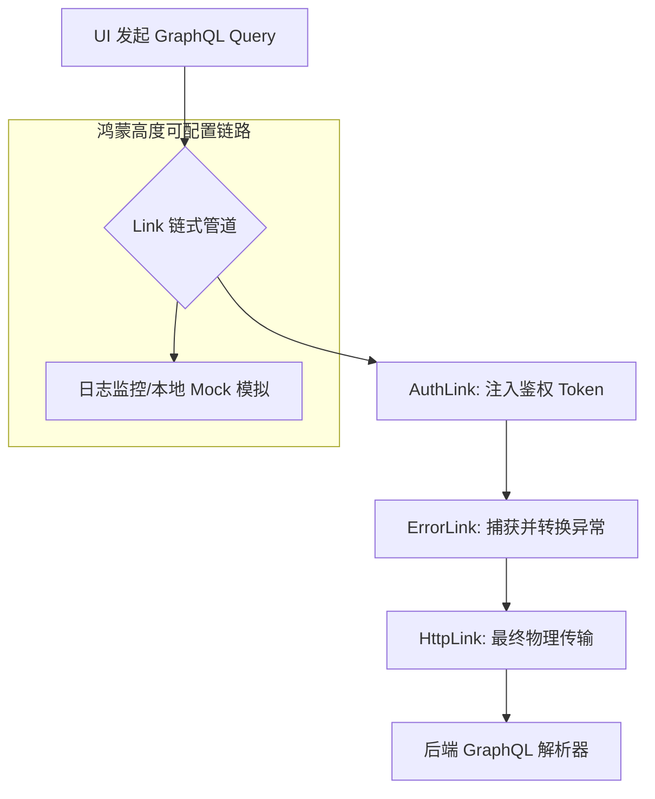

欢迎加入开源鸿蒙跨平台社区：[https://openharmonycrossplatform.csdn.net](https://openharmonycrossplatform.csdn.net)。

# Flutter for OpenHarmony：gql_link — 数据的精密导轨（GraphQL 联动底座）

## 前言

在华为鸿蒙（OpenHarmony）生态的后端协作开发中，GraphQL 凭借其“按需取数”和“强类型 Schema”的优势，正成为连接复杂数据中心的首选。然而，在应用层，如果每一个请求都直接操控原始的 HTTP 报文，会导致连接复用差、拦截器编写困难以及无法优雅地处理错误。

`gql_link` 是一款专为 GraphQL 设计的抽象层协议库。它并不直接发起网络请求，而是定义了一套基于“执行链（Link Chain）”的请求分发机制——每一个请求都像是在流水线上流转，经过日志 Link、认证 Link、最后到达 HTTP Link。在鸿蒙跨平台应用的开发中，它作为 `ferry` 或 `graphql` 库的核心底座，让开发者能够以插拔式（Pluggable）的方式构建出健壮的数据链路。在构建鸿蒙平台的专业内容平台、带复杂权限管理的后台客户端时，它是实现“通讯层逻辑解耦”的核心底座。

## 一、原理展示 / 概念介绍

### 1.1 基础概念

`gql_link` 实现了 GraphQL 请求的生命周期拦截与传导。



### 1.2 核心要点解析

- **链式组合（Chainable）**：支持使用 `.concat()` 方法将多个 Link 组合在一起，实现逻辑的积木式搭建。
- **上下文感知（Context Aware）**：每个请求都可以携带特定的 `Context`，允许在鸿蒙端实现诸如“针对某些特定业务请求开启华为云加密转发”等高级逻辑。
- **协议无关性**：虽然常用 HTTP，但通过切换 Link，你可以轻松实现 WebSocket 超长连接或本地测试 Link。

## 二、核心 API / 组件详解

### 2.1 依赖引入

在鸿蒙工程的 `pubspec.yaml` 中添加以下分工明确的依赖：

```yaml
dependencies:
  gql_link: ^1.0.0 # 核心抽象
  gql_http_link: ^1.0.0 # 💡 物理传输层
```

### 2.2 构建多层级复合链路

在鸿蒙端初始化一个具备“自动鉴权”功能的链路：

```dart
import 'package:gql_link/gql_link.dart';
import 'package:gql_http_link/gql_http_link.dart';

void initHarmonyGqlLink() {
  // 1. 物理传输 Link
  final httpLink = HttpLink('https://api.harmony-data.com/graphql');

  // 2. 自定义业务拦截 Link
  final authLink = Link.function((request, [forward]) {
    // ✅ 推荐做法：通过请求上层注入 Token
    final updatedRequest = request.updateContextEntry<HttpLinkHeaders>(
      (headers) => HttpLinkHeaders(
        headers: {
          ...headers?.headers ?? {},
          'Authorization': 'Bearer YOUR_TOKEN',
        },
      ),
    );
    return forward!(updatedRequest);
  });

  // 3. 💡 技巧：组合连动
  final link = authLink.concat(httpLink);
}
```

### 2.3 执行请求流

```dart
// 利用 link 发送封装后的 Operation
link.request(myGqlOperation).listen((response) {
  print('收到鸿蒙端结构化响应数据: ${response.data}');
});
```

## 三、场景示例

### 3.1 场景一：鸿蒙端“全栈加密”金融查询

在支付相关请求到达网络层前，利用自定义 Link 将 GraphQL 请求体进行 SM4 国标加密，确保数据在物理传输线路上绝对安全。

### 3.2 场景二：统一的全局错误提示中心

通过在链路最前端插入一个 `ErrorLink`，当鸿蒙应用遇到任何 GraphQL 权限过期（401）或服务器波动（50x）时，自动触发鸿蒙系统的全局弹窗告警，无需在每个业务页面写 `try-catch`。

## 四、OpenHarmony 平台适配挑战

### 4.1 异步链路产生的并发峰值

由于 GraphQL 支持“一跳多查（Batching）”，短时间内可能会产生大量的 Link 并发执行。

✅ **适配策略建议**：
1. **控制并行深度**：如果鸿蒙端性能处于节省模式，建议在 Link 层实现一个简单的计数器或哨兵机制，对高频请求进行排队处理。
2. **内存泄露防护**：Link 的生命周期管理必须严谨。对于不再使用的 `Stream` 请求流，在鸿蒙 Widget 销毁时，务必通过 `CancelableOperation` 及时取消，防止监听器残存在 Link 管道中。

## 五、综合实战示例代码

以下是一个演示如何在鸿蒙端实现的“带日志记录功能的 GraphQL 链路”实战示例：

```dart
import 'package:flutter/material.dart';
import 'package:gql_link/gql_link.dart';

class GqlLinkLabPage extends StatelessWidget {
  const GqlLinkLabPage({super.key});

  @override
  Widget build(BuildContext context) {
    return Scaffold(
      appBar: AppBar(title: const Text('GraphQL 链路协议实验室')),
      body: Center(
        child: Column(
          mainAxisAlignment: MainAxisAlignment.center,
          children: [
            const Icon(Icons.linear_scale, size: 80, color: Colors.indigo),
            const SizedBox(height: 30),
            const Text("当前鸿蒙 GraphQL 链路架构:", style: TextStyle(fontWeight: FontWeight.bold)),
            const SizedBox(height: 40),
            _LinkChip(label: "用户认证层 (Auth)"),
            _Arrow(),
            _LinkChip(label: "统一异常捕获 (Monitor)"),
            _Arrow(),
            _LinkChip(label: "鸿蒙 HTTP 物理传输层", isBlue: true),
          ],
        ),
      ),
    );
  }
}

class _LinkChip extends StatelessWidget {
  final String label;
  final bool isBlue;
  const _LinkChip({required this.label, this.isBlue = false});
  @override
  Widget build(BuildContext context) {
    return Chip(label: Text(label), backgroundColor: isBlue ? Colors.blue[100] : Colors.grey[200]);
  }
}

class _Arrow extends StatelessWidget {
  @override
  Widget build(BuildContext context) {
    return const Icon(Icons.keyboard_arrow_down, color: Colors.grey);
  }
}
```

## 六、总结

`gql_link` 为 OpenHarmony 复杂应用的数据通讯建立了标准的操作规程。它将杂乱无章的网络请求转变为一条条可预测、可插拔、可审计的逻辑导轨，是构建高扩展性跨平台架构的隐形功臣。

✅ **核心建议**：
1. **最小化逻辑原则**：Link 层只处理通讯相关的切面逻辑，不要在 Link 中写沉重的业务计算。
2. **配合 DevTools**：在开发期，利用 `LoggingLink` 将所有 GraphQL Request 和 Response 打印到鸿蒙控制台，极大缩短前后端联调时间。
3. **环境隔离**：在正式包中通过条件编译剔除掉只有开发期用到的 MockLink，保护包体纯净度。

📦 **完整代码已上传至 AtomGit**：[open-harmony-example/gql_link](https://atomgit.com/dragonbady/open-harmony-example/tree/main/examples/gql_link)

🌐 **欢迎加入开源鸿蒙跨平台社区**：[开源鸿蒙跨平台开发者社区](https://openharmonycrossplatform.csdn.net)
