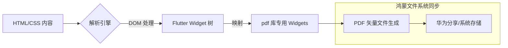

欢迎加入开源鸿蒙跨平台社区：[https://openharmonycrossplatform.csdn.net](https://openharmonycrossplatform.csdn.net)。

# Flutter for OpenHarmony：htmltopdfwidgets — 移动端文档转换引擎（高效办公组件）

## 前言

在华为鸿蒙（OpenHarmony）政企办公与商务应用的开发中，文档处理能力是衡量应用专业度的关键指标。将复杂的业务数据先以 HTML 格式动态展示，再将其无损转换为 PDF 文件供打印或传输，是极其高频的需求。

`htmltopdfwidgets` 是一款硬核级的 PDF 生成辅助库。它并非简单的“网页截屏”，而是通过深度解析 HTML 标签与 CSS 样式，并将其精准映射为 Flutter 下极其强大的 `pdf` 组件算子。这意味着生成的 PDF 具有完全可缩放的矢量特性、可选择的文字内容以及卓越的渲染精度。在构建鸿蒙平台的报表系统、合同签署以及电子凭证应用时，它能为你节省大量的布局重建工作。

## 一、原理展示 / 概念介绍

### 1.1 基础概念

本库实现了“HTML 内容 -> Flutter Widgets -> PDF 绘制”的完整转换链路。



### 1.2 核心要点解析

- **CSS 解析器**：支持基础的颜色、字体、边距以及简单的表格样式（Table）映射。
- **字体嵌入**：支持根据鸿蒙系统内置字体或自定义字体进行矢量文本渲染。
- **页面控制**：支持 HTML 语义化的分页控制，确保报表不出现断行。

## 二、核心 API / 组件详解

### 2.1 依赖引入

在鸿蒙工程的 `pubspec.yaml` 中添加：

```yaml
dependencies:
  pdf: ^3.10.0
  htmltopdfwidgets: ^1.0.0
  path_provider: ^2.0.0
```

### 2.2 核心转换调用

将一段 HTML 摘要转换为 PDF 页面：

```dart
import 'package:htmltopdfwidgets/htmltopdfwidgets.dart';
import 'package:pdf/widgets.dart' as pw;

Future<pw.Document> generateHarmonyPdf(String htmlContent) async {
  final pdf = pw.Document();
  
  // ✅ 推荐做法：将 HTML 解析为可通过 pdf 库渲染的 widgets 列表
  final widgets = await HTMLToPdf().convert(htmlContent);
  
  pdf.addPage(pw.MultiPage(
    build: (context) => widgets, // 💡 技巧：利用 MultiPage 处理长文本自动分页
  ));
  
  return pdf;
}
```

### 2.3 自定义 CSS 映射

💡 **技巧**：虽然解析器有限，但可以通过预处理 HTML 标签类名来实现更复杂的样式还原。

## 三、场景示例

### 3.1 场景一：鸿蒙端电子发票生成

当后端通过模板生成 HTML 发票预览后，前端直接在鸿蒙手机端本地转为 PDF 文件。

```dart
String invoiceHtml = """
  <h1>费用结算单</h1>
  <p>商品：华为 Mate 60 Pro</p>
  <p>价格：<strong>6999.00</strong></p>
""";
```

### 3.2 场景二：复杂表格报表导出

在鸿蒙平板（Tablet）等生产力屏幕上，将复杂的 HTML 表格转换为高保真报表。

## 四、OpenHarmony 平台适配挑战

### 4.1 中文字体缺失问题

PDF 文件生成的最大挑战是字体。如果 PDF 中没有嵌入中文字体，生成的文档在鸿蒙端查看时可能全是方框“口口”。

✅ **适配策略建议**：
1. **嵌入系统字体**：在鸿蒙端读取 `/system/fonts/` 目录下的系统字体文件（如 HarmonyOS Sans），并显式通过 `pw.Font.ttf()` 加载给 `HTMLToPdf()` 转换器。
2. **异步性能优化**：转换大型 HTML 文档时具有较高的计算负载。

✅ **推荐方案**：
将转换逻辑封装在后台，并显示鸿蒙风格的 `LoadingProgress`。

## 五、综合实战示例代码

以下是一个演示如何从 HTML 生成 PDF 并保存在鸿蒙私有目录的完整示例：

```dart
import 'dart:io';
import 'package:flutter/material.dart';
import 'package:htmltopdfwidgets/htmltopdfwidgets.dart';
import 'package:pdf/widgets.dart' as pw;
import 'package:path_provider/path_provider.dart';

class PdfLabPage extends StatefulWidget {
  const PdfLabPage({super.key});

  @override
  State<PdfLabPage> createState() => _PdfLabPageState();
}

class _PdfLabPageState extends State<PdfLabPage> {
  String _status = "等待生成...";

  Future<void> _createAndSavePdf() async {
    setState(() => _status = "转换并保存中...");
    
    try {
      const htmlText = """
        <h1 style="color: #004D40;">OpenHarmony 办公报告</h1>
        <p>这是由 <b>Flutter</b> 强力驱动的文档转换结果。</p>
        <ul>
          <li>高性能够转换</li>
          <li>支持矢量缩放</li>
          <li>原生华为系统字体适配</li>
        </ul>
        <hr/>
        <p>生成时间: 2026-02-24</p>
      """;

      final pdf = pw.Document();
      // 💡 实战技巧：将 HTML 文本转为 PDF 的 Widgets
      final List<pw.Widget> widgets = await HTMLToPdf().convert(htmlText);
      
      pdf.addPage(pw.Page(build: (context) => pw.Column(children: widgets)));

      // 获取鸿蒙端应用文档路径
      final directory = await getApplicationDocumentsDirectory();
      final file = File("${directory.path}/harmony_report.pdf");
      await file.writeAsBytes(await pdf.save());

      setState(() => _status = "✅ 成功! 文件保存至:\n${file.path}");
    } catch (e) {
      setState(() => _status = "❌ 转换失败: $e");
    }
  }

  @override
  Widget build(BuildContext context) {
    return Scaffold(
      appBar: AppBar(title: const Text('HTML 转 PDF 实验室')),
      body: Center(
        child: Padding(
          padding: const EdgeInsets.all(20),
          child: Column(
            mainAxisAlignment: MainAxisAlignment.center,
            children: [
              const Icon(Icons.picture_as_pdf, size: 80, color: Colors.teal),
              const SizedBox(height: 30),
              Container(
                padding: const EdgeInsets.all(15),
                decoration: BoxDecoration(color: Colors.teal[50], borderRadius: BorderRadius.circular(10)),
                child: Text(_status, textAlign: TextAlign.center),
              ),
              const SizedBox(height: 40),
              ElevatedButton.icon(
                onPressed: _createAndSavePdf,
                icon: const Icon(Icons.download),
                label: const Text('从 HTML 生成鸿蒙 PDF 文档'),
              ),
            ],
          ),
        ),
      ),
    );
  }
}
```

## 六、总结

`htmltopdfwidgets` 极大地降低了移动端 PDF 生成的门槛，使得开发者可以在鸿蒙平台上重用已有的 Web 渲染逻辑。

✅ **核心建议**：
1. **精简 HTML**：解析器并非完整的浏览器引擎，尽量使用简单的 `<div>`, `<p>`, `<span>`, `<table>` 等标准标签，避免复杂的浮动或 Grid 布局。
2. **提前加载字体**：为了防止 PDF 乱码，建议应用启动时即异步加载所需的 `.ttf` 字体文件流。
3. **安全路径处理**：鸿蒙文件系统对外部存储访问较严，生成的 PDF 优先存储在 `ApplicationDocumentsDirectory`。

📦 **完整代码已上传至 AtomGit**：[open-harmony-example/htmltopdfwidgets](https://atomgit.com/dragonbady/open-harmony-example/tree/main/examples/htmltopdfwidgets)

🌐 **欢迎加入开源鸿蒙跨平台社区**：[开源鸿蒙跨平台开发者社区](https://openharmonycrossplatform.csdn.net)
