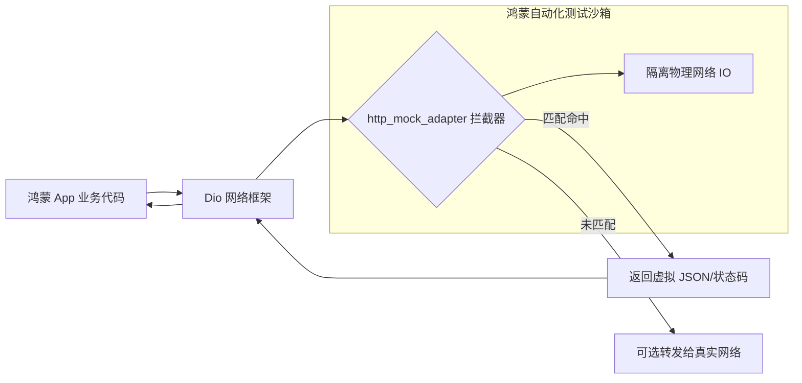

欢迎加入开源鸿蒙跨平台社区：[https://openharmonycrossplatform.csdn.net](https://openharmonycrossplatform.csdn.net)。

# Flutter for OpenHarmony：http_mock_adapter — 虚实结合的联调盾牌（接口 Mock 底座）

## 前言

在华为鸿蒙（OpenHarmony）生态的应用开发中，前后端并行开发（Parallel Development）是常态。当后端 API 还在设计或局域网联调环境不稳定时，如果客户端开发者只能干等着真实数据，开发进度将会大打折扣。此外，在进行健壮性测试（如模拟服务器 500 错误、超时、返回脏数据）时，真实服务器往往难以配合。

`http_mock_adapter` 是一款专为 `Dio` 打造的高性能 Mock 拦截器。它能拦截应用发出的任何网络请求，并根据预设规则（Endpoint/Post Data/Headers）即时返回自定义的模拟响应。在鸿蒙跨平台应用的开发与自动化测试中，它让开发者能够摆脱对物理网络的依赖，构建出 100% 确定性的测试闭环。在构建鸿蒙平台的交付级测试套件、离线演示 Demo 或快速原型开发时，它是不可或缺的效率利器。

## 一、原理展示 / 概念介绍

### 1.1 基础概念

本库实现了在应用内部对网络协议栈的“中间人注入”。



### 1.2 核心要点解析

- **无感注入**：只需为 `Dio` 实例添加一个 `DioAdapter`，业务层代码无需做任何修改（如切换 URL）。
- **丰富的匹配算子**：支持根据路径通配符、请求体（Request Body）内容、特定 Header 甚至 Query 参数进行精准拦截。
- **状态全覆盖**：支持模拟 200 (Success), 401 (Unauthorized), 404 (Not Found), 500 (Internal Server Error) 等各种网络状态及其响应时延。

## 二、核心 API / 组件详解

### 2.1 依赖引入

在鸿蒙工程的 `pubspec.yaml` 中添加以下开发辅助依赖：

```yaml
dependencies:
  dio: ^5.0.0
  
dev_dependencies:
  http_mock_adapter: ^0.5.0 # 建议参考最新主流版本
```

### 2.2 初始化 Mock 适配器

在鸿蒙端初始化一个用于测试的模块：

```dart
import 'package:dio/dio.dart';
import 'package:http_mock_adapter/http_mock_adapter.dart';

void setupHarmonyMock() {
  final dio = Dio();
  // ✅ 推荐做法：创建 DioAdapter 并关联 Dio 实例
  final dioAdapter = DioAdapter(dio: dio);

  // 1. 定义拦截逻辑
  dioAdapter.onGet(
    '/api/harmony/profile',
    (server) => server.reply(200, {'name': '鸿蒙开发者', 'level': 99}),
    data: null,
    queryParameters: {},
    headers: {},
  );
}
```

### 2.3 模拟复杂的异步错误

💡 **技巧**：在鸿蒙端验证应用的容错率。

```dart
dioAdapter.onPost(
  '/api/login',
  (server) => server.throws(
    403,
    DioException(requestOptions: RequestOptions(path: '/api/login'), type: DioExceptionType.badResponse),
  ),
);
```

## 三、场景示例

### 3.1 场景一：鸿蒙端 UI 的“冒烟测试”

通过 Mock 不同长度的 JSON 列表，验证鸿蒙端列表视图在“数据过多”时的流畅度，以及在“数据为空”时的空状态占位图展示。

### 3.2 场景二：复杂支付流程的本地闭环

模拟支付成功、余额不足、系统扣费中等多种后端状态，让鸿蒙客户端能根据 Mock 返回跳转不同的业务结果页，提高测试覆盖率。

## 四、OpenHarmony 平台适配挑战

### 4.1 Mock 代码的打包隔离

Mock 逻辑不应该被打入正式发布的鸿蒙 HAP 包中。

✅ **适配策略建议**：
1. **统一工厂注入**：建议在项目中建立一个 `HttpFactory`。根据当前的编译宏（如 `kDebugMode`）或自定义的鸿蒙编译参数，决定是否装载 `http_mock_adapter`。
2. **本地测试目录隔离**：将 Mock JSON 数据文件存放在鸿蒙测试资源的独立目录下，避免污染生产环境的包体大小。

## 五、综合实战示例代码

以下是一个演示如何在鸿蒙端实现的“接口联调模拟实验室”组件：

```dart
import 'package:flutter/material.dart';
import 'package:dio/dio.dart';
import 'package:http_mock_adapter/http_mock_adapter.dart';

class HttpMockLabPage extends StatefulWidget {
  const HttpMockLabPage({super.key});

  @override
  State<HttpMockLabPage> createState() => _HttpMockLabPageState();
}

class _HttpMockLabPageState extends State<HttpMockLabPage> {
  final _dio = Dio();
  String _response = "点击按钮发起请求";

  @override
  void initState() {
    super.initState();
    _initMock();
  }

  void _initMock() {
    // 💡 实战技巧：拦截器注入
    final adapter = DioAdapter(dio: _dio);
    adapter.onGet('/harmony_data', (s) => s.reply(200, {'msg': '来自模拟器的鸿蒙专属数据'}));
  }

  void _fetchData() async {
    try {
      final res = await _dio.get('/harmony_data');
      setState(() => _response = "🎉 收到 Mock 数据:\n${res.data}");
    } catch (e) {
      setState(() => _response = "❌ 请求失败");
    }
  }

  @override
  Widget build(BuildContext context) {
    return Scaffold(
      appBar: AppBar(title: const Text('网络 Mock 模拟实验室')),
      body: Center(
        child: Column(
          mainAxisAlignment: MainAxisAlignment.center,
          children: [
            const Icon(Icons.webhook_outlined, size: 80, color: Colors.teal),
            const SizedBox(height: 30),
            Container(
              padding: const EdgeInsets.all(16),
              margin: const EdgeInsets.symmetric(horizontal: 20),
              decoration: BoxDecoration(color: Colors.teal[50], borderRadius: BorderRadius.circular(12)),
              child: Text(_response, textAlign: TextAlign.center),
            ),
            const SizedBox(height: 50),
            ElevatedButton(onPressed: _fetchData, child: const Text('发起模拟接口调用')),
          ],
        ),
      ),
    );
  }
}
```

## 六、总结

`http_mock_adapter` 是保证 OpenHarmony 高质量交付的“消音器”。它消除了网络的不确定性噪点，让开发者能专注于业务逻辑与 UI 交互的打磨。

✅ **核心建议**：
1. **JSON 本地化**：对于超大的响应体，建议配合 `rootBundle.loadString` 读取本地 JSON 文件再传入 `reply`，保持 Mock 逻辑的代码整洁。
2. **模拟延迟**：通过 `delay` 参数模拟真实环境下的 200ms~2s 延迟，验证鸿蒙端 Loading 动画的视觉衔接。
3. **保持同步**：前端 Mock 的结构定义应与后端 Swagger/OpenAPI 文档保持强一致，防止“Mock 是好的，一上线全是报错”。

📦 **完整代码已上传至 AtomGit**：[open-harmony-example/http_mock](https://atomgit.com/dragonbady/open-harmony-example/tree/main/examples/http_mock)

🌐 **欢迎加入开源鸿蒙跨平台社区**：[开源鸿蒙跨平台开发者社区](https://openharmonycrossplatform.csdn.net)
