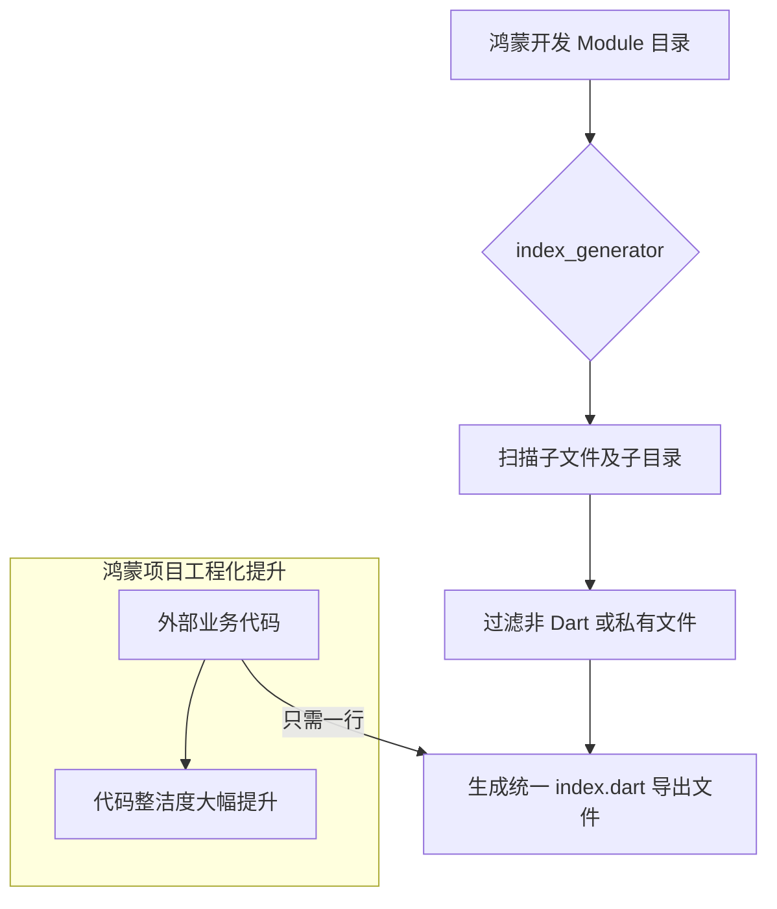

欢迎加入开源鸿蒙跨平台社区：[https://openharmonycrossplatform.csdn.net](https://openharmonycrossplatform.csdn.net)。

# Flutter for OpenHarmony：index_generator — 引用之道的简化师（大型工程索引底座）

## 前言

在华为鸿蒙（OpenHarmony）生态的深度开发中，随着业务组件和模型类的爆发式增长，开发者经常会陷入“Import 迷宫”。当你需要引用某个页面时，发现上方堆叠了数十行细碎的文件引用，这不仅影响代码的可读性，更让后续的重构工作（如移动目录）变得极其痛苦。

`index_generator` 是一款极其高效的命令行工具。它能根据你定义的配置文件，自动扫描指定目录并生成一个统一的“索引文件（Barrel File，通常为 index.dart）”，将目录下的所有组件一键导出。在构建鸿蒙平台的复杂多模块（Multi-module）工程、管理庞大的 UI 组件库或数据模型层时，它是实现“一键引用、全局即达”的工程化核心工具。

## 一、原理展示 / 概念介绍

### 1.1 基础概念

本工具实现了从“碎片化引用”到“统一门户引用”的自动化转换。



### 1.2 核心要点解析

- **自动化维护**：只要运行一次指令，项目中的所有新增文件都会自动被包进索引文件，省去了手动编写 `export` 的时间。
- **自定义模板**：支持在导出的索引文件中添加特定 Header（标题）或许可证声明，符合鸿蒙企业级开发的合规性要求。
- **排除机制**：利用简单的正则或通配符排除掉不需要导出的内部私有类（如 `*_internal.dart`）。

## 二、核心 API / 组件详解

### 2.1 依赖引入

在鸿蒙工程的 `pubspec.yaml` 中添加以下开发辅助依赖：

```yaml
dev_dependencies:
  index_generator: ^1.0.0 # 建议参考最新稳定版本
```

### 2.2 配置索引生成规则

在项目根目录下创建一个 `index_generator.yaml`：

```yaml
# ✅ 推荐做法：定义扫描路径与输出文件名
index_generator:
  - path: lib/models
    name: models.dart # 💡 技巧：生成的索引文件名
  - path: lib/widgets
    name: index.dart
```

### 2.3 执行生成指令

在鸿蒙工程终端中一键触发：

```bash
# 💡 技巧：运行生成器
dart run index_generator
```

后续在业务逻辑中，原本需要引入 10 个 model，现在只需：
`import 'package:your_hb_app/models/models.dart';`

## 三、场景示例

### 3.1 场景一：鸿蒙端全量“组件包（UI Kit）”分发

构建一套鸿蒙原生的共享 UI 库，利用 `index_generator` 为每个子类目（如 `buttons/`, `input/`, `dialogs/`）生成统一索引，让使用者通过极简的语句引入。

### 3.2 场景二：重构代码时的“零成本”路径迁移

当某个模型类在鸿蒙工程中移动了位置，只需重新运行生成器，所有引用该目录汇总索引的其他页面均无需做任何代码修改。

## 四、OpenHarmony 平台适配挑战

### 4.1 命名冲突与重复导出

如果不同子目录下有重名的类且都被导出到同一个 index 中，会引发编译错误。

✅ **适配策略建议**：
1. **采用命名空间（Namespacing）**：在生成索引时，对于可能冲突的内容，通过配置文件使用 `as` 关键字进行重命名导出（虽然目前本库追求轻量，建议尽可能在开发期避免重名）。
2. **CI 集成自检**：将 `dart run index_generator` 放入鸿蒙的自动化流水线中，确保证索引文件始终是最新的，防止手动修改导致的导出遗漏。

## 五、综合实战示例代码

以下是一个演示如何在鸿蒙端利用生成的索引简化引用关系的伪代码示例：

```dart
// ⚠️ 场景：处理大量鸿蒙资产模型

// ❌ 传统方式（乱糟糟）
// import 'models/user_model.dart';
// import 'models/account_model.dart';
// import 'models/order_model.dart';
// ... 还有 20 行

// ✅ index_generator 优化方式（一行搞定）
import 'package:harmony_app/models/index.dart';

void processHarmonyData() {
  // 💡 实战技巧：直接使用来自 index.dart 导出的所有类
  final user = UserModel();
  final account = AccountModel();
  final order = OrderModel();
}
```

## 六、总结

`index_generator` 虽然不直接运行在手机端，但它是决定鸿蒙项目开发“幸福感”的重要工程化插件。它从琐碎的引用管理中解放了开发者，让大型项目的模块边界变得更加清晰和易于维护。

✅ **核心建议**：
1. **多目录配置**：不要试图把所有的 lib 都生成一个 index。按照鸿蒙的功能模块（Features）划分索引，逻辑更清晰。
2. **配合注释**：在 `index_generator.yaml` 中配置 `header`，自动在每个生成的文件顶端加入“自动生成，请勿手动编辑”的提示。
3. **结合 Git 钩子**：建议在 Git Pre-commit 时自动运行一次索引生成，确保证版本库里的导出永远处于最新状态。

📦 **完整代码已上传至 AtomGit**：[open-harmony-example/index_gen](https://atomgit.com/dragonbady/open-harmony-example/tree/main/examples/index_gen)

🌐 **欢迎加入开源鸿蒙跨平台社区**：[开源鸿蒙跨平台开发者社区](https://openharmonycrossplatform.csdn.net)
