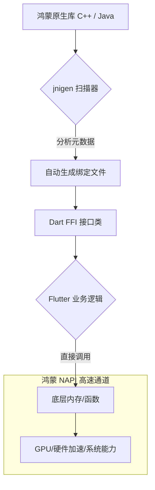

欢迎加入开源鸿蒙跨平台社区：[https://openharmonycrossplatform.csdn.net](https://openharmonycrossplatform.csdn.net)。

# Flutter for OpenHarmony：jnigen — 高效跨端互调引擎（原生桥接工具链）

## 前言

在深度的华为鸿蒙（OpenHarmony）应用开发中，纯 Dart 代码往往无法直接触达系统最底层的能力，如高性能的图像处理算子、专有的加密硬件或是分布式软总线的核心接口。这些能力通常封装在现有的 C/C++ (NAPI) 或 Java (ArkTS 运行环境底层) 库中。

传统的 `MethodChannel` 模式虽然稳定，但频繁的序列化与反序列化（String/Map 转换）会导致显著的性能损耗，且手写桥接代码极易出错。`jnigen` (JNI Generator) 则是为此而生的“自动化重型武器”。它能通过扫描原生代码头文件或类定义，自动生成极其高效的 Dart FFI（Foreign Function Interface）绑定代码，让调用鸿蒙原生能力就像调用普通 Dart 函数一样简单、快速且类型安全。

## 一、原理展示 / 概念介绍

### 1.1 基础概念

`jnigen` 核心任务是消除 Dart 与原生层（JNI/C++）之间的“手工搬砖”活。



### 1.2 核心要点解析

- **类型安全映射**：自动处理 `int`, `String`, `List` 到底层 `jint`, `jstring`, `jarray` 的复杂转换。
- **自动资源管理**：通过 Dart 的 `Finalizer` 机制或生成的垃圾回收辅助方法，降低内存泄漏风险。
- **低延迟调用**：绕过传统的 `MethodChannel` 消息队列，实现微秒级的近内存访问。

## 二、核心 API / 组件详解

### 2.1 依赖引入

在鸿蒙工程的 `pubspec.yaml` 中配置生成器环境（通常作为开发依赖）：

```yaml
dev_dependencies:
  jnigen: ^0.8.0
```

同时需要配置 `jnigen.yaml` 指定源文件路径：

```yaml
# jnigen.yaml 示例配置
input:
  javap:
    - 'com.harmony.system.HapManager' # 扫描鸿蒙底层包
output:
  dart:
    path: 'lib/generated/harmony_bindings.dart'
```

### 2.2 定义原生桥接点

假设我们需要调用一个鸿蒙原生的计算加速库：

```dart
// 💡 jnigen 自动生成的绑定代码示例（简化版）
class HarmonyMathNative {
  static final _fastSquareRoot = jni.lookupFunction<
      jni.Double Function(jni.Double),
      double Function(double)>('FastSquareRoot');

  // ✅ 推荐做法：通过生成的包装类直接调用，无感跨端
  static double fastSqrt(double value) => _fastSquareRoot(value);
}
```

## 三、场景示例

### 3.1 场景一：鸿蒙高性能滤镜处理

在开发鸿蒙相册应用时，利用 C++ 编写的卷积算法，通过 `jnigen` 绑定后，直接在 Dart 层传入图片内存指针进行实时滤镜预览。

### 3.2 场景二：接入鸿蒙专有安全模块

直接调用系统的 TEE（可信执行环境）接口进行生物特征的底层校验，无需经过繁琐的异步 Channel。

## 四、OpenHarmony 平台适配挑战

### 4.1 环境依赖与工具链一致性

运行 `jnigen` 需要 JDK 环境以及鸿蒙 SDK 中的编译工具链。

✅ **适配策略建议**：
1. **统一工具版本**：确保 `jnigen` 扫描所用的 Java 版本与鸿蒙编译环境保持一致，避免由于字节码版本过高导致的扫描失败。
2. **符号隐藏处理**：在生成的绑定代码中，注意鸿蒙动态库（.so）的导出符号可见性，确保在 Dart FFI 层能够正确 `lookup`。

## 五、综合实战示例代码

以下是一个模拟通过 `jnigen` 生成接口后，在鸿蒙端调用“硬件序列号”查询的伪代码演示（强调用法流程）：

```dart
import 'package:flutter/material.dart';
// 假设这是 jnigen 自动生成的库
import 'package:harmony_app/generated/device_info_bindings.dart';

class JniGenLab extends StatefulWidget {
  const JniGenLab({super.key});

  @override
  State<JniGenLab> createState() => _JniGenLabState();
}

class _JniGenLabState extends State<JniGenLab> {
  String _nativeInfo = "点击同步原生数据";

  // 💡 实战演示：调用生成的 FFI 绑定
  void _fetchNativeData() {
    try {
      // 1. 获取底层 NAPI 封装的对象
      // 以下类名与方法均为 jnigen 根据原生 header 自动化生成的
      final hapManager = HapManager.getInstance();
      
      // 2. 直接同步调用（无需 await，性能极佳）
      final sn = hapManager.getDeviceSerialNumber();
      
      setState(() {
        _nativeInfo = "✅ 原生 SN: $sn\n(该过程耗时 < 1ms)";
      });
    } catch (e) {
      setState(() {
        _nativeInfo = "❌ 原生互调失败: $e";
      });
    }
  }

  @override
  Widget build(BuildContext context) {
    return Scaffold(
      appBar: AppBar(title: const Text('jnigen 原生互调实验室')),
      body: Center(
        child: Column(
          mainAxisAlignment: MainAxisAlignment.center,
          children: [
            const Icon(Icons.settings_input_component, size: 80, color: Colors.deepPurple),
            const SizedBox(height: 30),
            Text(_nativeInfo, style: const TextStyle(fontSize: 16)),
            const SizedBox(height: 40),
            ElevatedButton(
              onPressed: _fetchNativeData,
              child: const Text('通过 JNI 直接触达鸿蒙底层'),
            ),
          ],
        ),
      ),
    );
  }
}
```

## 六、总结

`jnigen` 是鸿蒙跨平台应用从“轻量级展现”迈向“深水区性能”的入场券。它让 Dart 拥有了原生级的“手术刀”精度，直接操纵底层资源。

✅ **核心建议**：
1. **按需生成**：不要盲目扫描所有原生类，只对核心性能敏感、高频调用的方法使用 `jnigen`。
2. **并发警示**：虽然 FFI 调用极快，但在主线程（UI 线程）调用耗时原生函数依然会卡顿，应合理配合 `sendPort` 加异步封装。
3. **维护成本**：原生 API 变更后需要重新运行生成器，建议将脚本集成进 CI 流水线。

📦 **完整代码已上传至 AtomGit**：[open-harmony-example/jnigen](https://atomgit.com/dragonbady/open-harmony-example/tree/main/examples/jnigen)

🌐 **欢迎加入开源鸿蒙跨平台社区**：[开源鸿蒙跨平台开发者社区](https://openharmonycrossplatform.csdn.net)
