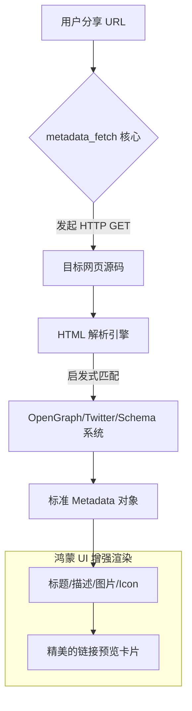

欢迎加入开源鸿蒙跨平台社区：[https://openharmonycrossplatform.csdn.net](https://openharmonycrossplatform.csdn.net)。

# Flutter for OpenHarmony：metadata_fetch — 链接的读心术（元数据提取底座）

## 前言

在华为鸿蒙（OpenHarmony）生态的社交、新闻以及办公应用中，用户经常会分享网页链接（URL）。如果我们仅仅显示一串冰冷的链接字符，用户的点击欲望和阅读效率会大大降低。现代化的应用应当在用户粘贴链接时，瞬间展示出网页的精美标题、摘要以及代表性的封面图——这就是所谓的“链接卡片”。

`metadata_fetch` 是一款高性能、多标准的网页元数据解析库。它能自适应解析 HTML 文档中的 `OpenGraph` (og:), `Twitter Cards` (twitter:), 以及传统的 `<meta>` 标签和 JSON-LD 数据。在鸿蒙跨平台应用的开发中，它通过极其简练的接口，让开发者能够瞬间获取网页的灵魂信息。在构建鸿蒙平台的社交动态、笔记应用或内容聚合展示页时，它是提升界面丰富度与交互颗粒度的必备组件。

## 一、原理展示 / 概念介绍

### 1.1 基础概念

本库实现了端侧对 Web 语义化标签的高速扫描。



### 1.2 核心要点解析

- **多系统兼容**：能够从多种不规范的网页标签中，按照优先级（优先使用 OpenGraph）自动融合出最准确的描述信息。
- **高效处理**：基于底层轻量级的 HTML 解析器，无须在鸿蒙端完整渲染 Webview 即可得到结果，极大地节省了 CPU 与内存。
- **灵活的数据结构**：不仅提供常用字段简化访问，还允许开发者通过自定义选择器（Selectors）深挖网页中特定的自定义 Meta 字段。

## 二、核心 API / 组件详解

### 2.1 依赖引入

在鸿蒙工程的 `pubspec.yaml` 中添加以下依赖：

```yaml
dependencies:
  metadata_fetch: ^0.5.0 # 建议参考最新稳定版本
```

### 2.2 快速提取网页摘要

在鸿蒙端处理用户粘贴的外部链接：

```dart
import 'package:metadata_fetch/metadata_fetch.dart';

Future<void> previewLink(String url) async {
  // ✅ 推荐做法：通过 extract 方法发起异步检索并解析
  var data = await MetadataFetch.extract(url);
  
  if (data != null) {
    print('网页标题: ${data.title}');
    print('描述摘要: ${data.description}');
    print('封面图地址: ${data.image}');
    print('网站图标: ${data.favIcon}');
  }
}
```

### 2.3 自定义解析来源

💡 **技巧**：针对一些特殊的电商或技术博客，可以手动获取 `Document` 对象后进行二次提取。

## 三、场景示例

### 3.1 场景一：鸿蒙分布式社交卡片

当鸿蒙设备间通过低功耗蓝牙分享一个链接时，接收端利用 `metadata_fetch` 异步生成预览卡片，让用户在点击打开前即知晓内容大意。

### 3.2 场景二：智能收藏夹预览

在鸿蒙平板端的浏览器收藏功能中，不再显示单一的网址，而是自动为每个收藏位抓取精美封面图，构建属于用户的视觉化阅读库。

## 四、OpenHarmony 平台适配挑战

### 4.1 网络加载策略与 User-Agent

部分网页会对移动端访问或特定的请求头进行反爬限制，导致抓取失败。

✅ **适配策略建议**：
1. **设置合理的 UA**：在调用 `extract` 时，可以尝试传入符合鸿蒙系统标识的 User-Agent 字符串，让服务器返回更适合预览的轻量版 HTML。
2. **异步与并发控制**：在处理列表页多链接预览时，由于每个链接都需要网络 IO。务必结合鸿蒙自带的多核算力，分批次进行提取，并配合骨架屏（Shimmer）动效，提升用户的整体感知流畅度。

## 五、综合实战示例代码

以下是一个演示如何在鸿蒙端实现的“链接读心术”预览卡片组件：

```dart
import 'package:flutter/material.dart';
import 'package:metadata_fetch/metadata_fetch.dart';

class MetadataLabPage extends StatefulWidget {
  const MetadataLabPage({super.key});

  @override
  State<MetadataLabPage> createState() => _MetadataLabPageState();
}

class _MetadataLabPageState extends State<MetadataLabPage> {
  Metadata? _previewData;
  bool _isLoading = false;

  void _fetchMetadata(String url) async {
    setState(() => _isLoading = true);
    
    // 💡 实战技巧：异步提取元数据
    final data = await MetadataFetch.extract(url);
    
    setState(() {
      _previewData = data;
      _isLoading = false;
    });
  }

  @override
  Widget build(BuildContext context) {
    return Scaffold(
      appBar: AppBar(title: const Text('网页元数据实验室')),
      body: Padding(
        padding: const EdgeInsets.all(20),
        child: Column(
          children: [
            TextField(onSubmitted: _fetchMetadata, decoration: const InputDecoration(labelText: '输入网址并回车 (如: https://huawei.com)')),
            const SizedBox(height: 30),
            if (_isLoading) const CircularProgressIndicator(),
            if (_previewData != null)
              Card(
                clipBehavior: Clip.antiAlias,
                child: Column(
                  children: [
                    if (_previewData!.image != null) Image.network(_previewData!.image!),
                    ListTile(
                      title: Text(_previewData!.title ?? "未知标题"),
                      subtitle: Text(_previewData!.description ?? "暂无预览描述", maxLines: 2),
                    ),
                  ],
                ),
              ),
          ],
        ),
      ),
    );
  }
}
```

## 六、总结

`metadata_fetch` 是链接与用户之间的一座感官桥梁。它通过解析网页深层的语义数据，赋予了鸿蒙应用理解万维网、呈现高质量互动内容的能力。

✅ **核心建议**：
1. **本地结果持久化**：预览结果通常半个月内不会改变。建议配合 `shared_preferences` 在鸿蒙端缓存解析结果，避免重复对同一个 URL 发起网络请求。
2. **异常捕获**：由于网络不通或 URL 格式非法，`extract` 极易抛出异常，务必使用 `try-catch` 严密包裹。
3. **占位处理**：对于无法提取图片的链接，建议使用鸿蒙默认的“网页链接”图标作为占位图，保持 UI 的整体厚度一致性。

📦 **完整代码已上传至 AtomGit**：[open-harmony-example/metadata_fetch](https://atomgit.com/dragonbady/open-harmony-example/tree/main/examples/metadata_fetch)

🌐 **欢迎加入开源鸿蒙跨平台社区**：[开源鸿蒙跨平台开发者社区](https://openharmonycrossplatform.csdn.net)
