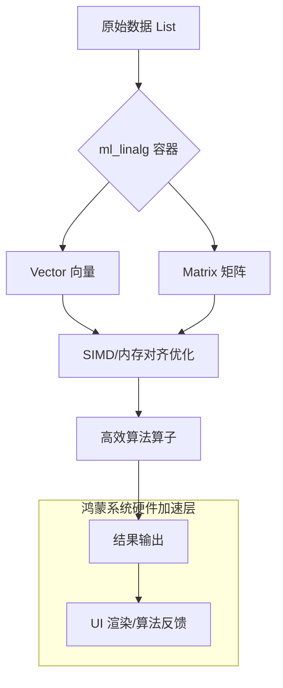

欢迎加入开源鸿蒙跨平台社区：[https://openharmonycrossplatform.csdn.net](https://openharmonycrossplatform.csdn.net)。

# Flutter for OpenHarmony：ml_linalg — 高性能线性代数引擎（数据科学底座）

## 前言

随着华为鸿蒙（OpenHarmony）生态向专业办公与智能化方向演进，开发者对高性能科学计算的需求日益旺盛。无论是处理复杂的图像变换、实现个性化推荐算法，还是进行实时的传感器数据滤波，都离不开底层的线性代数运算。

`ml_linalg` 是一款专门为 Dart 生态设计的工程级线性代数库。它不仅提供了极其丰富的向量（Vector）与矩阵（Matrix）运算接口，更在底层进行了大量的数学优化。在鸿蒙跨平台开发中，它能帮助你规避手写嵌套循环导致的性能瓶颈，直接利用高效的数据结构处理大规模数据集。

## 一、原理展示 / 概念介绍

### 1.1 基础概念

`ml_linalg` 的核心在于对数学实体的抽象与高效存储。



### 1.2 核心要点解析

- **Vector（向量）**：支持一维数值的高效点积、标量乘法及各种范数计算。
- **Matrix（矩阵）**：支持二维数据的加减乘除、转置、求逆以及特征值分解（取决于版本支持）。
- **惰性求值与性能**：部分操作采用惰性计算模式，仅在真正访问数据时执行计算，显著降低内存抖动。

## 二、核心 API / 组件详解

### 2.1 依赖引入

在鸿蒙工程的 `pubspec.yaml` 中添加以下依赖：

```yaml
dependencies:
  ml_linalg: ^13.0.0
```

### 2.2 向量运算实战

处理鸿蒙设备传感器数据（如加速度计）的标准化：

```dart
import 'package:ml_linalg/vector.dart';

void processSensorData() {
  // ✅ 推荐做法：使用 Vector 加载原始数据
  final accelerometer = Vector.fromList([9.8, 0.1, -0.2]);
  
  // 💡 技巧：快速进行向量归一化
  final normalized = accelerometer.normalize();
  print('标准化后的重力向量: $normalized');
}
```

### 2.3 矩阵变换应用

在处理自定义图形绘制或鸿蒙 2D 骨骼动画时：

```dart
import 'package:ml_linalg/matrix.dart';

void applyTransformation() {
  // 定义一个 3x3 的平移矩阵
  final translationMatrix = Matrix.fromList([
    [1, 0, 100],
    [0, 1, 50],
    [0, 0, 1],
  ]);
  
  // 💡 技巧：利用矩阵乘法进行批量坐标变换
  final points = Matrix.fromList([
    [10, 20, 1],
    [30, 40, 1],
  ]);
  
  final transformed = points * translationMatrix.transpose();
}
```

## 三、场景示例

### 3.1 场景一：鸿蒙智能相册的特征比对

当需要根据图像特征向量计算两张图片的相似度时。

```dart
double calculateSimilarity(Vector feat1, Vector feat2) {
  // 💡 技巧：使用余弦相似度（Cosine Similarity）
  return feat1.dot(feat2) / (feat1.norm() * feat2.norm());
}
```

### 3.2 场景二：复杂 UI 的色彩空间转换

在鸿蒙应用中实现动态主题时，可能需要对 RGB 颜色矩阵进行线性变换以获取滤镜效果。

```dart
Matrix applyGrayscaleFilter(Matrix pixels) {
  final grayscaleWeights = Matrix.fromList([
    [0.299, 0.587, 0.114],
    [0.299, 0.587, 0.114],
    [0.299, 0.587, 0.114],
  ]);
  return pixels * grayscaleWeights;
}
```

## 四、OpenHarmony 平台适配挑战

### 4.1 内存管理与垃圾回收

大量的矩阵运算会产生海量的短生命周期对象，这对鸿蒙系统的 ArkTS/Dart 虚拟机 GC 压力较大。

✅ **适配策略建议**：
1. **重用对象**：对于在 `Animation` 回调中执行的运算，尽量预先创建好 `Matrix` 结构，避免每帧 `fromList`。
2. **精度选择**：如果不需要双精度浮点数，可以考虑是否能通过数据缩放改用整数运算，但在 `ml_linalg` 中，应优先利用其内置的批量操作以触发底层编译器优化。

## 五、综合实战示例代码

以下是一个用于计算鸿蒙应用中“用户活跃度评分”的加权评估系统：

```dart
import 'package:flutter/material.dart';
import 'package:ml_linalg/vector.dart';
import 'package:ml_linalg/matrix.dart';

class MLAnalysisLab extends StatefulWidget {
  const MLAnalysisLab({super.key});

  @override
  State<MLAnalysisLab> createState() => _MLAnalysisLabState();
}

class _MLAnalysisLabState extends State<MLAnalysisLab> {
  String _result = "点击开始数据分析";

  void _runAnalysis() {
    // 💡 实战示例：用户行为数据分析
    // 假设数据：[登录次数, 在线时长(h), 点击率]
    final userData = Matrix.fromList([
      [5, 2.5, 0.1],
      [10, 8.0, 0.4],
      [2, 0.5, 0.05],
    ]);

    // 定义各项指标的权重向量
    final weights = Vector.fromList([0.3, 0.5, 0.2]);

    // 💡 技巧：通过矩阵与向量乘法一次性算出所有用户的综合评分
    final scores = userData * weights;

    setState(() {
      _result = "用户 A 评分: ${scores[0].toStringAsFixed(2)}\n"
                "用户 B 评分: ${scores[1].toStringAsFixed(2)}\n"
                "用户 C 评分: ${scores[2].toStringAsFixed(2)}";
    });
  }

  @override
  Widget build(BuildContext context) {
    return Scaffold(
      appBar: AppBar(title: const Text('ml_linalg 科学计算实验室')),
      body: Center(
        child: Padding(
          padding: const EdgeInsets.all(20),
          child: Column(
            mainAxisAlignment: MainAxisAlignment.center,
            children: [
              const Icon(Icons.calculate_outlined, size: 80, color: Colors.indigo),
              const SizedBox(height: 30),
              Container(
                padding: const EdgeInsets.all(15),
                decoration: BoxDecoration(
                  color: Colors.grey[100],
                  borderRadius: BorderRadius.circular(12),
                ),
                child: Text(_result, style: const TextStyle(fontFamily: 'monospace')),
              ),
              const SizedBox(height: 40),
              ElevatedButton.icon(
                onPressed: _runAnalysis,
                icon: const Icon(Icons.play_arrow),
                label: const Text('执行加权评分矩阵运算'),
                style: ElevatedButton.styleFrom(
                  backgroundColor: Colors.indigo,
                  foregroundColor: Colors.white,
                  padding: const EdgeInsets.symmetric(horizontal: 30, vertical: 15),
                ),
              ),
            ],
          ),
        ),
      ),
    );
  }
}
```

## 六、总结

`ml_linalg` 将枯燥的数学公式转化为了高效的生产力工具。在 OpenHarmony 平台上，它不仅是开发机器学习应用的基石，更是优化常规应用数据处理性能的“降维打击”武器。

✅ **核心建议**：
1. **向量化思维**：能用向量批量解决的，绝不写 `for` 循环。
2. **注意维度匹配**：在进行矩阵乘法前，务必校验列数与行数是否相等，避免运行时抛出维度异常。
3. **结合图表展示**：科学计算的结果通常需要可视化，建议配合 `fl_chart` 等库在鸿蒙端直观展示运算结果。

📦 **完整代码已上传至 AtomGit**：[open-harmony-example/ml_linalg](https://atomgit.com/dragonbady/open-harmony-example/tree/main/examples/ml_linalg)

🌐 **欢迎加入开源鸿蒙跨平台社区**：[开源鸿蒙跨平台开发者社区](https://openharmonycrossplatform.csdn.net)
