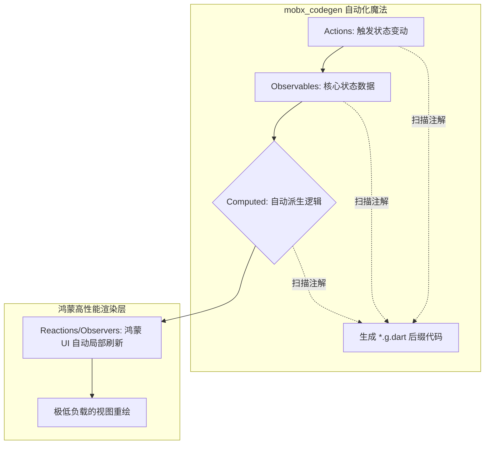

欢迎加入开源鸿蒙跨平台社区：[https://openharmonycrossplatform.csdn.net](https://openharmonycrossplatform.csdn.net)。

# Flutter for OpenHarmony：mobx_codegen — 透明响应式的魔法棒（状态派生底座）

## 前言

在华为鸿蒙（OpenHarmony）生态的复杂业务应用开发中，如何在保持逻辑解耦的同时，实现 UI 与状态之间“丝滑、自动化”的同步更新，是架构设计面临的一大挑战。传统的观察者模式（Observers）通常需要开发者手动编写大量的通知（Notify）代码，不仅繁琐，且极其容易出错。

`mobx_codegen` 是一款专为 MobX 状态管理框架设计的代码生成利器。它倡导“透明响应式”概念，通过简单的注解（Annotations），自动生成复杂的观察者绑定逻辑、计算属性派生以及动作执行封装。在鸿蒙跨平台应用的开发中，它通过将繁琐的样板代码自动化，让开发者能够专注于核心业务逻辑。在构建鸿蒙平台的股票高频动态列表、复杂多级表单联动、以及实时数据可视化看板时，它是实现“极致开发效率”与“像素级实时响应”的核心基座。

## 一、原理展示 / 概念介绍

### 1.1 基础概念

MobX 实现了从“数据变动”到“界面更新”的自动传导。



### 1.2 核心要点解析

- **透明追踪**：不需要订阅（Subscribe）特定的流，UI 在读取状态的那一刻，MobX 就会自动建立依赖关系并在数据变动时精准通知。
- **派生（Computed）优化**：计算属性仅在依赖的状态真正改变时才会重新计算，极大减轻了鸿蒙设备的 CPU 运算负担。
- **样板代码消除**：开发者写的是简洁的抽象类模型，底层繁杂的属性存取与更新逻辑由 `mobx_codegen` 一键生成。

## 二、核心 API / 组件详解

### 2.1 依赖引入

在鸿蒙工程的 `pubspec.yaml` 中添加以下依赖：

```yaml
dependencies:
  mobx: ^2.0.0
  flutter_mobx: ^2.0.0 # UI 绑定
  
dev_dependencies:
  mobx_codegen: ^2.0.0 # 💡 代码生成器
  build_runner: ^2.4.0
```

### 2.2 定义响应式 Store

在鸿蒙工程中创建一个简单的用户状态模型：

```dart
import 'package:mobx/mobx.dart';

// ✅ 推荐做法：通过 part 引用生成的代码
part 'user_store.g.dart';

class UserStore = _UserStoreBase with _$UserStore;

abstract class _UserStoreBase with Store {
  @observable
  int clickCount = 0; // 💡 技巧：声明一个可观察状态

  @action
  void increment() { // 💡 技巧：声明一个修改状态的动作
    clickCount++;
  }
}
```

### 2.3 启动生成任务

在鸿蒙项目根目录下执行：

```bash
# 💡 技巧：实时监听文件变化并生成代码
dart run build_runner watch
```

## 三、场景示例

### 3.1 场景一：鸿蒙端“实时股票行情”自适应看板

每秒刷新成百上千次的数据流，利用 MobX 的高效依赖追踪，确保只有变动的那几行行情数据触发自绘，维持鸿蒙高刷屏的满分帧率。

### 3.2 场景二：复杂折叠屏多级联动表单

在鸿蒙平板上，用户修改左侧的数值，右侧派生出的“预计总额”和“税务详情”通过 `@computed` 属性秒级自动重绘，无需任何回调（Callbacks）传递。

## 四、OpenHarmony 平台适配挑战

### 4.1 代码生成对大型项目的编译压力

随着鸿蒙应用规模扩大，`build_runner` 的速度可能变慢。

✅ **适配策略建议**：
1. **分模块构建（Build Filtering）**：在大型鸿蒙工程中，使用 `dart run build_runner build --build-filter="lib/feature_x/*.dart"` 仅对当前开发的模块进行生成。
2. **避免过深的计算嵌套**：虽然 MobX 很智能，但在鸿蒙端处理超大规模数据时，过深的派生链（Computed 链）可能会增加首次初始化的耗时。

## 五、综合实战示例代码

以下是一个演示如何在鸿蒙端实现的“透明响应式计数器”实战组件：

```dart
import 'package:flutter/material.dart';
import 'package:flutter_mobx/flutter_mobx.dart';
import 'user_store.dart'; // 引入上面定义的 Store

class MobXLabPage extends StatelessWidget {
  final UserStore store = UserStore();

  @override
  Widget build(BuildContext context) {
    return Scaffold(
      appBar: AppBar(title: const Text('MobX 自动状态实验室')),
      body: Center(
        child: Column(
          mainAxisAlignment: MainAxisAlignment.center,
          children: [
            const Icon(Icons.auto_awesome, size: 80, color: Colors.amber),
            const SizedBox(height: 30),
            // 💡 实战技巧：使用 Observer 包裹需要响应状态的组件
            Observer(
              builder: (_) => Text(
                '鸿蒙透明响应次数: ${store.clickCount}',
                style: const TextStyle(fontSize: 28, fontWeight: FontWeight.bold),
              ),
            ),
            const SizedBox(height: 50),
            ElevatedButton.icon(
              onPressed: () => store.increment(), // 调用 Action
              icon: const Icon(Icons.add),
              label: const Text('触发 MobX 状态变更'),
            ),
          ],
        ),
      ),
    );
  }
}
```

## 六、总结

`mobx_codegen` 将“响应式开发”提升到了一个新的高度。它让鸿蒙应用的逻辑流转看起来和编写同步代码一样直观，极大地降低了心智负担，同时为应用注入了高性能的运行基因。

✅ **核心建议**：
1. **不要手动修改生成的 `.g.dart` 文件**：所有的修改都应在抽象基类中进行，生成器会自动覆盖产物。
2. **合理颗粒度**：为每个鸿蒙功能页面定义独立的 Store，通过依赖注入（DI）或 Provider 在组件内共享。
3. **结合 Reaction 调试**：利用 MobX 的 `reaction` 函数，在鸿蒙端的逻辑日志中监控特定敏感数据的非法变动，实现快速排障。

📦 **完整代码已上传至 AtomGit**：[open-harmony-example/mobx_gen](https://atomgit.com/dragonbady/open-harmony-example/tree/main/examples/mobx_gen)

🌐 **欢迎加入开源鸿蒙跨平台社区**：[开源鸿蒙跨平台开发者社区](https://openharmonycrossplatform.csdn.net)
