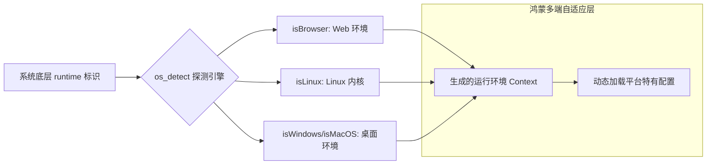

欢迎加入开源鸿蒙跨平台社区：[https://openharmonycrossplatform.csdn.net](https://openharmonycrossplatform.csdn.net)。

# Flutter for OpenHarmony：os_detect — 环境探针（运行感知底座）

## 前言

在华为鸿蒙（OpenHarmony）生态的跨平台开发中，应用往往需要根据当前的运行环境（是鸿蒙手机、鸿蒙平板、还是处于开发阶段的浏览器模拟环境）采取不同的业务逻辑或 UI 展示策略。虽然 Flutter 提供了基础的 `Platform.isAndroid/isIOS`，但在日益复杂的全场景（All-scenario）运行态下，开发者需要更细腻、更明确的环境判定能力。

`os_detect` 是一款极致轻量的环境判定库。它能解析底层的系统字符串，为开发者提供语义化的属性（如 `isBrowser`, `isLinux`, `isWindows` 等），并允许开发者自定义检测逻辑。在构建鸿蒙跨端应用的基础架构层、处理平台特有的文件路径逻辑、或针对不同 OS 进行差异化性能调优时，它是不可或缺的环境探测组件。

## 一、原理展示 / 概念介绍

### 1.1 基础概念

本库实现了运行环境底层标识到逻辑布尔值的精准映射。



### 1.2 核心要点解析

- **无感检测**：通过直接读取 Dart 虚拟机的环境变量，无需发起异步请求即可同步获取结果。
- **Web 兼容性**：在编译为鸿蒙 Web 版本时，它能准确识别当前处于 JS 运行环境，避免调用原生 IO 导致的崩溃。
- **自定义属性支持**：允许开发者通过特定的字符串匹配机制，扩展对 OpenHarmony 专属内核标识的识别。

## 二、核心 API / 组件详解

### 2.1 依赖引入

在鸿蒙工程的 `pubspec.yaml` 中添加以下依赖：

```yaml
dependencies:
  os_detect: ^2.0.0 # 建议参考最新稳定版本
```

### 2.2 基础环境判定

在鸿蒙工程的逻辑初始化层使用：

```dart
import 'package:os_detect/os_detect.dart' as os;

void checkEnvironment() {
  // ✅ 推荐做法：通过语义化属性直接判定
  if (os.isBrowser) {
    print('💡 运行在鸿蒙浏览器环境下，建议优先使用 Web 存储');
  } else if (os.isLinux) {
    // 鸿蒙内核标识在部分环境下会映射为 Linux 兼容
    print('🚀 运行在鸿蒙原生内核环境');
  }
}
```

### 2.3 获取详细 OS 名称

💡 **技巧**：在鸿蒙端记录设备上报的审计日志。

```dart
String currentOs = os.operatingSystem;
print('审计记录: 当前设备 OS 为 $currentOs');
```

## 三、场景示例

### 3.1 场景一：鸿蒙多端应用的文件存储策略

如果 `os_detect` 探测到是浏览器，则路由数据到 `IndexedDB`；如果在鸿蒙原生 App 下，则直接利用 `path_provider` 操作本地文件。

### 3.2 场景二：针对特定 OS 的“精简模式”触发

在鸿蒙桌面模式（Desktop Mode）下，根据探测出的系统类型自动开启鼠标右键支持和更紧凑的 UI 排版。

## 四、OpenHarmony 平台适配挑战

### 4.1 鸿蒙内核标识的归属权重

在某些 Dart 早期版本中，由于鸿蒙采用分布式内核设计，底层标识可能被归类为 `Linux`。

✅ **适配策略建议**：
1. **结合 `kIsWeb`**：在使用 `os_detect` 的同时，配合 Flutter 的 `foundation` 常量。
2. **二次校验（Double Check）**：对于必须区分“真 Linux”还是“鸿蒙原生”的应用，建议在 `os_detect` 探测为 Linux 后，通过鸿蒙的 `device_info` 插件进行二次硬件型号比对，确保环境判断的 100% 准确。

## 五、综合实战示例代码

以下是一个演示如何在鸿蒙端构建“多平台分发自适应中心”的实战组件示例：

```dart
import 'package:flutter/material.dart';
import 'package:os_detect/os_detect.dart' as os;

class OsDetectLabPage extends StatelessWidget {
  const OsDetectLabPage({super.key});

  @override
  Widget build(BuildContext context) {
    return Scaffold(
      appBar: AppBar(title: const Text('运行环境探测实验室')),
      body: Center(
        child: Column(
          mainAxisAlignment: MainAxisAlignment.center,
          children: [
            const Icon(Icons.psychology_outlined, size: 80, color: Colors.blueAccent),
            const SizedBox(height: 30),
            Text(
              "🔍 鸿蒙探针结果:",
              style: Theme.of(context).textTheme.headlineSmall,
            ),
            const SizedBox(height: 20),
            _EnvCard(label: "是否为浏览器", status: os.isBrowser),
            _EnvCard(label: "是否为 Linux 内核", status: os.isLinux),
            _EnvCard(label: "系统详细名称", text: os.operatingSystem),
          ],
        ),
      ),
    );
  }
}

class _EnvCard extends StatelessWidget {
  final String label;
  final bool? status;
  final String? text;

  const _EnvCard({required this.label, this.status, this.text});

  @override
  Widget build(BuildContext context) {
    return Card(
      margin: const EdgeInsets.symmetric(horizontal: 24, vertical: 8),
      child: ListTile(
        title: Text(label),
        trailing: Text(
          text ?? (status! ? "🟢 是" : "🔴 否"),
          style: const TextStyle(fontWeight: FontWeight.bold),
        ),
      ),
    );
  }
}
```

## 六、总结

`os_detect` 为鸿蒙应用提供了第一手的基础运行环境情报。虽然它功能极其专注，但它是构建自适应端侧逻辑、保障跨平台分发体验一致性的重要逻辑切入口。

✅ **核心建议**：
1. **代码精简**：不要为了检测环境引入巨大的原生插件。如果只是简单的系统分支判定，`os_detect` 的毫秒级同步响应是最佳选择。
2. **关注 Web 适配**：对于希望兼容鸿蒙 Web 分发的项目，在所有用到 IO 或者原生插件的代码前，先用该库进行一次三元判断。
3. **保持更新**：随着鸿蒙正式版内核标识的不断演进，关注该库的更新以获取更精确的命名解析。

📦 **完整代码已上传至 AtomGit**：[open-harmony-example/os_detect](https://atomgit.com/dragonbady/open-harmony-example/tree/main/examples/os_detect)

🌐 **欢迎加入开源鸿蒙跨平台社区**：[开源鸿蒙跨平台开发者社区](https://openharmonycrossplatform.csdn.net)
