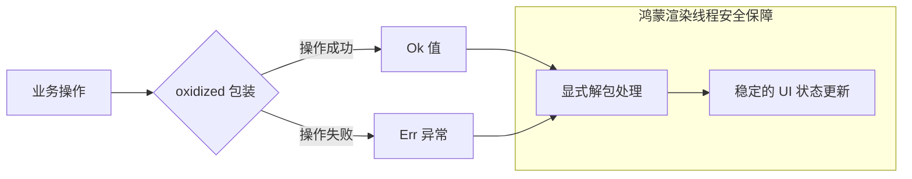

欢迎加入开源鸿蒙跨平台社区：[https://openharmonycrossplatform.csdn.net](https://openharmonycrossplatform.csdn.net)。

# Flutter for OpenHarmony：oxidized — 现代化的错误处理与 Result 类型机制（错误治理引擎）

## 前言

在大型华为鸿蒙（OpenHarmony）应用的开发中，传统的 `try-catch` 错误处理模式往往会导致代码逻辑支离破碎。异常流与正常业务流交织在一起，不仅降低了代码的可维护性，更容易遗漏边界情况，导致应用在真实鸿蒙设备上意外崩溃。

`oxidized` 库借鉴了 Rust 语言的核心设计理念，为 Dart 和 Flutter 带来了强类型的 `Result` 和 `Option` 机制。它引导开发者通过类型系统显式化处理“成功”与“失败”，不仅能消除臭名昭著的 `null` 引用问题，还能大幅提升复杂异步逻辑下的系统稳定性。在追求极致稳健的鸿蒙跨平台应用中，它是构建防御式编程体系的必备利器。

## 一、原理展示 / 概念介绍

### 1.1 基础概念

`oxidized` 的核心思想是将异常抛出转变为数据返回。



### 1.2 核心要点解析

- **Result<T, E>**：代表一个可能产生错误的操作结果。它要么是 `Ok(T)`（包含成功数据），要么是 `Err(E)`（包含错误信息）。
- **Option<T>**：代表一个可能为空的值，消除原始的 `null` 判断，强制开发者处理 `None` 的情况。
- **模式匹配（Pattern Matching）**：结合 Dart 的 `switch` 表达式，可以优雅地穷举所有可能的结果分支。

## 二、核心 API / 组件详解

### 2.1 依赖引入

在鸿蒙工程的 `pubspec.yaml` 中添加以下依赖：

```yaml
dependencies:
  oxidized: ^6.0.0
```

### 2.2 Result 类型详解

在处理鸿蒙底层 NAPI 调用或网络请求时，`Result` 表现极佳：

```dart
import 'package:oxidized/oxidized.dart';

// ✅ 推荐做法：显式返回 Result 而不是抛出 Exception
Result<String, String> getHarmonyVersion() {
  bool success = true; // 模拟鸿蒙系统 API 调用
  if (success) {
    return Ok("OpenHarmony 5.0");
  } else {
    return Err("获取版本失败：系统服务未就绪");
  }
}
```

### 2.3 高效解包技巧

💡 **技巧**：利用 `.match()` 方法可以强制覆盖所有逻辑分支，避免业务漏洞。

```dart
final result = getHarmonyVersion();

final message = result.match(
  (version) => "当前系统：$version",  // 成功分支
  (error) => "警告：$error",          // 错误分支
);
```

## 三、场景示例

### 3.1 场景一：鸿蒙多设备资源同步检测

在鸿蒙分布式场景下，我们需要检测远程设备的资源是否可用。使用 `Option` 可以极大地精简判断逻辑。

```dart
Option<String> findRemoteResource(String deviceId) {
  // 模拟寻找分布式资源
  return None(); // 如果找不到，直接返回 None
}

// 💡 技巧：使用 unwrapOr 提供默认值，防止空指针
String resource = findRemoteResource("oh_tablet_01").unwrapOr("本地备份资源");
```

### 3.2 场景二：链式处理复杂业务流

当多个操作需要按顺序执行，且任何一步出错都要立即终止时。

```dart
// 模拟登录 -> 获取 Token -> 拉取用户配置的链式调用
Result<Config, String> loginAndGetConfig() {
  return login().andThen((token) => getProfile(token)).andThen((profile) => loadConfig(profile));
}
```

## 四、OpenHarmony 平台适配挑战

### 4.1 错误码语义化映射

鸿蒙系统（ArkUI/NAPI）有大量特有的数值型错误码（如 `401` 代表无权限）。

✅ **适配策略建议**：
1. **统一 Result 包装**：在 Flutter 插件层或 NAPI 桥接层，立即将鸿蒙原生错误码映射为 `Err` 类型的有效语义枚举。
2. **异步主线程隔离**：确保在处理长耗时的 `oxidized` 链式转换时，利用 Flutter 的 `Isolate` 或鸿蒙的 `Worker` 线程，避免阻塞渲染。

## 五、综合实战示例代码

以下是一个模拟鸿蒙系统文件读写的完整健壮示例：

```dart
import 'package:flutter/material.dart';
import 'package:oxidized/oxidized.dart';

// 💡 实战示例：模拟鸿蒙文件存储层封装
class HarmonyStorageService {
  Future<Result<String, Exception>> readFile(String fileName) async {
    await Future.delayed(const Duration(milliseconds: 500)); // 模拟 IO 耗时
    if (fileName == "config.json") {
      return Ok('{"theme": "dark"}'); // 成功读取
    }
    return Err(Exception("文件不存在：$fileName")); // 模拟错误
  }
}

class OxidizedLabPage extends StatefulWidget {
  const OxidizedLabPage({super.key});

  @override
  State<OxidizedLabPage> createState() => _OxidizedLabPageState();
}

class _OxidizedLabPageState extends State<OxidizedLabPage> {
  String _status = "等待读取...";
  final storage = HarmonyStorageService();

  void _handleRead() async {
    setState(() => _status = "读取中...");
    
    // 💡 模式匹配实战：优雅处理鸿蒙 IO 结果
    final result = await storage.readFile("setting.json");
    
    setState(() {
      _status = result.match(
        (data) => "✅ 读取成功内容: $data",
        (err) => "❌ 发生预期内错误: ${err.toString()}",
      );
    });
  }

  @override
  Widget build(BuildContext context) {
    return Scaffold(
      appBar: AppBar(title: const Text('Oxidized 错误处理实验室')),
      body: Center(
        child: Column(
          mainAxisAlignment: MainAxisAlignment.center,
          children: [
            const Icon(Icons.shield_outlined, size: 80, color: Colors.blue),
            const SizedBox(height: 20),
            Text(_status, style: const TextStyle(fontSize: 16)),
            const SizedBox(height: 40),
            ElevatedButton(
              onPressed: _handleRead,
              child: const Text('模拟读取鸿蒙配置文件'),
            ),
          ],
        ),
      ),
    );
  }
}
```

## 六、总结

`oxidized` 强有力地改变了我们在 OpenHarmony 平台上编写 Flutter 代码的习惯。它将“错误”从需要躲避的洪水猛兽，转变为了可以被编译期静态检查的、可预测的数据类型。

✅ **核心建议**：
1. **从接口开始**：首先将所有 Data Layer（数据层）和 Service Layer（服务层）的返回值改写为 `Result`。
2. **不要滥用 unwrap**：除非你 100% 确定数据存在，否则请始终使用 `match` 或 `ifLet` 进行安全解包。
3. **结合架构**：在 Bloc 或 Riverpod 中，直接将 `Result` 存储为 State，可以完美对应 UI 的 Loading/Success/Error 状态。

📦 **完整代码已上传至 AtomGit**：[open-harmony-example/oxidized](https://atomgit.com/dragonbady/open-harmony-example/tree/main/examples/oxidized)

🌐 **欢迎加入开源鸿蒙跨平台社区**：[开源鸿蒙跨平台开发者社区](https://openharmonycrossplatform.csdn.net)
