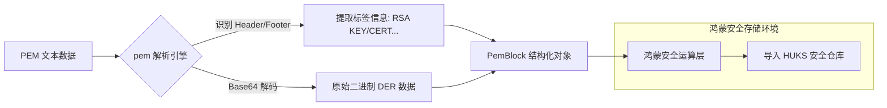

欢迎加入开源鸿蒙跨平台社区：[https://openharmonycrossplatform.csdn.net](https://openharmonycrossplatform.csdn.net)。

# Flutter for OpenHarmony：pem — 安全架构的解码者（秘钥解析底座）

## 前言

在华为鸿蒙（OpenHarmony）生态的政务、金融及高性能后台管理应用中，安全交互的核心往往基于非对称加密与数字证书。当应用从服务端下载了一个包含公钥或私钥的 PEM 格式文件（通常以 `-----BEGIN...` 开头）时，如何将其快速解析为原始的二进制数据（DER 格式），并移除掉所有换行符和 Base64 包裹，是进行后续加密运算的前提。

`pem` 是一款高度轻量化、专门用于 PEM 编码格式解析的 Dart 库。它不承担复杂的加密运算（那是 `cryptography` 的工作），而是专注于最基础、也最繁琐的“文本到二进制”的清洗与格式识别。在构建鸿蒙平台的安全证书管理器、VPN 客户端或专有加密通讯工具时，它是你打通安全数据流“第一公里”的底层工具。

## 一、原理展示 / 概念介绍

### 1.1 基础概念

PEM（Privacy-Enhanced Mail）是一种常见的密码学数据封装格式。



### 1.2 核心要点解析

- **自动提取标签**：能够精准识别是 `PRIVATE KEY`、`PUBLIC KEY` 还是 `CERTIFICATE`，方便鸿蒙端根据类型选择不同的存储策略。
- **鲁棒的解码能力**：自动处理 PEM 文件中多余的空格、各种风格的换行符（CRLF/LF），确保证书解析的 100% 成功率。
- **轻量无依赖**：纯 Dart 实现，无任何 C++ 原生绑定，完美适配鸿蒙各处理器架构。

## 二、核心 API / 组件详解

### 2.1 依赖引入

在鸿蒙工程的 `pubspec.yaml` 中添加以下分工明确的依赖：

```yaml
dependencies:
  pem: ^1.0.0 # 建议参考最新稳定版本
```

### 2.2 解析单个证书块

将一段 PEM 文本转化为二进制字节数组：

```dart
import 'package:pem/pem.dart';

void decodePem(String pemContent) {
  // ✅ 推荐做法：通过 decode 快速获取二进制
  List<int> bytes = PemCodec(pemLabel: "CERTIFICATE").decode(pemContent);
  print('解析完成，二进制长度: ${bytes.length}');
}
```

### 2.3 编码（逆向封装）

💡 **技巧**：将导出的公钥封装为标准的 PEM 格式保存。

```dart
String exportToPem(List<int> rawData) {
  // 💡 技巧：利用 PemCodec 的 encode 方法重新包裹
  return PemCodec(pemLabel: "RSA PUBLIC KEY").encode(rawData);
}
```

## 三、场景示例

### 3.1 场景一：鸿蒙端“政务证书”批量入库

当从系统下发一批包含数十个 PEM 证书的混合文件时，利用 `decode` 循环提取出每一个加密块，展示给用户预览并导入鸿蒙安全仓库。

### 3.2 场景二：两笔自定义加密通讯握手

在鸿蒙设备间建立点对点（P2P）连接时，将生成的临时 ECDSA 公钥通过 `pem` 库编码为字符串，便于在不稳定的通讯链路（如 BLE）中进行文本传输。

## 四、OpenHarmony 平台适配挑战

### 4.1 与原生安全库（HUKS）的对接

鸿蒙系统推荐将密钥存储在 `ohos.security.huks` 硬件保险箱中。

✅ **适配策略建议**：
1. **数据格式转换**：`pem` 库产生的 `List<int>` 数据即为标准的 DER 编码。在调用鸿蒙原生 NAPI 时，可直接将该数据流作为 `Uint8Array` 传入，无需二次转换。
2. **严防内存泄露**：在解析私钥 PEM 时，解析后产生的二进制流由于在受限的 Dart 堆内存中，务必在用完后手动对 List 进行填充零操作（Zeroing），保护鸿蒙应用在多任务切换时的隐私安全。

## 五、综合实战示例代码

以下是一个演示如何在鸿蒙端利用 `pem` 实现一个“证书元数据查看器”的实战组件：

```dart
import 'package:flutter/material.dart';
import 'package:pem/pem.dart';

class PemLabPage extends StatefulWidget {
  const PemLabPage({super.key});

  @override
  State<PemLabPage> createState() => _PemLabPageState();
}

class _PemLabPageState extends State<PemLabPage> {
  String _pemText = "-----BEGIN PUBLIC KEY-----\nMFkwEwYHKoZIzj0CAQYIKoZIzj0DAQcDQgAEMS59z...\n-----END PUBLIC KEY-----";
  String _result = "等待解析...";

  void _runDecode() {
    try {
      // 💡 实战技巧：解析并反馈二进制状态
      final codec = PemCodec(pemLabel: "PUBLIC KEY");
      final bytes = codec.decode(_pemText);
      
      setState(() {
        _result = "✅ 解析成功！\n解析字节数: ${bytes.length}\n首个字节标志位: 0x${bytes.first.toRadixString(16)}";
      });
    } catch (e) {
      setState(() => _result = "❌ 解析失败，证书格式或 Label 不匹配。");
    }
  }

  @override
  Widget build(BuildContext context) {
    return Scaffold(
      appBar: AppBar(title: const Text('PEM 加密数据实验室')),
      body: Padding(
        padding: const EdgeInsets.all(24),
        child: Column(
          children: [
            const Icon(Icons.security, size: 80, color: Colors.indigo),
            const SizedBox(height: 20),
            TextField(
              maxLines: 5,
              onChanged: (val) => _pemText = val,
              decoration: const InputDecoration(labelText: '粘贴 PEM 文本内容', border: OutlineInputBorder()),
            ),
            const SizedBox(height: 20),
            Container(
              width: double.infinity,
              padding: const EdgeInsets.all(16),
              color: Colors.indigo[50],
              child: Text(_result, style: const TextStyle(fontFamily: 'monospace')),
            ),
            const Spacer(),
            ElevatedButton.icon(
              onPressed: _runDecode,
              icon: const Icon(Icons.cleaning_services),
              label: const Text('执行鸿蒙端 PEM 解码清洗'),
              style: ElevatedButton.styleFrom(minimumSize: const Size.fromHeight(50)),
            ),
          ],
        ),
      ),
    );
  }
}
```

## 六、总结

`pem` 库虽然只负责格式的“拆箱”与“装箱”，但它是现代鸿蒙密评合规应用中的重要数据预处理环节。它让繁杂的代码签名与证书链操作变得简单而确定。

✅ **核心建议**：
1. **注意 Label 匹配**：PEM 的 Header（头部）标签必须与 `PemCodec` 设定的 `pemLabel` 完全一致，否则解析会失败，建议对比前进行白名单过滤。
2. **配合安全性检测**：解析出来的 DER 数据建议结合 `asn1lib` 进行深度的证书有效期与算法合规性二次校验。
3. **文本保护**：在鸿蒙端 UI 组件中输入 PEM 时，建议关闭自动拼写纠错（Autocorrect），防止某些文本被由于系统联想而篡改。

📦 **完整代码已上传至 AtomGit**：[open-harmony-example/pem](https://atomgit.com/dragonbady/open-harmony-example/tree/main/examples/pem)

🌐 **欢迎加入开源鸿蒙跨平台社区**：[开源鸿蒙跨平台开发者社区](https://openharmonycrossplatform.csdn.net)
