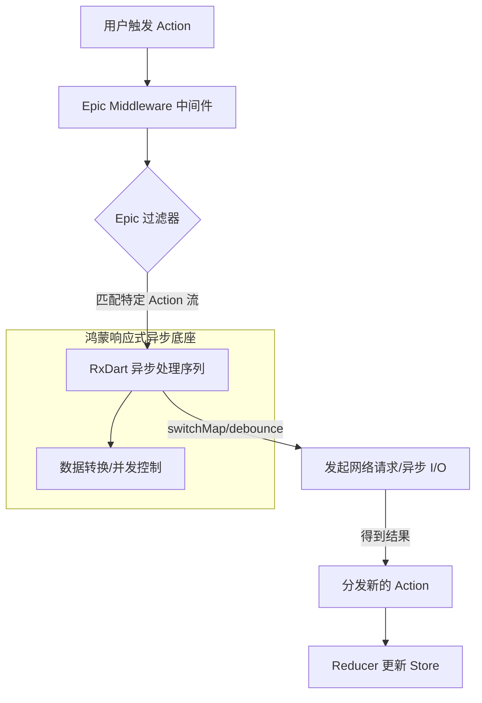

欢迎加入开源鸿蒙跨平台社区：[https://openharmonycrossplatform.csdn.net](https://openharmonycrossplatform.csdn.net)。

# Flutter for OpenHarmony：redux_epics — 异步逻辑的引力波（副作用管理底座）

## 前言

在华为鸿蒙（OpenHarmony）生态的大规模应用开发中，采用 Redux 架构可以极大地提高数据的一致性与可测试性。然而，Redux 的核心准则之一是“Reducer 必须是纯函数（Pure Functions）”，这意味着它不能处理任何网络请求、延时调度或文件读写。

`redux_epics` 是一款专为处理 Redux “副作用（Side Effects）”而生的中间件。它基于功能极其强大的 RxDart，倡导将“Actions（动作）”视为一种连续流，并通过“Epics”——一种监听 Action 流并产出新 Action 流的函数，来实现极其复杂的异步链式反应。在构建鸿蒙平台的股票高频交易系统、带自动重试机制的网络层、或具备复杂加载状态的详情页时，它是你将响应式编程与 Redux 完美融合的架构利器。

## 一、原理展示 / 概念介绍

### 1.1 基础概念

Epic 将 Action 的触发转化为逻辑流的处理。



### 1.2 核心要点解析

- **流式映射**：不同于 `redux_thunk` 的回调地狱，Epics 使用管道操作符（Operators）优雅地描述“当 A 发生时，执行 B 异步，完成后返回 C”的逻辑。
- **并发策略管理**：利用 `switchMap` 自动取消上一次未完成的任务（例如：在鸿蒙端快速点击多次搜索），保证状态更新的唯一性。
- **解耦逻辑**：业务逻辑完全独立于 UI 组件，实现 100% 的纯逻辑测试覆盖。

## 二、核心 API / 组件详解

### 2.1 依赖引入

在鸿蒙工程的 `pubspec.yaml` 中添加以下依赖：

```yaml
dependencies:
  redux: ^5.0.0
  redux_epics: ^0.16.0 
  rxdart: ^0.27.0
```

### 2.2 定义一个异步 Epic

实现一个典型的鸿蒙个人信息加载逻辑：

```dart
import 'package:redux_epics/redux_epics.dart';
import 'package:rxdart/rxdart.dart';

// ✅ 推荐做法：Epic 定义
Stream<dynamic> fetchUserEpic(Stream<dynamic> actions, EpicStore<AppState> store) {
  return actions
    .whereType<FetchUserAction>() // 1. 过滤目标动作
    .debounceTime(const Duration(milliseconds: 300)) // 💡 技巧：防抖处理
    .switchMap((action) => 
       Stream.fromFuture(api.getUser(action.id)) // 2. 执行异步
         .map((user) => FetchUserSuccessAction(user)) // 3. 成功映射
         .onErrorReturn(FetchUserErrorAction()) // 4. 异常处理
    );
}
```

### 2.3 注入中间件

💡 **技巧**：在鸿蒙应用启动初始化 Store 时绑定。

```dart
final epicMiddleware = EpicMiddleware(fetchUserEpic);
final store = Store<AppState>(
  reducer,
  initialState: AppState.initial(),
  middleware: [epicMiddleware], // 💡 技巧：作为中间件注入
);
```

## 三、场景示例

### 3.1 场景一：鸿蒙多端全量“一键注销”

当用户点击退出登录 Action 时，Epic 负责并发清空本地数据库、调用删除 Token 接口并撤销所有后台正在执行的异步计算，最后分发回到登录页的 Action。

### 3.2 场景二：智能搜索建议的深度优化

在鸿蒙手机搜索框输入时，利用 Epic 的 `debounceTime` 和 `distinctUntilChanged` 算子，在降低服务器负载的同时，为用户提供零感卡顿的搜索提示。

## 四、OpenHarmony 平台适配挑战

### 4.1 响应式流对内存的精细化需求

RxDart 的操作符序列如果不正确管理，可能会导致多个 Stream 不被销毁而造成的内存攀升。

✅ **适配策略建议**：
1. **自动取消机制（Auto-Dispose）**：在鸿蒙端，虽然 Epics 通常随 Store 生命周期运行，但在处理单次页面相关的局部流时，务必利用 `takeUntil` 配合页面销毁信号，确保流的主动断开。
2. **性能压测**：在处理高频传感器数据（如鸿蒙 AR 导航的姿态数据）入 Action 流时，避免使用过重的 `flatMap` 导致线程堵塞，应优先考虑 `throttleTime`。

## 五、综合实战示例代码

以下是一个演示如何在鸿蒙端实现的“带加载状态自动同步”的计数器进阶版：

```dart
import 'package:flutter/material.dart';
import 'package:redux/redux.dart';
import 'package:redux_epics/redux_epics.dart';

class ReduxEpicsLabPage extends StatelessWidget {
  final Store<CounterState> store;

  const ReduxEpicsLabPage({super.key, required this.store});

  @override
  Widget build(BuildContext context) {
    return Scaffold(
      appBar: AppBar(title: const Text('Redux Epics 异步实验室')),
      body: Center(
        child: Column(
          mainAxisAlignment: MainAxisAlignment.center,
          children: [
            const Icon(Icons.stream, size: 80, color: Colors.purple),
            const SizedBox(height: 30),
            // 💡 实战技巧：订阅 Store 数据并在 UI 展示
            StreamBuilder<int>(
               stream: store.onChange.map((s) => s.count).distinct(),
               builder: (context, snapshot) => Text(
                 "鸿蒙异步快照: ${snapshot.data ?? 0}",
                 style: const TextStyle(fontSize: 24, fontWeight: FontWeight.bold),
               ),
            ),
            const SizedBox(height: 50),
            ElevatedButton(
              // 💡 技巧：触发一个动作，后续异步完全由 Epic 接盘
              onPressed: () => store.dispatch(AsyncIncrementAction()),
              child: const Text('执行异步云端累加'),
            ),
          ],
        ),
      ),
    );
  }
}

// 模拟状态与动作定义
class CounterState { final int count; CounterState(this.count); }
class AsyncIncrementAction {}
```

## 六、总结

`redux_epics` 为 OpenHarmony 开发者提供了一套极其严密、可预测的响应式异步开发范式。它消除了副作用代码在 UI 层和层级间的渗透，让大型项目的状态流转如同流水生产线一般清晰可控。

✅ **核心建议**：
1. **拥抱类型安全**：始终配套使用 `whereType<DataType>` 算子进行输入过滤。
2. **日志调试必备**：建议搭配 `redux_logging` 中间件，在鸿蒙控制台清晰观察 Action 的分发序列与 Epic 的触发时点。
3. **单元测试极致化**：利用 `EpicTester` 类的流式比对特性，确认为输入一个特定 Action 时，输出结果流是否符合预期。

📦 **完整代码已上传至 AtomGit**：[open-harmony-example/redux_epics](https://atomgit.com/dragonbady/open-harmony-example/tree/main/examples/redux_epics)

🌐 **欢迎加入开源鸿蒙跨平台社区**：[开源鸿蒙跨平台开发者社区](https://openharmonycrossplatform.csdn.net)
