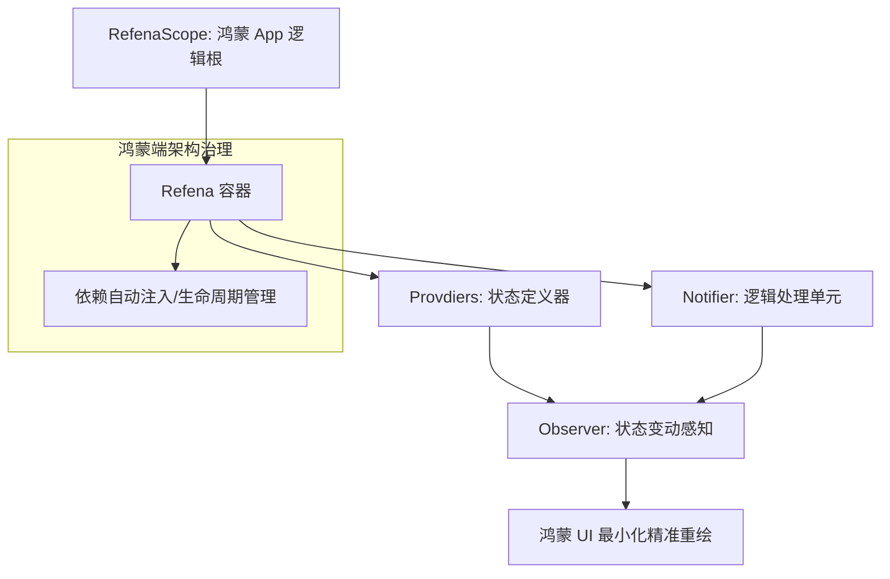

欢迎加入开源鸿蒙跨平台社区：[https://openharmonycrossplatform.csdn.net](https://openharmonycrossplatform.csdn.net)。

# Flutter for OpenHarmony：refena — 状态的精密导航仪（解耦治理底座）

## 前言

在华为鸿蒙（OpenHarmony）生态的超大规模工程开发中，传统的继承式状态管理（如 Provider）往往会因为上下文（BuildContext）的深度嵌套和复杂的刷新链路导致维护困难和性能瓶颈。开发者渴望一种既能拥有类似 Riverpod 的高性能，又能规避代码生成依赖，且具备显式、强类型注入能力的“现代方案”。

`refena`（原名 Refena）是一款为极致开发者打造的一站式状态管理库。它不依赖代码生成（CodeGen），支持同步/异步状态派生，提供内置的依赖注入（DI）系统，并拥有目前市场上最直观的全局状态追踪与调试工具。在构建鸿蒙平台的跨模块复杂业务系统、处理深层组件通信或需要严丝合缝的单体测试（Unit Testing）时，它是实现“逻辑自治”与“架构优雅”的核心基座。

## 一、原理展示 / 概念介绍

### 1.1 基础概念

`refena` 基于“全局容器（Container）”与“细粒度监听”实现了完全脱离 UI 树的逻辑驱动。



### 1.2 核心要点解析

- **显式控制（Explicit Control）**：所有状态的变动都通过 `ref` 对象操作，即便在 UI 树之外（如鸿蒙 Service 拦截器中）也能轻松访问和修改状态。
- **无代码生成依赖**：所有的 Provider 定义均为纯 Dart 代码，极大地提升了鸿蒙项目的编译速度，并消除了恼人的 `.g.dart` 冲突。
- **内置调试（Redux 精髓）**：自带事件监听器（Action Log），能清晰看到在鸿蒙端是哪一个 Action 触发了哪一个状态位的变动，排障效率倍增。

## 二、核心 API / 组件详解

### 2.1 依赖引入

在鸿蒙工程的 `pubspec.yaml` 中添加以下分工明确的依赖：

```yaml
dependencies:
  refena: ^1.2.0 # 建议参考最新生产版本
  flutter_refena: ^1.2.0 # UI 绑定层
```

### 2.2 定义响应式 Provider

在鸿蒙工程中创建一个管理“鸿蒙系统配置”的状态类：

```dart
import 'package:refena/refena.dart';

// ✅ 推荐做法：使用简单的 Provider 定义状态
final systemConfigProvider = Provider((ref) => "HarmonyOS 5.0");

// 💡 进阶：带逻辑的 Notifier
class Counter extends Notifier<int> {
  @override
  int init() => 0;

  void increment() => state++;
}

final counterProvider = NotifierProvider<Counter, int>((ref) => Counter());
```

### 2.3 在 UI 中精准监听

💡 **技巧**：使用 `ref.watch` 实现最小化的 Widget 刷新。

```dart
class MyWidget extends StatelessWidget {
  @override
  Widget build(BuildContext context) {
    // 💡 技巧：获取全局引用
    final ref = context.ref;
    final version = ref.watch(systemConfigProvider);
    
    return Text("当前系统: $version");
  }
}
```

## 三、场景示例

### 3.1 场景一：鸿蒙分布式协同的“全局配置中心”

将用户的主题偏好、登录 Token、以及多端设备的在线状态放入 `refena` 的全局容器中，确保应用内任何角落都能实现数据同步。

### 3.2 场景二：复杂业务流的“服务注入”

在鸿蒙端调用后端的 API 服务时，利用 `refena` 的 DI 能力将 `ApiService` 注入到特定的 Notifier 中，实现逻辑层与底层 IO 的完美解耦。

## 四、OpenHarmony 平台适配挑战

### 4.1 全局容器对内存的持续占用

由于 `refena` 是全局状态，如果存放了超大的图片二进制流或万级列表数据的缓存，可能会触发鸿蒙系统的内存警告。

✅ **适配策略建议**：
1. **模块化容器（Modules）**：不要把所有状态堆在一个根容器。利用 `refena` 对 Provider 的生命周期管理功能，在鸿蒙页退出后，手动重置（Reset）不再需要的 Provider。
2. **性能基准分析**：利用内置的 `Observer` 监控每一个状态更新。如果发现某个 Provider 更新频率过高（例如每秒重绘 120 次），利用 `ref.select` 进行更细粒度的字段监听，降低无谓的更新透传。

## 五、综合实战示例代码

以下是一个演示如何在鸿蒙端实现的“带异步加载能力的响应式计数器”实战：

```dart
import 'package:flutter/material.dart';
import 'package:flutter_refena/flutter_refena.dart';

// 1. 定义状态
final asyncCounterProvider = AsyncNotifierProvider<AsyncCounter, int>((ref) => AsyncCounter());

class AsyncCounter extends AsyncNotifier<int> {
  @override
  Future<int> init() async => 0;

  Future<void> delayedIncrement() async {
    await Future.delayed(const Duration(seconds: 1));
    state = AsyncValue.data((state.data ?? 0) + 1);
  }
}

class RefenaLabPage extends StatelessWidget {
  @override
  Widget build(BuildContext context) {
    return Scaffold(
      appBar: AppBar(title: const Text('Refena 高阶状态实验室')),
      body: Center(
        child: Column(
          mainAxisAlignment: MainAxisAlignment.center,
          children: [
            const Icon(Icons.architecture_outlined, size: 80, color: Colors.blueAccent),
            const SizedBox(height: 30),
            // 💡 实战技巧：优雅处理异步状态
            context.ref.watch(asyncCounterProvider).when(
              data: (val) => Text("鸿蒙异步数值: $val", style: const TextStyle(fontSize: 28)),
              loading: () => const CircularProgressIndicator(),
              error: (e, st) => Text("❌ 错误: $e"),
            ),
            const SizedBox(height: 40),
            ElevatedButton(
              onPressed: () => context.ref.notifier(asyncCounterProvider).delayedIncrement(),
              child: const Text('执行异步云端累加'),
            ),
          ],
        ),
      ),
    );
  }
}
```

## 六、总结

`refena` 让 OpenHarmony 开发者既能享受“响应式”编程的快感，又能拥有“确定性”的架构掌控力。在大步迈向大型化工程的今天，它是构建高性能、可测试鸿蒙应用的坚实地基。

✅ **核心建议**：
1. **拥抱 Testability**：利用 `refena` 对 Provider 的 Override 能力，在单元测试中轻松 Mock 掉鸿蒙原生的 API 调用。
2. **减少 Rebuild**：养成使用 `ref.select` 的习惯，只有关心的字段变了才触发鸿蒙 UI 的渲染，保护设备电池。
3. **架构分层**：坚持将业务代码写在 `Notifier` 类中，将 UI 保持为“哑（Dumb）”组件，实现逻辑的极致重用。

📦 **完整代码已上传至 AtomGit**：[open-harmony-example/refena](https://atomgit.com/dragonbady/open-harmony-example/tree/main/examples/refena)

🌐 **欢迎加入开源鸿蒙跨平台社区**：[开源鸿蒙跨平台开发者社区](https://openharmonycrossplatform.csdn.net)
