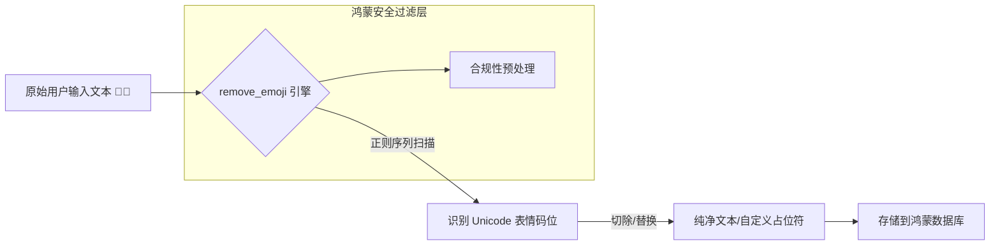

欢迎加入开源鸿蒙跨平台社区：[https://openharmonycrossplatform.csdn.net](https://openharmonycrossplatform.csdn.net)。

# Flutter for OpenHarmony：remove_emoji — 文本的净水器（字符清洗底座）

## 前言

在华为鸿蒙（OpenHarmony）生态的应用开发中，处理用户输入是家常便饭。然而，五花八门的 Emoji 表情符号虽然增加了交互趣味，但对于某些对后端数据库（如早期的 MySQL utf8 编码）、传统短信网关、或是需要显示在不支持表情的窄带设备（如部分鸿蒙穿戴设备）上的业务而言，它们是导致“乱码”或“请求失败”的头号杀手。

`remove_emoji` 是一款功能专一且极其极速的文本处理库。它能自适应识别并一键剔除字符串中所有的 Unicode 笑脸、符号以及各类复杂的彩色表情。在构建鸿蒙平台的系统登录页（防止非法用户名）、批量导出业务报表、或进行传统政务系统对接时，它是保障数据“格式纯净”的核心技术插件。

## 一、原理展示 / 概念介绍

### 1.1 基础概念

本库通过高效的模式匹配识别 Unicode 表情字符集。



### 1.2 核心要点解析

- **极简接口**：仅需调用一个方法即可完成全量过滤，无学习成本。
- **自定义替换**：除了直接移除，还支持将表情替换为特定的字符（如 `[表情]`），保留语境提示。
- **鲁棒性**：完整覆盖了最新的 Unicode Emoji 标准，不仅包括简单的图形，还包括复杂的性别/肤色组合表情。

## 二、核心 API / 组件详解

### 2.1 依赖引入

在鸿蒙工程的 `pubspec.yaml` 中添加以下依赖：

```yaml
dependencies:
  remove_emoji: ^2.1.0 # 建议参考最新稳定版本
```

### 2.2 一键移除所有表情

在鸿蒙端处理用户输入的昵称：

```dart
import 'package:remove_emoji/remove_emoji.dart';

void cleanUserName(String input) {
  // ✅ 推荐做法：通过扩展方法直接获取清洗后的结果
  String cleanData = RemoveEmoji().removemode(input);
  print('清洗后的鸿蒙用户名: $cleanData');
}
```

### 2.3 自定义占位符替换

💡 **技巧**：不希望直接删掉，而是用符号替代。

```dart
String replaced = RemoveEmoji().removemode(input, "❓"); 
```

## 三、场景示例

### 3.1 场景一：鸿蒙端“传统架构”后端对接

针对部分不支持存储 4 字节 UTF-8 字符的旧版鸿蒙后台系统，在提交表单前强制利用 `remove_emoji` 过滤掉非法表情，防止 API 返回致命的 DB 写入异常。

### 3.2 场景二：电子发票与纸质面单打印

在鸿蒙 POS 终端打印纸质面单时，由于物理打印机固件大多无法理解 Emoji，提前移除表情可以避免打印出“???”形式的乱码块。

## 四、OpenHarmony 平台适配挑战

### 4.1 全球化特殊符号的误伤

在某些多语言（如泰语、阿拉伯语）的变音符号中，由于码位较为接近，需要确保清洗逻辑不产生误伤。

✅ **适配策略建议**：
1. **优先在业务关键点调用**：不要在全局输入框中实时调用，而是在“点击发送”或“点击保存”的业务拦截点进行。
2. **UI 视觉反馈**：对于由于移除表情导致文本长度发生大幅变化的场景，应在鸿蒙 UI 界面上通过小气泡提醒用户：“为了数据安全，系统已自动过滤不支持的符号”。

## 五、综合实战示例代码

以下是一个演示如何在鸿蒙端实现的“输入内容合规性检查器”组件：

```dart
import 'package:flutter/material.dart';
import 'package:remove_emoji/remove_emoji.dart';

class RemoveEmojiLabPage extends StatefulWidget {
  const RemoveEmojiLabPage({super.key});

  @override
  State<RemoveEmojiLabPage> createState() => _RemoveEmojiLabPageState();
}

class _RemoveEmojiLabPageState extends State<RemoveEmojiLabPage> {
  final _remover = RemoveEmoji();
  String _cleanedText = "待检测...";

  void _onInput(String val) {
    // 💡 实战技巧：实时清洗展示
    setState(() {
      _cleanedText = _remover.removemode(val, " [表情] ");
    });
  }

  @override
  Widget build(BuildContext context) {
    return Scaffold(
      appBar: AppBar(title: const Text('文本表情清洗实验室')),
      body: Padding(
        padding: const EdgeInsets.all(24),
        child: Column(
          children: [
            const Icon(Icons.cleaning_services_rounded, size: 80, color: Colors.blueGrey),
            const SizedBox(height: 30),
            TextField(
              onChanged: _onInput,
              decoration: const InputDecoration(labelText: '输入带表情的内容 (如: 鸿蒙牛逼 🚀🔥)'),
            ),
            const SizedBox(height: 30),
            Container(
              width: double.infinity,
              padding: const EdgeInsets.all(16),
              decoration: BoxDecoration(color: Colors.grey[100], borderRadius: BorderRadius.circular(12)),
              child: Text("清洗后的结果:\n$_cleanedText", style: const TextStyle(fontSize: 18)),
            ),
            const Spacer(),
            const Text("💡 提示：该工具常用于适配不支持 4 字节编码的旧系统", style: TextStyle(color: Colors.grey, fontSize: 12)),
          ],
        ),
      ),
    );
  }
}
```

## 六、总结

`remove_emoji` 为鸿蒙应用的数据交换提供了最基础的“合规性漏斗”。它虽然简单，但在处理企业级存量系统对接时，是保证业务链路不中断的低成本保障。

✅ **核心建议**：
1. **结合 `string_similarity`**：清洗完 Emoji 后，可以结合相似度算法再次判定内容是否依然具备原意。
2. **关注 Unicode 更新**：表情包库是不断膨胀的。建议定期更新该库的版本，以覆盖鸿蒙新系统可能引入的特有元数据表情。
3. **分场景开关**：允许用户在高级设置中选择“保留表情”或“自动过滤”，提升鸿蒙应用的灵活性。

📦 **完整代码已上传至 AtomGit**：[open-harmony-example/remove_emoji](https://atomgit.com/dragonbady/open-harmony-example/tree/main/examples/remove_emoji)

🌐 **欢迎加入开源鸿蒙跨平台社区**：[开源鸿蒙跨平台开发者社区](https://openharmonycrossplatform.csdn.net)
