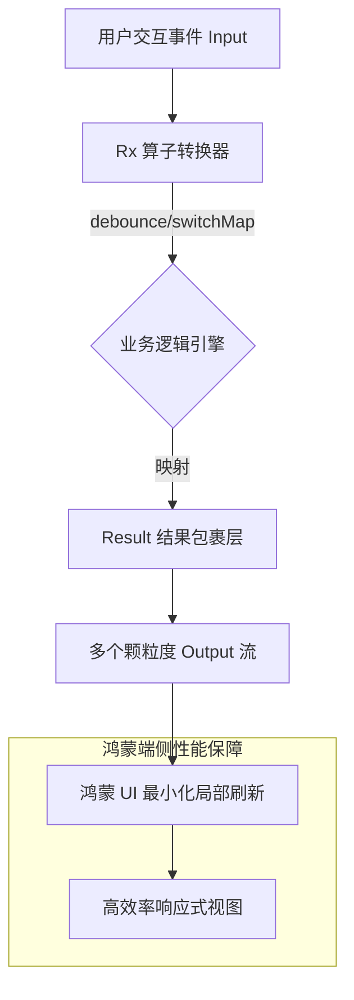

欢迎加入开源鸿蒙跨平台社区：[https://openharmonycrossplatform.csdn.net](https://openharmonycrossplatform.csdn.net)。

# Flutter for OpenHarmony：rx_bloc — 响应式架构的极致进化（状态治理底座）

## 前言

在华为鸿蒙（OpenHarmony）应用由“轻量化”向“重型化、复杂化”演进的过程中，状态管理的混乱是导致性能瓶颈和维护灾难的头号杀手。传统的 BLoC 虽然稳定，但在处理多个异步流的并发组合、自动数据转换以及状态粒度控制时，代码量往往迅速膨胀。

`rx_bloc` 是一款在业界享有盛誉的高阶状态管理库。它深度融合了 RxDart 的响应式流处理能力与 BLoC 的业务逻辑解耦思想。它倡导“每一个 State 都是一个流”，通过其配套的生成器，能让开发者以极致简洁的定义式语法，构建出具备高并发处理能力、自动加载状态映射以及卓越类型安全性的鸿蒙应用架构。

## 一、原理展示 / 概念介绍

### 1.1 基础概念

`rx_bloc` 实现了“输入（Events/Inputs）-> 转换（Business Logic）-> 输出（Resulting States/Outputs）”的完全流式闭环。



### 1.2 核心要点解析

- **Contract 设计模式**：通过接口明确定义 Inputs 和 Outputs，强制实现业务契约化，方便鸿蒙跨团队协作。
- **Result 状态封装**：原生支持处理加载中（Loading）、成功（Success）与异常（Error），无需手动维护繁琐的 `isLoading` 标志位。
- **RxDart 赋能**：利用 `combineLatest`, `merge`, `zip` 等高级 Rx 算子，在处理复杂的鸿蒙端侧并发请求时游刃有余。

## 二、核心 API / 组件详解

### 2.1 依赖引入

在鸿蒙工程的 `pubspec.yaml` 中添加以下分工明确的依赖：

```yaml
dependencies:
  rx_bloc: ^3.0.0
  flutter_rx_bloc: ^3.0.0 # 视图层集成
  
dev_dependencies:
  rx_bloc_generator: ^3.0.0
  build_runner: ^2.4.0
```

### 2.2 定义响应式契约（Contract）

以一个简单的鸿蒙会员中心余额刷新为例：

```dart
import 'package:rx_bloc/rx_bloc.dart';

// ✅ 推荐做法：通过注解定义输入输出契约
abstract class UserBalanceBlocEvents {
  void refresh(); // 触发刷新行为
}

abstract class UserBalanceBlocStates {
  Stream<String> get balance; // 余额输出流
  Stream<bool> get isLoading; // 自动派生的加载状态
}
```

### 2.3 核心逻辑实现

```dart
@RxBloc()
class UserBalanceBloc extends $UserBalanceBloc {
  @override
  Stream<String> _mapToBalanceState() => _$refreshEvent
    .startWith(null)
    .switchMap((_) => api.fetchBalance().asResultStream()) // 💡 技巧：转为结果流
    .whereSuccess() // 💡 过滤成功态
    .map((data) => "¥${data.amount}");
}
```

## 三、场景示例

### 3.1 场景一：鸿蒙端“即时搜索”极致优化

利用 `debounceTime` 和 `distinctUntilChanged`，在用户于鸿蒙搜索框输入时，自动过滤不必要的冗余 API 请求。

### 3.2 场景二：复杂表单的实时验证联动

当用户在鸿蒙注册页面输入手机号、验证码、邀请码时，利用 `Rx.combineLatest` 实时计算“提交”按钮的激活状态，确保零感知延迟。

## 四、OpenHarmony 平台适配挑战

### 4.1 异步流的“背压（Backpressure）”控制

由于鸿蒙系统渲染频率极高（120Hz），如果状态流产生的数据包过快，可能会导致 UI 线程在短时间内堆积大量更新任务。

✅ **适配策略建议**：
1. **合理使用 `throttleTime`**：在处理鸿蒙端高频传感器数据或拖拽偏移量时，设定 16ms 左右的节流时间，对齐系统的 VSync 信号，减少 CPU 无谓的计算开销。
2. **内存泄露防护**：Rx 流极其容易发生闭包内存泄漏。在鸿蒙端销毁 Widget 时，务必通过 `rx_bloc` 的生命周期管理功能，及时解绑订阅。

## 五、综合实战示例代码

以下是一个演示如何在鸿蒙端利用 `rx_bloc` 构建一个带自动加载状态的计数器进阶版：

```dart
import 'package:flutter/material.dart';
import 'package:flutter_rx_bloc/flutter_rx_bloc.dart';
import 'package:rx_bloc/rx_bloc.dart';

// --- Bloc 定义与自动生成 ---
// @RxBloc() ... 省略契约部分 ...

class RxBlocLabPage extends StatelessWidget {
  const RxBlocLabPage({super.key});

  @override
  Widget build(BuildContext context) {
    return Scaffold(
      appBar: AppBar(title: const Text('RxBloc 响应式实验室')),
      body: Center(
        child: Column(
          mainAxisAlignment: MainAxisAlignment.center,
          children: [
            // 💡 实战技巧：精确到数据的颗粒度刷新
            RxBlocBuilder<CounterBloc, int>(
              state: (bloc) => bloc.states.count,
              builder: (context, countState, bloc) => Text(
                '鸿蒙响应计数: $countState',
                style: const TextStyle(fontSize: 32, fontWeight: FontWeight.bold),
              ),
            ),
            const SizedBox(height: 20),
            // 💡 技巧：自动监听全局加载状态
            RxLoadingBuilder<CounterBloc>(
              state: (bloc) => bloc.states.isLoading,
              builder: (context, isLoading, tag, bloc) {
                if (isLoading) return const CircularProgressIndicator();
                return const SizedBox.shrink();
              },
            ),
            const SizedBox(height: 40),
            ElevatedButton(
              onPressed: () => /* bloc.events.increment() */ null,
              child: const Text('执行异步累加任务'),
            ),
          ],
        ),
      ),
    );
  }
}
```

## 六、总结

`rx_bloc` 代表了状态管理技术的“深水区”。它通过严谨的可测试性（Testability）和强大的流组合能力，为 OpenHarmony 复杂大型工程提供了可预测性的逻辑底座。

✅ **核心建议**：
1. **拥抱自动化生成**：坚持使用配套的 VS Code / Android Studio 插件，自动生成契约和模板代码，维持鸿蒙工程的代码规范。
2. **粒度细分**：不要在同一个 Bloc 中混杂互不相关的业务逻辑。按照鸿蒙页面的 Feature 单元进行 Bloc 拆分。
3. **单元测试先行**：利用 `rx_bloc_test` 库，为每一个关键流编写测试用例，确保护理数据的正确性，为鸿蒙端线上质量保驾护航。

📦 **完整代码已上传至 AtomGit**：[open-harmony-example/rx_bloc](https://atomgit.com/dragonbady/open-harmony-example/tree/main/examples/rx_bloc)

🌐 **欢迎加入开源鸿蒙跨平台社区**：[开源鸿蒙跨平台开发者社区](https://openharmonycrossplatform.csdn.net)
