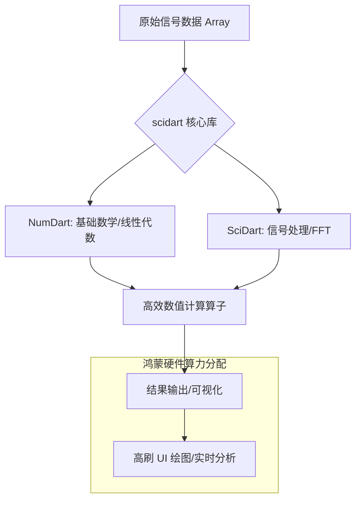

欢迎加入开源鸿蒙跨平台社区：[https://openharmonycrossplatform.csdn.net](https://openharmonycrossplatform.csdn.net)。

# Flutter for OpenHarmony：scidart — 科学计算与信号处理引擎（专业算法底座）

## 前言

在华为鸿蒙（OpenHarmony）生态的专业应用开发中，对底层数学运算和高性能信号处理的需求日益增长。无论是开发医疗健康类应用中的心率波形分析、音频处理应用系统中的频谱转换，还是工业监测应用中的实时数据滤波，开发者都需要一个功能完备且运行高效的科学计算库。

`scidart` 是 Dart 生态中首屈一指的科学计算库，它填补了移动端在高级数学运算和信号处理（DSP）领域的空白。在鸿蒙跨平台开发中，`scidart` 让开发者能够摆脱复杂的 C++ NAPI 桥接，直接在 Dart 层实现复数运算、快速傅里叶变换（FFT）、数字滤波以及线性代数运算。在构建鸿蒙平台的专业生产力工具时，它是实现“高性能算法原生底座”的核心利器。

## 一、原理展示 / 概念介绍

### 1.1 基础概念

`scidart` 将复杂的信号处理理论转化为易于调用的 Dart 算子。



### 1.2 核心要点解析

- **NumDart**：提供类似于 NumPy 的多维数组（Array）操作、统计分析及基础数学函数。
- **SciDart**：提供信号处理核心功能，如 FIR/IIR 滤波器设计、窗函数（Windowing）以及卷积运算。
- **高性能 FFT**：内置高度优化的快速傅里叶变换算法，能够实时将时域信号转为频域。

## 二、核心 API / 组件详解

### 2.1 依赖引入

在鸿蒙工程的 `pubspec.yaml` 中添加以下依赖：

```yaml
dependencies:
  scidart: ^0.0.2 # 请参考最新版本
```

### 2.2 信号处理实战：快速傅里叶变换 (FFT)

将鸿蒙设备传感器获取的周期性振动信号进行频谱分析：

```dart
import 'package:scidart/scidart.dart';
import 'package:scidart/numdart.dart';

void analyzeSignal() {
  // ✅ 推荐做法：使用 Array 加载采样数据
  final signal = Array([1.0, 0.5, 0.0, -0.5, -1.0, -0.5, 0.0, 0.5]);
  
  // 💡 技巧：执行实数 FFT
  final fftResult = fft(signal.castToComplexArray());
  print('频谱分析结果: $fftResult');
}
```

### 2.3 数字滤波应用

在鸿蒙健康应用中滤除原始脉搏信号的高频噪声：

```dart
// 💡 技巧：使用 FIR 滤波器平滑数据
final rawData = Array([/* 原始采样数据 */]);
final filteredData = firFilter(rawData, Array([0.2, 0.2, 0.2, 0.2, 0.2])); // 简单移动平均滤波
```

## 三、场景示例

### 3.1 场景一：鸿蒙端实时音频可视化

通过捕获 Mic 输入流，利用 `scidart` 的 FFT 能力实时提取频率分布，构建律动的频谱条 UI。

### 3.2 场景二：工业设备振动监测

在鸿蒙平板（Tablet）上实时计算机械臂传感器的功率谱密度，预警潜在的设备磨损。

## 四、OpenHarmony 平台适配挑战

### 4.1 浮点运算精度与性能

科学计算涉及大量的双精度浮点数（Double）计算。

✅ **适配策略建议**：
1. **多核并发**：对于超大规模的信号处理（如百万点 FFT），建议利用鸿蒙的多核架构，通过 Flutter 的 `compute` 或 `Isolate` 将计算卸载到后台，防止鸿蒙主线程渲染掉帧。
2. **SIMD 优化利用**：确保鸿蒙端的 Dart Runtime 正确开启了 SIMD（单指令多数据）优化，这能显著提升 `scidart` 数组运算的速度。

## 五、综合实战示例代码

以下是一个模拟鸿蒙手机“波形分析实验室”实时生成与处理正弦波的组件：

```dart
import 'package:flutter/material.dart';
import 'package:scidart/numdart.dart';
import 'package:scidart/scidart.dart';

class SciDartLabPage extends StatefulWidget {
  const SciDartLabPage({super.key});

  @override
  State<SciDartLabPage> createState() => _SciDartLabPageState();
}

class _SciDartLabPageState extends State<SciDartLabPage> {
  String _stats = "点击生成波形数据";

  void _processSignal() {
    // 💡 实战技巧：生成 10Hz 正弦波信号
    final samplingRate = 100.0; // 采样率
    final duration = 1.0; // 1秒
    final t = linspace(0, duration, num: (samplingRate * duration).toInt());
    final freq = 10.0;
    
    // 生成包含噪声的正弦波
    final signal = arraySin(t.map((i) => 2 * pi * freq * i).toIterable().toList());
    
    // 计算均值与方差
    final meanVal = mean(signal);
    final stdVal = standardDeviation(signal);

    setState(() {
      _stats = "📊 信号采样点数: ${signal.length}\n"
               "📈 均值: ${meanVal.toStringAsFixed(4)}\n"
               "📉 标准差: ${stdVal.toStringAsFixed(4)}";
    });
  }

  @override
  Widget build(BuildContext context) {
    return Scaffold(
      appBar: AppBar(title: const Text('SciDart 科学计算实验室')),
      body: Center(
        child: Padding(
          padding: const EdgeInsets.all(20),
          child: Column(
            mainAxisAlignment: MainAxisAlignment.center,
            children: [
              const Icon(Icons.waves, size: 80, color: Colors.blueAccent),
              const SizedBox(height: 30),
              Container(
                padding: const EdgeInsets.all(15),
                decoration: BoxDecoration(color: Colors.blue[50], borderRadius: BorderRadius.circular(12)),
                child: Text(_stats, style: const TextStyle(fontFamily: 'monospace')),
              ),
              const SizedBox(height: 40),
              ElevatedButton.icon(
                onPressed: _processSignal,
                icon: const Icon(Icons.analytics),
                label: const Text('生成并分析鸿蒙传感器模拟信号'),
              ),
            ],
          ),
        ),
      ),
    );
  }
}
```

## 六、总结

`scidart` 将复杂的数学公式抽象为极简的函数调用，让 OpenHarmony 应用具备了处理专业领域算法的底气。

✅ **核心建议**：
1. **数据分段处理**：对于流式信号，采用滑动窗口（Windowing）策略，分段调用 `scidart` 算子。
2. **结合可视化**：科学计算的结果必须具备直观性，建议配合 `fl_chart` 展示滤波前后对比图。
3. **性能基准测试**：在不同规格的鸿蒙设备（如旗舰手机 vs 入门级穿戴设备）上测试算法耗时。

📦 **完整代码已上传至 AtomGit**：[open-harmony-example/scidart](https://atomgit.com/dragonbady/open-harmony-example/tree/main/examples/scidart)

🌐 **欢迎加入开源鸿蒙跨平台社区**：[开源鸿蒙跨平台开发者社区](https://openharmonycrossplatform.csdn.net)
