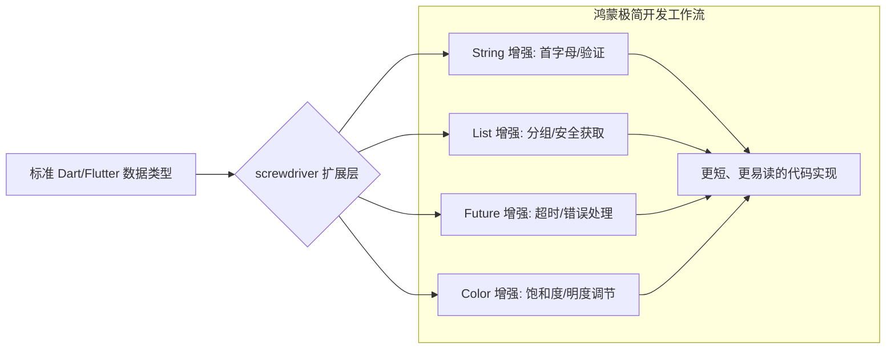

欢迎加入开源鸿蒙跨平台社区：[https://openharmonycrossplatform.csdn.net](https://openharmonycrossplatform.csdn.net)。

# Flutter for OpenHarmony：screwdriver — 编码效能倍增器（开发利器底座）

## 前言

在华为鸿蒙（OpenHarmony）应用的高频开发中，开发者往往需要处理大量细碎且重复的逻辑：比如判断一个列表是否为空、安全地解析一个可能由于脏数据导致的 JSON 字段、亦或是对字符串进行首字母大写转换。如果这些逻辑散落在鸿蒙工程的各个角落，不仅让代码显得零乱，更增加了调试与维护的负担。

`screwdriver` 是一款专为高效开发者设计的“万能瑞士军刀”。它通过 Dart 的 `extension`（扩展方法）机制，为原生的 `List`, `String`, `Map`, `Future` 等类型注入了极其丰富且语义化的增强接口。在构建鸿蒙平台的系统 UI 界面、业务逻辑层以及复杂数据处理模块时，它能让你以极简的代码量完成原本繁琐的操作。

## 一、原理展示 / 概念介绍

### 1.1 基础概念

`screwdriver` 致力于消除样板代码（Boilerplate）。



### 1.2 核心要点解析

- **无侵入性**：不需要修改任何原生类代码，只需导入包即可通过 `.` 语法调用增强功能。
- **语义化命名**：所有函数命名均遵循“所见即所得”原则（如 `isNotNullOrEmpty`），提升了鸿蒙工程代码的自说明性。
- **类型安全**：基于 Dart 强类型系统，在编译期即可拦截错误的调用。

## 二、核心 API / 组件详解

### 2.1 依赖引入

在鸿蒙工程的 `pubspec.yaml` 中添加以下依赖：

```yaml
dependencies:
  screwdriver: ^1.2.0 # 建议参考最新版本
```

### 2.2 字符串与集合的极致简写

在鸿蒙端处理用户输入的名称与标签列表：

```dart
import 'package:screwdriver/screwdriver.dart';

void processInput(String? raw, List<int>? data) {
  // ✅ 推荐做法：安全判断字符串且首字母大写
  String name = raw.orEmpty.capitalize();
  
  // 💡 技巧：判断列表是否非空且直接获取特定位置值
  if (data.isNotNullOrEmpty) {
    int first = data!.firstOrNull ?? 0;
  }
}
```

### 2.3 颜色与主题增强

💡 **技巧**：在鸿蒙端动态调节组件的主题色深度。

```dart
Color theme = Colors.blue;
// 💡 快速获取互补色或调节亮度
Color darker = theme.darken(20); 
```

## 三、场景示例

### 3.1 场景一：鸿蒙多任务管理界面的“数据清洗”

当从鸿蒙分布式数据库拉取到原始列表后，利用 `sortBy` 与 `groupBy` 扩展，一行代码即可实现按时间排序并按日期分组展示。

### 3.2 场景二：智能家居页面“延时任务”封装

在鸿蒙手机上点击“延时关闭”灯光，利用 `future.delayed` 扩展更优雅地处理异步等待逻辑。

## 四、OpenHarmony 平台适配挑战

### 4.1 扩展重名冲突（Name Conflict）

如果在鸿蒙工程中同时引用了多个类似的扩展库（如 `dart_extensions`），可能会出现方法冲突。

✅ **适配策略建议**：
1. **优先使用统一工具链**：建议在同一个鸿蒙项目中，团队统一选择 `screwdriver` 作为基础扩展库，避免混用。
2. **渐进式重构**：在存量代码迁移到鸿蒙时，可以先用 `screwdriver` 进行小规模试验，主要提升 UI 层逻辑的简洁度。

## 五、综合实战示例代码

以下是一个演示如何在鸿蒙端利用 `screwdriver` 提升代码“含金量”的实战组件：

```dart
import 'package:flutter/material.dart';
import 'package:screwdriver/screwdriver.dart';

class ScrewdriverLabPage extends StatelessWidget {
  const ScrewdriverLabPage({super.key});

  @override
  Widget build(BuildContext context) {
    final List<String> techStack = ["flutter", "openharmony", "dart", "arkui"];
    const String welcomeRaw = "welcome to harmony labs";

    return Scaffold(
      appBar: AppBar(title: const Text('screwdriver 开发实验室')),
      body: Center(
        child: Padding(
          padding: const EdgeInsets.all(24),
          child: Column(
            mainAxisAlignment: MainAxisAlignment.center,
            children: [
              const Icon(Icons.build_circle_outlined, size: 80, color: Colors.blueAccent),
              const SizedBox(height: 30),
              // 💡 实战技巧：无需循环，直接 join 并格式化
              Text(
                "标签云: ${techStack.map((e) => e.capitalize()).join(' | ')}",
                style: const TextStyle(fontWeight: FontWeight.bold),
              ),
              const SizedBox(height: 20),
              Container(
                padding: const EdgeInsets.all(12),
                decoration: BoxDecoration(color: Colors.blue[50]),
                // 💡 技巧：快速首字母大写转换
                child: Text(welcomeRaw.capitalize()),
              ),
              const SizedBox(height: 40),
              ElevatedButton(
                onPressed: () {
                   // 模拟一个随机操作
                   ["A", "B", "C"].random.run((val) => print("随机选中: $val"));
                },
                child: const Text('执行 screwdriver 随机扩展方法'),
              ),
            ],
          ),
        ),
      ),
    );
  }
}
```

## 六、总结

`screwdriver` 不生产新功能，但它让现有的功能变得极其趁手。在追求极致逻辑简洁的 OpenHarmony 项目中，它是保证代码质量与开发爽快感的幕后功臣。

✅ **核心建议**：
1. **深度挖掘**：库中包含上百个小扩展（如 `Future.timeout` 处理），建议开发者详细阅读 README，发掘更多提效秘密。
2. **杜绝过度使用**：虽然扩展方法爽，但逻辑过于复杂的核心业务逻辑建议仍以显式函数实现，保持代码的可搜索性。
3. **保持同步**：随着 Dart 版本的升级（如 Dart 3 的模式匹配），部分扩展逻辑可能进入原生系统。

📦 **完整代码已上传至 AtomGit**：[open-harmony-example/screwdriver](https://atomgit.com/dragonbady/open-harmony-example/tree/main/examples/screwdriver)

🌐 **欢迎加入开源鸿蒙跨平台社区**：[开源鸿蒙跨平台开发者社区](https://openharmonycrossplatform.csdn.net)
