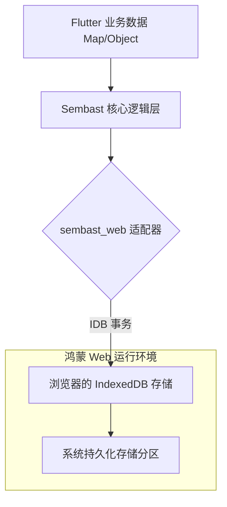

欢迎加入开源鸿蒙跨平台社区：[https://openharmonycrossplatform.csdn.net](https://openharmonycrossplatform.csdn.net)。

# Flutter for OpenHarmony：sembast_web — 云端与端侧的持久化纽带（Web 存储底座）

## 前言

在华为鸿蒙（OpenHarmony）生态的宏伟蓝图中，不仅包含了原生的 Hap 应用，还包括了基于 Flutter Web 构建的跨终端分发页面。当应用运行在鸿蒙系统的浏览器或 Web 组件（HarmonyOS Web Component）中时，如何像在原生端操作 SQLite 一样，拥有一个高性能、事务安全且无需编写复杂 SQL 的数据库，是开发者面临的挑战。

`sembast_web` 是一款专门为 Web 环境优化的 Sembast（Simple Embedded Object Database）适配器。它利用浏览器底层的 IndexedDB 技术，为 Flutter 应用提供了一套完全一致的 NoSQL 操作体验。在构建鸿蒙平台的 Web 轻应用、内部管理后台或跨设备同步的看板系统时，它是你实现“全端通用数据逻辑”的关键技术基座。

## 一、原理展示 / 概念介绍

### 1.1 基础概念

本库实现了 Dart 对象到 IndexedDB 二进制存储的优雅映射。



### 1.2 核心要点解析

- **事务 ACID 特性**：支持多文档事务操作，确保在鸿蒙端网络崩溃或进程重载时，数据不会出现部分写入的损坏。
- **无感适配**：开发者的业务代码只针对 `sembast` API 编写，通过简单的注入即可在鸿蒙原生 App（使用 IO 存储）与鸿蒙浏览器（使用 Web 存储）间切换。
- **异步响应式监听**：支持对特定查询进行监听，当数据库内容变动时，鸿蒙端 UI 会自动响应式触发刷新。

## 二、核心 API / 组件详解

### 2.1 依赖引入

在鸿蒙工程的 `pubspec.yaml` 中添加以下依赖：

```yaml
dependencies:
  sembast: ^3.4.0
  sembast_web: ^2.1.0
```

### 2.2 初始化与打开数据库

💡 **技巧**：使用 `databaseFactoryWeb` 单例在 Web 端进行持久化。

```dart
import 'package:sembast/sembast.dart';
import 'package:sembast_web/sembast_web.dart';

Future<Database> openHarmonyWebDb() async {
  // ✅ 推荐做法：通过 Web 特有的工厂类打开，名称通常代表 IndexedDB 的数据库名
  final db = await databaseFactoryWeb.openDatabase('harmony_cache.db');
  return db;
}
```

### 2.3 执行数据增删改查

```dart
final store = intMapStoreFactory.store('user_settings');

// 💡 技巧：保存一个 Map 对象
await store.add(db, {'theme': 'harmony_blue', 'fontSize': 16});

// 💡 技巧：查询所有记录
final finder = Finder(filter: Filter.equals('theme', 'harmony_blue'));
final records = await store.find(db, finder: finder);
```

## 三、场景示例

### 3.1 场景一：鸿蒙端 H5 轻量化记账簿

利用 `sembast_web` 实现在无网状态下依然可以在手机浏览器中记录开支，并在有网后同步到华为云空间。

### 3.2 场景二：表单自动草稿保存

在鸿蒙平板的大屏 Web 表单录入中，用户每输入一个字段，系统自动利用 Web 数据库存储草稿，防止因误退导致的录入丢失。

## 四、OpenHarmony 平台适配挑战

### 4.1 存储配额限制与安全性

鸿蒙系统对浏览器的隐私模式（Incognito）或无痕模式有严格的持久化限制，此时 IndexedDB 可能无法写入。

✅ **适配策略建议**：
1. **降级逻辑**：检测到 `sembast_web` 初始化失败时，自动切换到 `databaseFactoryMemory`（内存数据库），虽然不持久化但可保证业务不崩溃。
2. **数据清理习惯**：Web 存储空间宝贵。对于不重要的鸿蒙 Web 缓存，应设定过期机制（TTL），利用 Sembast 的记录删除功能定期清理冗余条目。

## 五、综合实战示例代码

以下是一个演示如何在鸿蒙端 Web 环境下实现简单待办事项存储的组件：

```dart
import 'package:flutter/material.dart';
import 'package:sembast/sembast.dart';
import 'package:sembast_web/sembast_web.dart';

class SembastWebLab extends StatefulWidget {
  const SembastWebLab({super.key});

  @override
  State<SembastWebLab> createState() => _SembastWebLabState();
}

class _SembastWebLabState extends State<SembastWebLab> {
  Database? _db;
  final _store = stringMapStoreFactory.store('todo_store');
  String _latestTask = "尚无数据";

  @override
  void initState() {
    super.initState();
    _initDb();
  }

  void _initDb() async {
    // 💡 实战演示：打开 Web 持久化存储
    _db = await databaseFactoryWeb.openDatabase('oh_web_demo.db');
    _loadData();
  }

  void _saveTask() async {
    final now = DateTime.now().toIso8601String();
    await _store.add(_db!, {'task': '学习鸿蒙开发', 'time': now});
    _loadData();
  }

  void _loadData() async {
    final records = await _store.find(_db!);
    setState(() {
      _latestTask = records.isNotEmpty ? records.last['task'] as String : "暂无内容";
    });
  }

  @override
  Widget build(BuildContext context) {
    return Scaffold(
      appBar: AppBar(title: const Text('Sembast Web 持久化实验室')),
      body: Center(
        child: Column(
          mainAxisAlignment: MainAxisAlignment.center,
          children: [
            const Icon(Icons.storage_rounded, size: 80, color: Colors.indigo),
            const SizedBox(height: 20),
            Text("最后一条存储的任务: $_latestTask", textAlign: TextAlign.center),
            const SizedBox(height: 40),
            ElevatedButton(onPressed: _saveTask, child: const Text('在鸿蒙浏览器保存一条任务')),
          ],
        ),
      ),
    );
  }
}
```

## 六、总结

`sembast_web` 抹平了原生应用与 Web 应用之间繁琐的数据存储差异。在 OpenHarmony 这样一个多元化的终端生态中，它帮助开发者以统一的逻辑模型管理跨端离线数据。

✅ **核心建议**：
1. **跨平台封装**：建议在项目中建立一个 `DatabaseLayer`，通过条件编译（Conditional Imports）让同一套业务逻辑在 App 端（IO）和 Web 端（Web）自动切换工厂。
2. **避免大文件存储**：IndexedDB 适合存储结构化 JSON，不建议将超大的图片 Base64 字符串直接丢入 `sembast_web`，会导致鸿蒙浏览器的响应变慢。
3. **安全加密**：对于敏感的用户信件，建议配合 `cryptography` 在存入数据库前自行完成加密，因为浏览器侧的 DB 物理文件相对容易被审查。

📦 **完整代码已上传至 AtomGit**：[open-harmony-example/sembast_web](https://atomgit.com/dragonbady/open-harmony-example/tree/main/examples/sembast_web)

🌐 **欢迎加入开源鸿蒙跨平台社区**：[开源鸿蒙跨平台开发者社区](https://openharmonycrossplatform.csdn.net)
