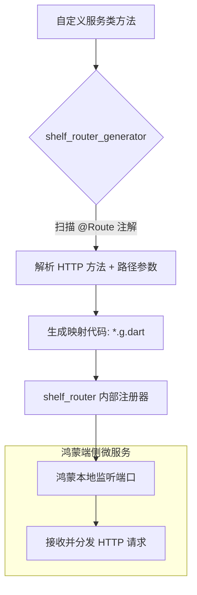

欢迎加入开源鸿蒙跨平台社区：[https://openharmonycrossplatform.csdn.net](https://openharmonycrossplatform.csdn.net)。

# Flutter for OpenHarmony：shelf_router_generator — 路径的自动编排师（端侧路由底座）

## 前言

在华为鸿蒙（OpenHarmony）生态的进阶开发场景中，Dart 的应用早已不局限于 UI。有时开发者需要在鸿蒙端发起一个轻量级的本地 HTTP 服务（如：用于预览分布式文件、作为调试工具的后门、或是构建离线微服务架构）。而在编写服务端代码时，手动通过 `Router().add('GET', '/path', handler)` 逐个挂载接口，不仅低效且会导致入口文件极其臃肿。

`shelf_router_generator` 是一款为极致后端开发体验而生的代码生成器。它允许开发者通过简洁的注解（@Route）直接在处理类中声明 API 路径。在鸿蒙端侧运行的 Dart 后端服务中，它能自动生成繁琐的路由匹配代码（Router Mapping）。在构建鸿蒙平台的本地数据同步中转站、端侧 Mock 管理器或实验性微服务时，它是实现“后端代码优雅化”的核心组件。

## 一、原理展示 / 概念介绍

### 1.1 基础概念

本库实现了从“类方法”到“HTTP API 路由”的自动化桥接。



### 1.2 核心要点解析

- **声明式路由**：通过 `@Route.get('/user/<id>')` 将 URL 路径、请求方法以及路径参数（Parameters）直接绑定到函数，逻辑清晰。
- **类型安全参数**：自动提取路径中的通配符并将其作为参数传入方法，减少了手动解析字符串的复杂性。
- **工程化收益**：通过分模块（Classes）编写 API 逻辑，避免了单体文件过大的问题，完美符合鸿蒙企业级代码规范。

## 二、核心 API / 组件详解

### 2.1 依赖引入

在鸿蒙工程的 `pubspec.yaml` 中添加以下分工明确的依赖：

```yaml
dependencies:
  shelf: ^1.4.0
  shelf_router: ^1.1.0
  
dev_dependencies:
  shelf_router_generator: ^1.0.0 # 💡 路由生成器
  build_runner: ^2.4.0
```

### 2.2 定义响应式服务

创建一个用于鸿蒙本地文件管理的后端接口：

```dart
import 'package:shelf/shelf.dart';
import 'package:shelf_router/shelf_router.dart';

part 'file_service.g.dart'; // 💡 技巧：引用自动生成的路由代码

class FileService {
  @Route.get('/files/<fileName>') // ✅ 推荐做法：声明式绑定路径
  Future<Response> getFile(Request request, String fileName) async {
    return Response.ok('鸿蒙端正在为您查找文件: $fileName');
  }

  // 暴露给外部调用的路由挂载点
  Router get router => _$FileServiceRouter(this); 
}
```

### 2.3 启动生成任务

在鸿蒙工程根目录下执行，让路由逻辑自动化落地：

```bash
dart run build_runner build
```

## 三、场景示例

### 3.1 场景一：鸿蒙分布式“本地数据中枢”

构建一个运行在鸿蒙手机内部的轻量级 API 服务，让同局域网的设备通过特定的路由（如 `/sync/logs`）即时抓取本机的系统运行日志。

### 3.2 场景二：Web 端与鸿蒙 App 的“端桥连接”

在鸿蒙平板开发中，为内部 Webview 容器提供一套基于 HTTP 协议的本地服务，绕过传统的 Bridge 限制，实现更直接的数据交互。

## 四、OpenHarmony 平台适配挑战

### 4.1 端口冲突与防火墙拦截

鸿蒙系统对监听本地端口有严格的安全管控，尤其是在非 root 设备上。

✅ **适配策略建议**：
1. **申请网络权限**：在 `module.json5` 中确保开启了网络监听权限。
2. **动态端口探测**：启动服务端前，先在鸿蒙端探测可用端口，防止硬编码端口导致服务启动失败。

## 五、综合实战示例代码

以下是一个演示如何在鸿蒙端启动带自动路由服务的逻辑示例：

```dart
import 'package:shelf/shelf_io.dart' as io;
import 'file_service.dart'; // 我们定义的 Service

void main() async {
  final service = FileService();
  
  // 💡 实战技巧：绑定监听并启动
  final handler = const Pipeline()
      .addMiddleware(logRequests())
      .addHandler(service.router);

  var server = await io.serve(handler, 'localhost', 8080);
  print('🚀 鸿蒙端侧微服务已就绪：http://${server.address.host}:${server.port}');
}
```

## 六、总结

`shelf_router_generator` 将成熟的后端开发范式引入到了鸿蒙 Dart 开发中。它让“端侧作为服务器”变成了一种架构整洁、维护简单的新可能。

✅ **核心建议**：
1. **分模块加载**：利用 `Mount` 注解，可以将不同业务类的 Router 挂载到一个全局路由树下。
2. **中间件配合**：使用 `shelf` 丰富的中间件进行鉴权与跨域控制，保护鸿蒙本地接口的安全。
3. **结合 OpenAPI**：逻辑写完后，可以快速根据生成的路由结构反向导出 API 文档，方便协同调测。

📦 **完整代码已上传至 AtomGit**：[open-harmony-example/shelf_gen](https://atomgit.com/dragonbady/open-harmony-example/tree/main/examples/shelf_gen)

🌐 **欢迎加入开源鸿蒙跨平台社区**：[开源鸿蒙跨平台开发者社区](https://openharmonycrossplatform.csdn.net)
