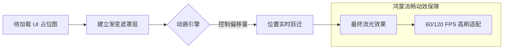

欢迎加入开源鸿蒙跨平台社区：[https://openharmonycrossplatform.csdn.net](https://openharmonycrossplatform.csdn.net)。

# Flutter for OpenHarmony：shimmer — 微动效加载艺术（用户体验底座）

## 前言

在追求卓越体验的华为鸿蒙（OpenHarmony）生态中，应用加载时的视觉感受往往决定了用户的第一印象。传统的转圈圈（CircularProgressIndicator）虽然简单，但在面对复杂的数据列表（如新闻流、商城首页）时，会显得枯燥且具有“被动等待感”。

`shimmer` 是一种通过流光溢彩（微动效）模拟内容轮廓的加载技术，俗称“骨架屏”。它模拟了内容即将跃然纸上的流动感，有效地缓解了用户对加载延迟的焦虑。在鸿蒙跨平台应用中，利用 `shimmer` 可以极大地提升整体界面的高级感，让你的 App 在众多的鸿蒙原生应用中脱颖而出。

## 一、原理展示 / 概念介绍

### 1.1 基础概念

`shimmer` 的核心原理是利用线性渐变遮罩（Gradient Mask）在子组件上循环滚动。



### 1.2 核心要点解析

- **Shimmer 组件**：包装层，负责控制流光的颜色（baseColor/highlightColor）和播放频率。
- **子组件透明度处理**：通常使用灰色圆角矩形代表文本和图片，`shimmer` 会自动检测子项的不透明像素并应用渐变。
- **性能优势**：直接在 Canvas 层进行渲染偏移，比起繁重的 GIF 加载，CPU 占用率极低。

## 二、核心 API / 组件详解

### 2.1 依赖引入

在鸿蒙工程的 `pubspec.yaml` 中添加以下依赖：

```yaml
dependencies:
  shimmer: ^3.0.0
```

### 2.2 基础用法

最简单的流光文字实现：

```dart
import 'package:shimmer/shimmer.dart';

// ✅ 推荐做法：通过 baseColor 和 highlightColor 调配符合鸿蒙主题的色彩
Shimmer.fromColors(
  baseColor: Colors.grey[300]!,
  highlightColor: Colors.grey[100]!,
  child: const Text('正在加载鸿蒙智慧生活...', style: TextStyle(fontSize: 40.0)),
)
```

### 2.3 进阶配置

💡 **技巧**：通过 `period` 属性可以控制流光速度。慢速流光适合稳重的政务应用，快速流光适合活泼的社交应用。

## 三、场景示例

### 3.1 场景一：鸿蒙新闻列表骨架屏

模拟新闻图片和两行文字组合的预加载状态，提供完美的“所见即所得”预期。

### 3.2 场景二：商品卡片加载

在鸿蒙折叠屏的大尺寸展示中，通过排列整齐的骨架卡片填补屏幕空白。

## 四、OpenHarmony 平台适配挑战

### 4.1 高刷屏幕下的动画卡顿（Jank）

华为多款鸿蒙设备（如 Mate 系列）支持 120Hz 刷新。如果动画逻辑在主线程执行过重，由于 `shimmer` 每帧都在重对齐线性渐变，可能会导致掉帧。

✅ **适配策略建议**：
1. **减少过度绘制**：仅让必要的占位框包裹在 `Shimmer` 内，避免把整个复杂的静态视图作为子组件。
2. **主题一致性**：鸿蒙系统有明确的“感知灵动”动效规范。建议将 `shimmer` 的渐变方向（direction）设定为从左上到右下，这符合大多数鸿蒙系统应用的设计直觉。

## 五、综合实战示例代码

以下是一个模拟鸿蒙“发现”页面的列表骨架屏实现：

```dart
import 'package:flutter/material.dart';
import 'package:shimmer/shimmer.dart';

class ShimmerLabPage extends StatefulWidget {
  const ShimmerLabPage({super.key});

  @override
  State<ShimmerLabPage> createState() => _ShimmerLabPageState();
}

class _ShimmerLabPageState extends State<ShimmerLabPage> {
  bool _isLoading = true;

  @override
  void initState() {
    super.initState();
    // 模拟数据加载
    Future.delayed(const Duration(seconds: 4), () {
      if (mounted) setState(() => _isLoading = false);
    });
  }

  @override
  Widget build(BuildContext context) {
    return Scaffold(
      appBar: AppBar(title: const Text('Shimmer 骨架屏实验室')),
      body: _isLoading ? _buildSkeleton() : _buildRealList(),
    );
  }

  // 💡 实战示例：构建典型的鸿蒙列表占位符
  Widget _buildSkeleton() {
    return Shimmer.fromColors(
      baseColor: Colors.grey[300]!,
      highlightColor: Colors.grey[100]!,
      child: ListView.builder(
        itemCount: 6,
        itemBuilder: (_, __) => Padding(
          padding: const EdgeInsets.all(16.0),
          child: Row(
            crossAxisAlignment: CrossAxisAlignment.start,
            children: [
              Container(width: 60.0, height: 60.0, decoration: BoxDecoration(color: Colors.white, borderRadius: BorderRadius.circular(10))),
              const SizedBox(width: 16),
              Expanded(
                child: Column(
                  crossAxisAlignment: CrossAxisAlignment.start,
                  children: [
                    Container(width: double.infinity, height: 12.0, color: Colors.white),
                    const SizedBox(height: 8),
                    Container(width: 150.0, height: 12.0, color: Colors.white),
                  ],
                ),
              )
            ],
          ),
        ),
      ),
    );
  }

  Widget _buildRealList() {
    return ListView.builder(
      itemCount: 6,
      itemBuilder: (_, index) => ListTile(
        leading: CircleAvatar(child: Text("${index + 1}")),
        title: Text("鸿蒙系统 5.0 开发者资讯 $index"),
        subtitle: const Text("这是一条已经加载完成的真实业务数据。"),
      ),
    );
  }
}
```

## 六、总结

`shimmer` 将无聊的等待变成了灵动的节奏。在 OpenHarmony 应用中，优秀的骨架屏设计不仅是技术实力的体现，更是对用户细致入微关怀的写照。

✅ **核心建议**：
1. **适时隐藏**：一旦数据返回，请使用 `CrossFade` 或淡入淡出动画进行平滑过渡，切忌生硬切换。
2. **颜色克制**：渐变背景色应与页面的全局 `scaffoldBackgroundColor` 保持高度谐调，避免亮眼的流光干扰鸿蒙页面的沉浸感。
3. **占位精准**：骨架屏的大小位置应尽量与正式内容保持 1:1，防止数据加载完成后产生剧烈的 UI 抖动。

📦 **完整代码已上传至 AtomGit**：[open-harmony-example/shimmer](https://atomgit.com/dragonbady/open-harmony-example/tree/main/examples/shimmer)

🌐 **欢迎加入开源鸿蒙跨平台社区**：[开源鸿蒙跨平台开发者社区](https://openharmonycrossplatform.csdn.net)
