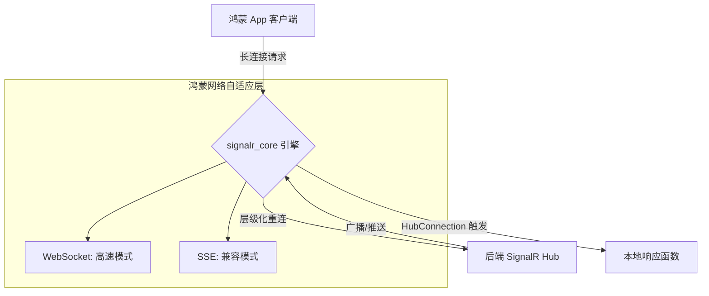

欢迎加入开源鸿蒙跨平台社区：[https://openharmonycrossplatform.csdn.net](https://openharmonycrossplatform.csdn.net)。

# Flutter for OpenHarmony：signalr_core — 实时互联引擎（双向通讯底座）

## 前言

在华为鸿蒙（OpenHarmony）生态的分布式协作、实时金融交易看板以及高并发社交聊天应用的开发中，如何确保服务器端的数据变动能毫秒级、低损耗地推送到千万个鸿蒙终端，是架构设计的核心。

`signalr_core` 是一款专为 ASP.NET Core SignalR 协议打造的纯 Dart 客户端库。它不仅支持高性能的 WebSocket 传输，还能在网络受限环境下自动降级为服务器发送事件（SSE）或长轮询（Long Polling）。在鸿蒙跨平台应用中，它凭借其高度抽象的 Hub（中心）模式，让开发者能够像调用本地函数一样实现跨进程、跨地域的实时双向互调。在构建鸿蒙平台的股票实时行情、协同办公编辑器或多人竞技游戏时，它是实现“全时在线”交互的核心底座。

## 一、原理展示 / 概念介绍

### 1.1 基础概念

SignalR 实现了透明的实时推送与调用。



### 1.2 核心要点解析

- **中心（Hub）机制**：通过简单的命名通道（Invoke/On）进行互调，极大简化了原始 Socket 编程中处理帧、分包的复杂逻辑。
- **自动重连（Auto-reconnect）**：原生支持智能避让式的重连机制，在鸿蒙设备切换隔离网或 Wi-Fi/5G 切换时实现无感连接恢复。
- **协议透明**：支持文本（JSON）和二进制（MessagePack）两种协议格式，后者在鸿蒙端能获得更小的流量开销和更快的解析性能。

## 二、核心 API / 组件详解

### 2.1 依赖引入

在鸿蒙工程的 `pubspec.yaml` 中添加以下依赖：

```yaml
dependencies:
  signalr_core: ^1.1.0 
```

### 2.2 建立与启动连接

在鸿蒙端开启一个实时行情监控：

```dart
import 'package:signalr_core/signalr_core.dart';

Future<void> initRealtimeConnection() async {
  // ✅ 推荐做法：通过 HubConnectionBuilder 构建连接
  final connection = HubConnectionBuilder()
    .withUrl('https://api.harmony-stocks.com/hub')
    .withAutomaticReconnect() // 💡 技巧：自动指数退避重连
    .build();

  // 1. 监听来自服务器的推送
  connection.on('ReceiveStockPrice', (arguments) {
     print('鸿蒙端收到最新金价: ${arguments![0]}');
  });

  // 2. 启动连接
  await connection.start();
}
```

### 2.3 调用服务器方法（RPC）

```dart
void joinChatRoom(String roomId) async {
  // 💡 技巧：向中心投递指令并等待确认
  await connection.invoke('JoinRoom', args: [roomId]);
}
```

## 三、场景示例

### 3.1 场景一：鸿蒙分布式协同白板

利用 SignalR 的广播能力，当一个鸿蒙平板端的画笔移动时，瞬间同步至局域网或云端的所有协作终端。

### 3.2 场景二：外卖骑手实时位置追踪

在鸿蒙端外卖应用中，通过 SignalR 推送骑手的精确坐标，实现地图轨迹的丝滑移动而非跳跃更新。

## 四、OpenHarmony 平台适配挑战

### 4.1 长连接对功耗的影响

长连接如果处理不当，会阻止鸿蒙系统的低能耗休眠（Doze Mode），导致耗电过快。

✅ **适配策略建议**：
1. **适时断开**：在鸿蒙端应用进入后台（Background）5 分钟后，建议主动调用 `connection.stop()`，转为使用系统级的 Push 通知（华为推送服务）。直到用户返回前台再次重连。
2. **心跳包（Keep-alive）调优**：鸿蒙的网络环境多变。建议将心跳频率稍微调慢（如 30 秒一次），平衡连接稳定性与鸿蒙设备的续航能力。

## 五、综合实战示例代码

以下是一个模拟鸿蒙手机“实时股市监控器”的实战组件示例：

```dart
import 'package:flutter/material.dart';
import 'package:signalr_core/signalr_core.dart';

class SignalRLabPage extends StatefulWidget {
  const SignalRLabPage({super.key});

  @override
  State<SignalRLabPage> createState() => _SignalRLabPageState();
}

class _SignalRLabPageState extends State<SignalRLabPage> {
  HubConnection? _connection;
  String _price = "---";
  String _status = "正在测速初始化...";

  @override
  void initState() {
    super.initState();
    _connectToHub();
  }

  void _connectToHub() async {
    _connection = HubConnectionBuilder()
        .withUrl('https://mock-market.harmony.com/v1/stock')
        .build();

    _connection!.on('UpdatePrice', (args) {
      if (mounted) setState(() => _price = "${args![0]} 元");
    });

    _connection!.onreconnecting((error) {
       setState(() => _status = "⚠️ 鸿蒙端断网重连中...");
    });

    try {
      await _connection!.start();
      setState(() => _status = "🟢 实时专线已连接");
    } catch (e) {
      setState(() => _status = "❌ 连接失败，请检查鸿蒙网络。");
    }
  }

  @override
  void dispose() {
    _connection?.stop();
    super.dispose();
  }

  @override
  Widget build(BuildContext context) {
    return Scaffold(
      appBar: AppBar(title: const Text('SignalR 实时通讯实验室')),
      body: Center(
        child: Column(
          mainAxisAlignment: MainAxisAlignment.center,
          children: [
            const Icon(Icons.sync_alt, size: 80, color: Colors.blueAccent),
            const SizedBox(height: 20),
            Text(_status, style: TextStyle(color: _status.contains('🟢') ? Colors.green : Colors.red)),
            const SizedBox(height: 40),
            const Text("当前华为（HUAWEI）股价", style: TextStyle(fontSize: 16)),
            Text(_price, style: const TextStyle(fontSize: 48, fontWeight: FontWeight.bold, color: Colors.red)),
          ],
        ),
      ),
    );
  }
}
```

## 六、总结

`signalr_core` 为 OpenHarmony 应用注入了“实时动态”的灵魂。它让开发者能够摆脱对轮询的依赖，构建出响应极其迅捷、用户交互感极强的现代化跨平台应用。

✅ **核心建议**：
1. **异常捕获严定义**：网络总是不稳定的。务必在 `connection.onclose` 和 `onreconnecting` 中定义清晰的 UI 引导逻辑。
2. **协议选择建议**：如果没有极端流量限制，使用 JSON 协议更方便调试；追求极致性能则选择 MessagePack。
3. **负载均衡支持**：如果后端使用了负载均衡器，记得开启保持长连接会话的相关设置。

📦 **完整代码已上传至 AtomGit**：[open-harmony-example/signalr](https://atomgit.com/dragonbady/open-harmony-example/tree/main/examples/signalr)

🌐 **欢迎加入开源鸿蒙跨平台社区**：[开源鸿蒙跨平台开发者社区](https://openharmonycrossplatform.csdn.net)
