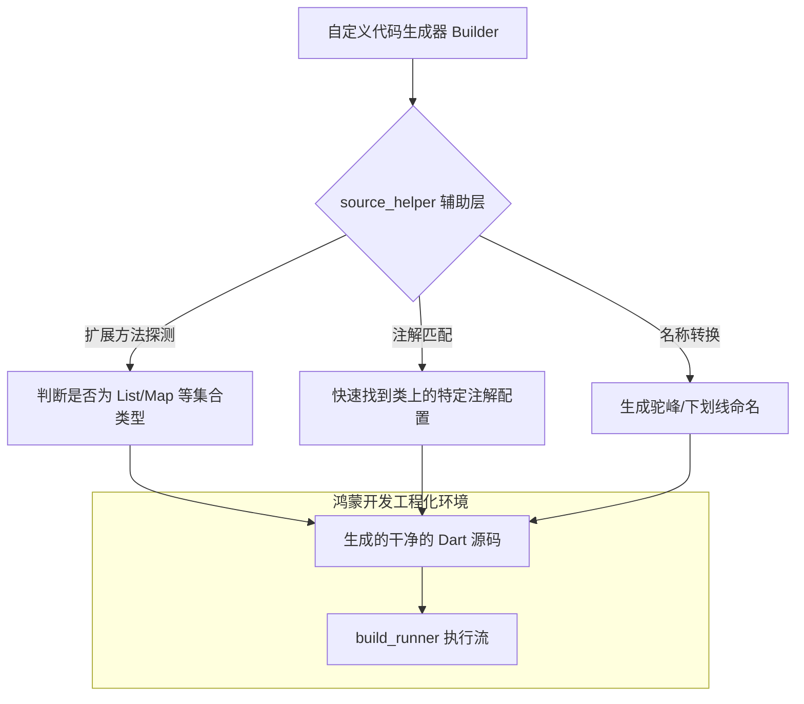

欢迎加入开源鸿蒙跨平台社区：[https://openharmonycrossplatform.csdn.net](https://openharmonycrossplatform.csdn.net)。

# Flutter for OpenHarmony：source_helper — 源码生成的导航员（构建辅助底座）

## 前言

在华为鸿蒙（OpenHarmony）生态的复杂企业级应用开发中，为了减少重复的样板代码（如自动生成 JSON 映射、自动构建数据库实体），开发者通常会编写自定义的代码生成器（Builders）。然而，在编写生成器时，如何优雅地解析 Dart 源码中的类名、属性类型、或是判断某个字段是否具备特定的注解（Annotation），往往需要处理极其晦涩的 `analyzer` 抽象语法树。

`source_helper` 是一款专为代码生成器作者打造的高效率工具库。它通过一系列语义化的扩展方法，极大地简化了对源码元数据（Metadata）的提取过程。在构建鸿蒙平台的专有协议生成器、自动化 UI 映射器或是特定的 Mock 注入工具时，它是你实现“生成器代码逻辑极其简洁”的核心辅助底座。

## 一、原理展示 / 概念介绍

### 1.1 基础概念

本库实现了从“底层 AST（抽象语法树）对象”到“开发者可直接使用的语义化属性”的快速映射。



### 1.2 核心要点解析

- **类型属性感知**：提供 `isEnum`, `isIterable` 等极其方便的属性，让你能够在一行代码内判定某个字段的本质特征。
- **注解聚合处理**：简化了从多个注解中提取特定参数（如别名、忽略标志）的逻辑，让生成器更健壮、更具扩展性。
- **高性能解析**：基于 `analyzer` 库的轻量级包装，在处理鸿蒙大型项目的成千上万个文件时，依然保持编译期的响应速度。

## 二、核心 API / 组件详解

### 2.1 依赖引入

在相关的鸿蒙代码生成器工程（通常是独立项目）的 `pubspec.yaml` 中添加：

```yaml
dependencies:
  source_helper: ^1.1.0 
  analyzer: '>=5.0.0 <7.0.0'
```

### 2.2 快速判定字段特征

在你的 `Generator` 实现代码中使用：

```dart
import 'package:source_helper/source_helper.dart';
import 'package:analyzer/dart/element/element.dart';

void analyzeField(FieldElement field) {
  // ✅ 推荐做法：通过扩展属性直接判断
  if (field.type.isIterable) {
     print('💡 这是一个鸿蒙列表类型字段');
  }
  
  // 快速获取注解实例
  final annotation = field.getAnnotation('MyHarmonyJson');
}
```

### 2.3 生成语义化代码片段

💡 **技巧**：在生成鸿蒙 UI 绑定代码时，自动转换字段名为变量名。

```dart
String variableName = field.name.toTitleCase(); // 💡 技巧：辅助类提供的命名处理
```

## 三、场景示例

### 3.1 场景一：构建鸿蒙专有的“分布式对象”生成器

针对鸿蒙多设备协同，自定义一套自动将类转换为二进制流的 Builder。利用 `source_helper` 快速识别出哪些字段由于标注了 `@skip` 而无需导出，逻辑清晰且无冗余。

### 3.2 场景二：自动化构建鸿蒙系统的“双色模式”资产索引

解析本地目录的所有图片文件及其注解元数据，自动生成一套符合鸿蒙 `Theme` 规范的静态变量索引文件，省去手动维护的苦恼。

## 四、OpenHarmony 平台适配挑战

### 4.1 注解解析的路径敏感性

由于代码生成通常在宿主（PC/Mac）端执行，处理生成的路径映射时需遵循鸿蒙的包名规范。

✅ **适配策略建议**：
1. **统一 Package 引用**：使用 `source_helper` 提取类型名时，务必携带完整的 `package:...` 路径。在生成的产物中，确保所有的 Import 语句都符合华为鸿蒙项目的包依赖结构，避免由于相对路径错误导致的编译失败。
2. **多版本兼容**：鸿蒙生态的 Dart 版本正在快速演进。在使用该库进行高级元数据解析时，建议在 `build.yaml` 中固定 `analyzer` 的兼容版本，防止由于语言特性微调导致的生成器逻辑崩溃。

## 五、综合实战示例代码

以下是一个演示如何利用 `source_helper` 提取类信息并生成对应“鸿蒙数据实体工厂”代码的逻辑片段：

```dart
import 'package:source_helper/source_helper.dart';
import 'package:analyzer/dart/element/element.dart';

String generateFactory(ClassElement clazz) {
  final className = clazz.name.toTitleCase();
  final fields = clazz.fields;
  
  StringBuffer buffer = StringBuffer();
  buffer.writeln('class ${className}Factory {');
  
  for (final field in fields) {
    // 💡 实战技巧：过滤掉静态或私有字段
    if (field.isStatic || field.name.startsWith('_')) continue;
    
    final typeName = field.type.getDisplayString(withNullability: true);
    buffer.writeln('  void process${field.name.toTitleCase()}($typeName value) {');
    buffer.writeln('    print("正在处理鸿蒙字段: ${field.name}");');
    buffer.writeln('  }');
  }
  
  buffer.writeln('}');
  return buffer.toString();
}
```

## 六、总结

`source_helper` 虽然深藏在“构建工具”的幕后，但它是 OpenHarmony 开发者实现工程化、向“自动化编程”迈进的重要基石。它不仅抹平了复杂 AST 操作的坑洼，更为构建高质量、工业级的鸿蒙专用代码生成器提供了稳健的支撑。

✅ **核心建议**：
1. **组合优于原始**：尽量使用库提供的 `getAnnotation`, `isIterable` 等现成扩展，避免自己去写复杂的 `checker` 逻辑。
2. **注重测试**：代码生成器的 Bug 通常很难发现。建议开启 `source_gen_test` 配合该库，通过对比生成的源码快照来保证生成逻辑的准确性。
3. **保持同步**：随着鸿蒙 5.0 对元数据（Reflection）管控加严，这种编译期处理（AOT 友好）的技术栈将愈发成为主流，强烈建议掌握。

📦 **完整代码已上传至 AtomGit**：[open-harmony-example/source_helper](https://atomgit.com/dragonbady/open-harmony-example/tree/main/examples/source_helper)

🌐 **欢迎加入开源鸿蒙跨平台社区**：[开源鸿蒙跨平台开发者社区](https://openharmonycrossplatform.csdn.net)
