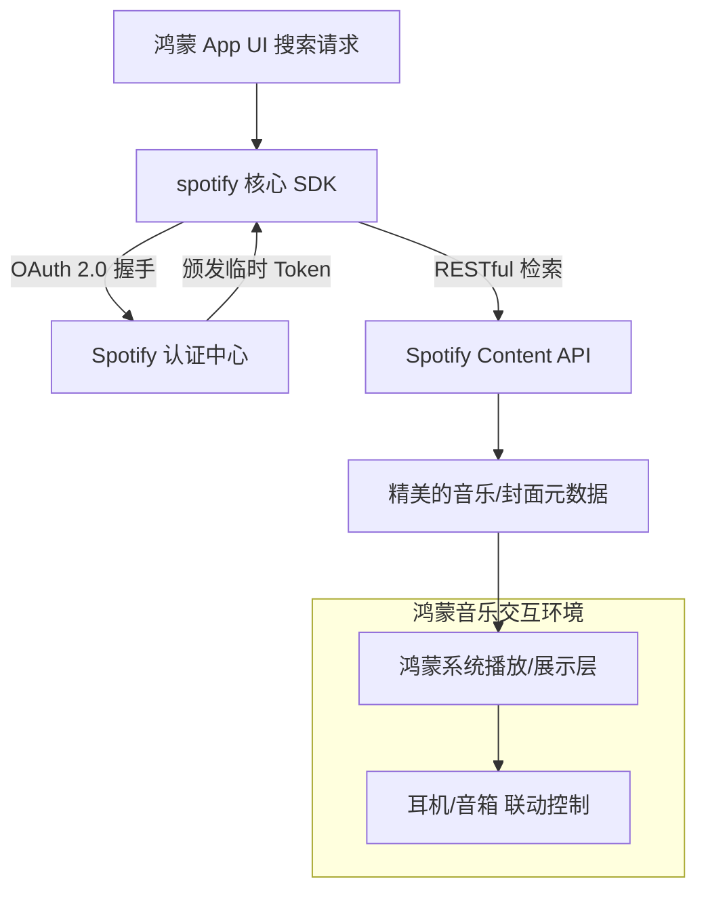

欢迎加入开源鸿蒙跨平台社区：[https://openharmonycrossplatform.csdn.net](https://openharmonycrossplatform.csdn.net)。

# Flutter for OpenHarmony：spotify — 全球音乐灵感引擎（数字娱乐底座）

## 前言

在华为鸿蒙（OpenHarmony）生态走向全球的过程中，数字娱乐体验是吸引用户的核心阵地。无论是构建具备“智能曲库推介”功能的音乐播放器、打造运动健身应用中的同步歌单，还是实现跨端的社交听歌房，接入业界领先的音乐数据源是关键。

`spotify` 是一款专为 Spotify Web API 设计的高级 Dart 封装库。它涵盖了从专辑检索、艺术家画像、全球热门榜单到用户私有歌单管理的完整能力。在鸿蒙跨平台应用的开发中，它凭借类型安全的接口与高效的模型解析，让开发者能够无缝对接 Spotify 的海量音乐资源。在构建鸿蒙平台的专业音频工具或生活社交应用时，它是你构建“云端曲库”能力的数字化枢纽。

## 一、原理展示 / 概念介绍

### 1.1 基础概念

本库实现了端侧与 Spotify 云端音乐大脑的高性能交互。



### 1.2 核心要点解析

- **全量 API 覆盖**：除了基础的搜索，还支持获取音频分析（音调、速度、能量等），完美适配鸿蒙端高级音频可视化应用。
- **自动分页处理**：内置了优雅的列表分页逻辑，在大规模展示歌单时内存占用极低。
- **类型安全模型**：为所有的实体（Track, Album, Artist）提供了详尽的类定义，支持 IDE 智能提示，降低鸿蒙端代码的 Bug 率。

## 二、核心 API / 组件详解

### 2.1 依赖引入

在鸿蒙工程的 `pubspec.yaml` 中添加以下依赖：

```yaml
dependencies:
  spotify: ^0.2.0 # 建议参考最新稳定版本
```

### 2.2 身份认证与客户端初始化

💡 **技巧**：Spotify 采用 OAuth 流程。对于无后端应用，可以使用 Client Credentials。

```dart
import 'package:spotify/spotify.dart';

// ✅ 推荐做法：通过凭证初始化单例
final credentials = SpotifyApiCredentials(
  'YOUR_CLIENT_ID',
  'YOUR_CLIENT_SECRET',
);

final spotify = SpotifyApi(credentials);
```

### 2.3 快速检索热门单曲

在鸿蒙端实现“猜你喜欢”模块：

```dart
Future<void> findMusic(String query) async {
  // 💡 技巧：搜索并仅获取前 5 个结果
  final results = await spotify.search.get(query, types: [SearchType.track]).first(5);
  
  for (final pages in results) {
    for (final track in pages.items!) {
      print('发现鸿蒙端热单: ${track.name} - ${track.artists?.first.name}');
    }
  }
}
```

## 三、场景示例

### 3.1 场景一：鸿蒙“律动”运动助手

根据用户的跑步步频（BPM），利用 `spotify` 的音频特征 API 动态从库中推荐快节奏的音乐，保持运动激情。

### 3.2 场景二：桌面模式下的“胶盘”播放器壁纸

在鸿蒙 Pad 桌面态，通过获取当前播放专辑的高保真封面图（Artwork），实时渲染一张极简主义的动态壁纸。

## 四、OpenHarmony 平台适配挑战

### 4.1 网络稳定性与 API 限频

Spotify API 在高并发访问下会有严格的 Rate Limit。

✅ **适配策略建议**：
1. **本地结果缓存**：对于常用的榜单或搜索词，建议在鸿蒙端本地配合 `sembast` 进行有效期为数小时的缓存。
2. **多机型网络自适应**：鉴于跨境链路的不确定性，务必为 `spotify` 客户端配置重试机制。在鸿蒙端弱网环境下，优先展示占位图而非空白加载。

## 五、综合实战示例代码

以下是一个演示如何在鸿蒙端利用 `spotify` 构建“艺术家搜索画廊”的实战组件：

```dart
import 'package:flutter/material.dart';
import 'package:spotify/spotify.dart' as sp;

class SpotifyLabPage extends StatefulWidget {
  const SpotifyLabPage({super.key});

  @override
  State<SpotifyLabPage> createState() => _SpotifyLabPageState();
}

class _SpotifyLabPageState extends State<SpotifyLabPage> {
  final _client = sp.SpotifyApi(sp.SpotifyApiCredentials('ID', 'SECRET'));
  List<sp.Artist> _artists = [];

  void _searchArtist(String name) async {
    // 💡 实战技巧：流式获取搜索结果
    final results = await _client.search.get(name, types: [sp.SearchType.artist]).first(10);
    
    setState(() {
      _artists = results.expand((page) => page.items!).cast<sp.Artist>().toList();
    });
  }

  @override
  Widget build(BuildContext context) {
    return Scaffold(
      appBar: AppBar(title: const Text('Spotify 音乐实验室')),
      body: Column(
        children: [
          Padding(
            padding: const EdgeInsets.all(16),
            child: TextField(onSubmitted: _searchArtist, decoration: const InputDecoration(labelText: '搜索艺术家 (如: 周杰伦)')),
          ),
          Expanded(
            child: ListView.builder(
              itemCount: _artists.length,
              itemBuilder: (context, index) {
                final artist = _artists[index];
                return ListTile(
                  leading: CircleAvatar(backgroundImage: NetworkImage(artist.images?.last.url ?? '')),
                  title: Text(artist.name!),
                  subtitle: Text("粉丝数: ${artist.followers?.total}"),
                );
              },
            ),
          )
        ],
      ),
    );
  }
}
```

## 六、总结

`spotify` 库让 OpenHarmony 应用与全球最大的数字音乐库实现了“零距离”对接。它不仅提升了应用内容的丰富度，更为打造极致的娱乐交互体验奠定了数据基础。

✅ **核心建议**：
1. **隐藏 Key**：绝不要将 Client Secret 提交到公开的 AtomGit 仓库，应使用私有环境变量。
2. **版权声明**：在 UI 展示界面，务必保留 “Powered by Spotify” 字样，符合开放平台协议。
3. **结合系统音频管理**：获取到音乐数据后，建议结合鸿蒙系统的音频控制中心（AVSession），让用户能通过下拉状态栏控制播放。

📦 **完整代码已上传至 AtomGit**：[open-harmony-example/spotify](https://atomgit.com/dragonbady/open-harmony-example/tree/main/examples/spotify)

🌐 **欢迎加入开源鸿蒙跨平台社区**：[开源鸿蒙跨平台开发者社区](https://openharmonycrossplatform.csdn.net)
