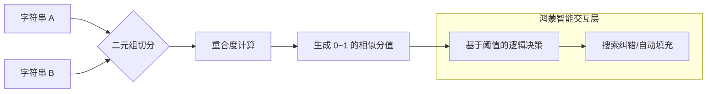

欢迎加入开源鸿蒙跨平台社区：[https://openharmonycrossplatform.csdn.net](https://openharmonycrossplatform.csdn.net)。

# Flutter for OpenHarmony：string_similarity — 文本智能匹配引擎（交互体验底座）

## 前言

在华为鸿蒙（OpenHarmony）应用的日常开发中，文本处理的“智能感”往往取决于对用户输入的宽容度。当用户在搜索框输入轻微错误的关键词，或者在处理不同来源的数据抓取结果时，精准的字符串相等判断（`==`）通常会失效。

`string_similarity` 是一款采用 Dice's Coefficient（戴斯系数）算法实现的字符串相似度比对库。它能计算两个字符串之间的相似度分值（0.0 到 1.0），并能从一组选项中自动筛选出最匹配的一项。在构建鸿蒙应用的模糊搜索、地址纠错以及列表智能过滤逻辑中，它是打造“猜你想找”极致体验的核心技术组件。

## 一、原理展示 / 概念介绍

### 1.1 基础概念

本库通过拆分字符串为二元组（Bigrams）进行集合相似度计算。



### 1.2 核心要点解析

- **Dice's Coefficient 算法**：相比于 Levinshtein（编辑距离），它对字符串的易位（Transpose）更加稳定，且计算开销更低。
- **最佳匹配查找**：支持传入一个字符串列表，一键返回最接近目标的元素及其分值。
- **高性能运行**：纯 Dart 实现，无原生依赖，完美适配鸿蒙各处理器架构。

## 二、核心 API / 组件详解

### 2.1 依赖引入

在鸿蒙工程的 `pubspec.yaml` 中添加以下依赖：

```yaml
dependencies:
  string_similarity: ^2.0.0
```

### 2.2 两两字符串相似度比对

```dart
import 'package:string_similarity/string_similarity.dart';

void compareStrings() {
  // ✅ 推荐做法：计算分值用于简单的权重分析
  double score = "OpenHarmony 5.0".similarityTo("OpenHarmony v5");
  print('相似度分值: $score'); // 输出约 0.8
}
```

### 2.3 在选项列表中寻找“真命天子”

💡 **技巧**：返回包含所有分值及最匹配项的综合对象。

```dart
final match = StringSimilarity.findBestMatch(
  "华为手机", 
  ["华为 Mate 60", "小米手机", "苹果手机", "华为全家桶"]
);
print('最匹配的项: ${match.bestMatch.target}'); // 华为 Mate 60
```

## 三、场景示例

### 3.1 场景一：鸿蒙端“拼写纠错”系统

当用户在商场应用输入“麦档劳”时，系统利用 `string_similarity` 自动提示：“您是不是想找：麦当劳？”

### 3.2 场景二：地址簿重复项排查

在鸿蒙分布式通讯录同步过程中，识别出由于格式差异（如“软件园 1 号”与“软件园一层”）产生的潜在重复条目并提醒合并。

## 四、OpenHarmony 平台适配挑战

### 4.1 中文分词与颗粒度

默认的戴斯系数基于字符或字节。对于中文而言，单个字的重合度解析可能不够精细。

✅ **适配策略建议**：
1. **预处理规范化**：由于鸿蒙系统可能涉及繁简混合，建议对比前先调用 `.toFullWidth()` 等工具进行全半角转换。
2. **长列表搜索优化**：在一两万条数据的鸿蒙应用历史记录中进行相似度全局扫描会产生计算峰值。

✅ **推荐方案**：
将比对逻辑放在鸿蒙端的异步后台线程（compute）执行，确保不阻塞搜索框的响应动效。

## 五、综合实战示例代码

以下是一个演示如何在鸿蒙搜索组件中引入“模糊匹配评分”的实战：

```dart
import 'package:flutter/material.dart';
import 'package:string_similarity/string_similarity.dart';

class StringSimilarityLab extends StatefulWidget {
  const StringSimilarityLab({super.key});

  @override
  State<StringSimilarityLab> createState() => _StringSimilarityLabState();
}

class _StringSimilarityLabState extends State<StringSimilarityLab> {
  final List<String> _tags = ["快速充电", "长续航", "徕卡摄影", "折叠屏", "鸿蒙系统"];
  String _input = "";
  List<Rating> _ratings = [];

  void _onInput(String val) {
    setState(() {
      _input = val;
      // 💡 实战技巧：获取所有匹配分值并按相似度倒序排列
      final res = StringSimilarity.findBestMatch(val, _tags);
      _ratings = res.ratings..sort((a, b) => b.rating!.compareTo(a.rating!));
    });
  }

  @override
  Widget build(BuildContext context) {
    return Scaffold(
      appBar: AppBar(title: const Text('文本智能匹配实验室')),
      body: Padding(
        padding: const EdgeInsets.all(20),
        child: Column(
          children: [
            TextField(
              onChanged: _onInput,
              decoration: const InputDecoration(labelText: '搜索标签 (试下: 鸿蒙系统)'),
            ),
            const SizedBox(height: 20),
            Expanded(
              child: ListView.builder(
                itemCount: _ratings.length,
                itemBuilder: (context, index) {
                  final item = _ratings[index];
                  return ListTile(
                    title: Text(item.target!),
                    trailing: Chip(
                      label: Text("${(item.rating! * 100).toInt()}%"),
                      backgroundColor: item.rating! > 0.4 ? Colors.green[100] : Colors.grey[200],
                    ),
                  );
                },
              ),
            ),
          ],
        ),
      ),
    );
  }
}
```

## 六、总结

`string_similarity` 让 OpenHarmony 应用具备了初步的“理解”能力。它不仅提高了搜索的容错率，更从细节处打磨了用户操作的爽快感。

✅ **核心建议**：
1. **设置阈值**：相似度低于 0.3 的结果通常建议不予展示，防止干扰。
2. **结合倒排索引**：在处理超大型数据集时，先用传统搜索命中一部分列表，再用 `string_similarity` 进行精细分值计算。
3. **大小写不敏感**：在处理英文包名或 ID 时，对比前务必统一 `.toLowerCase()`。

📦 **完整代码已上传至 AtomGit**：[open-harmony-example/string_similarity](https://atomgit.com/dragonbady/open-harmony-example/tree/main/examples/string_similarity)

🌐 **欢迎加入开源鸿蒙跨平台社区**：[开源鸿蒙跨平台开发者社区](https://openharmonycrossplatform.csdn.net)
