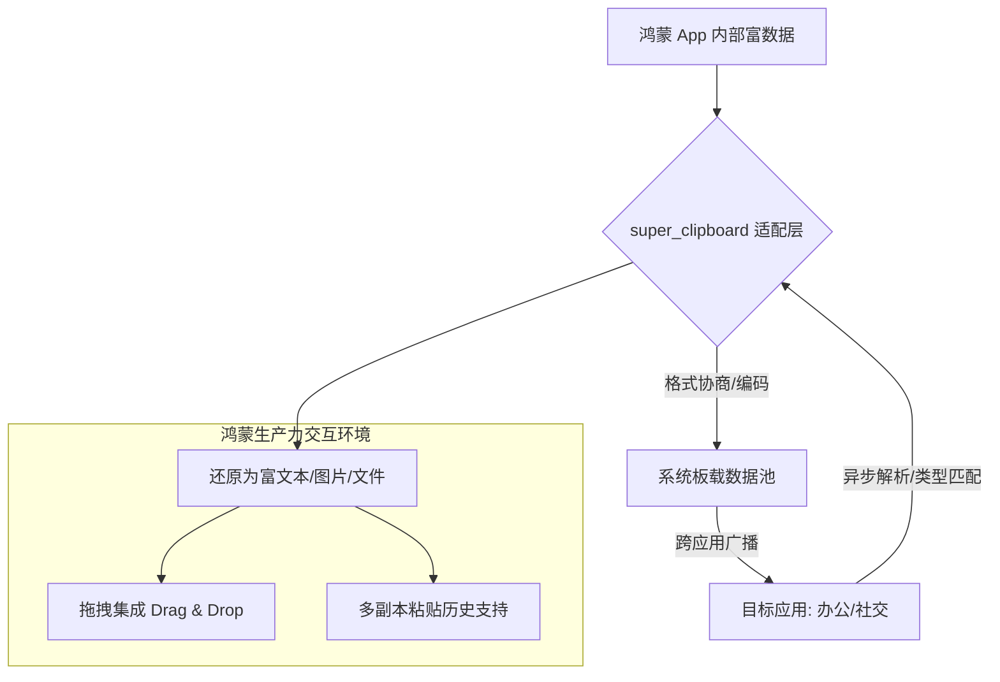

欢迎加入开源鸿蒙跨平台社区：[https://openharmonycrossplatform.csdn.net](https://openharmonycrossplatform.csdn.net)。

# Flutter for OpenHarmony：super_clipboard — 数据的任意门（系统交互底座）

## 前言

在华为鸿蒙（OpenHarmony）生态的办公协作、专业设计以及跨端笔记应用开发中，系统剪贴板（Clipboard）不再仅仅是“复制粘贴纯文本”的简单通道。现代生产力应用需要支持复制富文本（HTML/RTF）、导出带有透明度的图片原始数据、甚至是直接跨应用拖拽多个文件流。

`super_clipboard` 是一款专为极致性能和多格式支持而设计的下一代剪贴板框架。它彻底打破了原生剪贴板仅能处理有限类型的局限，提供了一套统一的异步接口，能完美处理字节流级别的复杂数据交换。在构建鸿蒙平台的专业文档编辑器、设计看板、或是多端协同的消息盒子时，它是实现“全格式、零损耗”数据流通的核心技术枢纽。

## 一、原理展示 / 概念介绍

### 1.1 基础概念

本库实现了应用内部数据到系统通用粘贴板池的高性能映射。



### 1.2 核心要点解析

- **多格式并行（Multi-format）**：当你点击“复制”时，可以同时在剪贴板中推入 Plain Text, HTML 以及对应的 PNG 预览，确保接收端应用能根据自身能力获取最佳版本。
- **异步流式处理**：针对大型文件或高保真图片，采用异步读取机制，避免在鸿蒙 UI 线程执行繁重的编解码操作导致界面卡死。
- **深度拖拽支持**：不仅仅是点击复制，还是实现鸿蒙平板上“一拖即走、一放即得”这种高级交互功能的基石。

## 二、核心 API / 组件详解

### 2.1 依赖引入

在鸿蒙工程的 `pubspec.yaml` 中添加以下依赖：

```yaml
dependencies:
  super_clipboard: ^0.8.0 # 建议参考最新稳定版本
```

### 2.2 跨应用复制富文本

在鸿蒙端实现一段包含样式的文本分发：

```dart
import 'package:super_clipboard/super_clipboard.dart';

void copyRichContent() async {
  // ✅ 推荐做法：通过 SystemClipboard 管理数据项
  final item = DataWriterItem();
  
  // 1. 同时写入文本和 HTML 格式
  item.add(Formats.plainText('鸿蒙开发万岁'));
  item.add(Formats.htmlText('<p style="color:red">鸿蒙开发万岁</p>'));

  // 2. 提交到系统剪贴板
  await SystemClipboard.instance?.write([item]);
}
```

### 2.3 读取多种格式

💡 **技巧**：在鸿蒙端监听剪贴板内容，识别其中是否有图像数据。

```dart
Future<void> readFromBoard() async {
  final reader = await SystemClipboard.instance?.read();
  if (reader != null) {
    if (reader.canProvide(Formats.png)) {
       // 💡 技巧：异步读取图像流
       final bytes = await reader.getFile(Formats.png, (file) => file.readAll());
       print('鸿蒙端已捕获剪贴板图片数据');
    }
  }
}
```

## 三、场景示例

### 3.1 场景一：鸿蒙平板“分屏办公”下的图像拖拽

在鸿蒙 Pad 上左边开相册，右边开你的绘图应用。利用 `super_clipboard` 实现将相册图片直接拖入画布，无需经过“保存-导入”的繁琐流程。

### 3.2 场景二：带样式的代码块分享

构建一个鸿蒙端的开发者社区应用。在复制代码时，通过该库同时携带文本和带语法高亮的 HTML，确保用户粘贴到公众号编辑器或 Word 档里时依然保持排版美观。

## 四、OpenHarmony 平台适配挑战

### 4.1 系统剪贴板权限与隐私合规

鸿蒙系统对第三方应用由于隐私保护，对频繁监听剪贴板行为有严格管控（弹出权限询问）。

✅ **适配策略建议**：
1. **触发式执行**：不要在后台开启高频定时器检测剪贴板。应由用户显式的点击“粘贴”按钮再触发 `SystemClipboard.read()`，确保获得鸿蒙系统的隐私准入。
2. **连接性校验**：在鸿蒙超级终端（Super Device）进行跨端粘贴时，网络延迟可能导致 `read()` 接口超时。务必设置合理的异步超时控制，并提供友好的 UI 状态反馈。

## 五、综合实战示例代码

以下是一个演示如何在鸿蒙端实现的“富数据剪贴板查看器”实战：

```dart
import 'package:flutter/material.dart';
import 'package:super_clipboard/super_clipboard.dart';

class ClipboardLabPage extends StatefulWidget {
  const ClipboardLabPage({super.key});

  @override
  State<ClipboardLabPage> createState() => _ClipboardLabPageState();
}

class _ClipboardLabPageState extends State<ClipboardLabPage> {
  String _boardContent = "点击按钮查看系统板载信息";

  void _onPaste() async {
    final reader = await SystemClipboard.instance?.read();
    
    // 💡 实战技巧：自适应识别多种格式
    if (reader != null) {
      String result = "";
      if (reader.canProvide(Formats.plainText)) {
        final text = await reader.readValue(Formats.plainText);
        result += "文本内容: $text\n";
      }
      if (reader.canProvide(Formats.htmlText)) {
        result += "检测到 HTML 富文本数据\n";
      }
      
      setState(() => _boardContent = result.isEmpty ? "板子是空的" : result);
    }
  }

  @override
  Widget build(BuildContext context) {
    return Scaffold(
      appBar: AppBar(title: const Text('下一代剪贴板实验室')),
      body: Center(
        child: Column(
          mainAxisAlignment: MainAxisAlignment.center,
          children: [
            const Icon(Icons.copy_all, size: 80, color: Colors.blueAccent),
            const SizedBox(height: 30),
            Container(
              padding: const EdgeInsets.all(20),
              margin: const EdgeInsets.symmetric(horizontal: 24),
              decoration: BoxDecoration(color: Colors.blue[50], borderRadius: BorderRadius.circular(15)),
              child: Text(_boardContent),
            ),
            const SizedBox(height: 50),
            ElevatedButton.icon(
              onPressed: _onPaste,
              icon: const Icon(Icons.paste_sharp),
              label: const Text('执行鸿蒙端跨格式反序列化'),
            ),
          ],
        ),
      ),
    );
  }
}
```

## 六、总结

`super_clipboard` 将 OpenHarmony 的内部数据交换能力提升到了桌面级的水平。它不仅赋予了应用处理复杂媒体格式的潜力，更通过对拖拽交互的深度支持，让鸿蒙多设备协同办公的体验得到了质的飞跃。

✅ **核心建议**：
1. **优先使用标准预览图**：在剪贴板中放入超大图片时，额外添加一张 `Formats.jpeg` 低分辨率缩略图，提升跨端传输速度。
2. **清理敏感信息**：当用户在鸿蒙应用中复制了密码或 Token 后，建议在 1 分钟后自动调用清空剪贴板逻辑，增强安全性。
3. **结合 `super_drag_and_drop`**：剪贴板只是第一步。配合同一家族的拖拽插件，可以构建出真正的全沉浸式作业流。

📦 **完整代码已上传至 AtomGit**：[open-harmony-example/clipboard](https://atomgit.com/dragonbady/open-harmony-example/tree/main/examples/clipboard)

🌐 **欢迎加入开源鸿蒙跨平台社区**：[开源鸿蒙跨平台开发者社区](https://openharmonycrossplatform.csdn.net)
