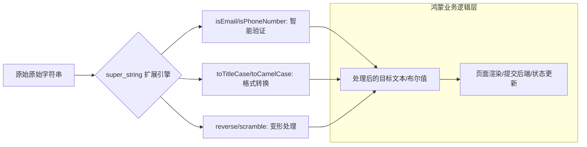

欢迎加入开源鸿蒙跨平台社区：[https://openharmonycrossplatform.csdn.net](https://openharmonycrossplatform.csdn.net)。

# Flutter for OpenHarmony：super_string — 字符串的百宝箱（文本处理底座）

## 前言

在华为鸿蒙（OpenHarmony）生态的各种应用开发中，字符串处理是最基础但也最繁琐的工作：判断是否为有效的邮箱、将首字母大写、剔除所有空格、或者进行精细的文本分片。虽然 Dart 原生提供了一些基础方法，但在面对复杂的业务逻辑时，开发者往往需要手写大量的正则表达式或辅助函数。

`super_string` 是一款专为提升开发幸福感而设计的字符串扩展库。它通过 Dart 的 `extension` 机制，为原生的 `String` 类型注入了数十个极具威力的“超能力”。在鸿蒙跨平台应用的开发中，它能让你以极简的链式调用，完成原本极其复杂的文本转换逻辑。在构建鸿蒙平台的注册表单验证、内容编辑器、或是日志分析工具时，它是实现“代码高可读性”与“逻辑紧凑化”的核心插件。

## 一、原理展示 / 概念介绍

### 1.1 基础概念

本库通过对原生 String 类的深度扩展（Extension），实现了语义化的文本操作。



### 1.2 核心要点解析

- **无感注入**：引用库后，所有的 `String` 变量会自动出现新增的 API 方法，无需额外创建工具类。
- **全方位覆盖**：涵盖了验证类、转换类、提取类以及趣味性转换（如 `scramble`）等全方位需求。
- **高性能实现**：底层算法经过优化，在鸿蒙端侧处理长文本时依然保持毫秒级的执行效率。

## 二、核心 API / 组件详解

### 2.1 依赖引入

在鸿蒙工程的 `pubspec.yaml` 中添加以下依赖：

```yaml
dependencies:
  super_string: ^1.0.0 # 建议参考最新稳定版本
```

### 2.2 文本格式化利器

在鸿蒙端处理用户输入的标题：

```dart
import 'package:super_string/super_string.dart';

void processText() {
  String raw = "harmony is awesome";
  
  // ✅ 推荐做法：链式调用格式转换
  print(raw.toTitleCase()); // Output: Harmony Is Awesome
  print(raw.toCamelCase()); // Output: harmonyIsAwesome
}
```

### 2.3 极致便捷的验证

💡 **技巧**：在鸿蒙注册页面快速校验。

```dart
String email = "dev@harmonyos.com";
if (email.isEmail) {
   print('这是一个有效的鸿蒙开发者邮箱');
}
```

## 三、场景示例

### 3.1 场景一：鸿蒙端“严谨型”用户注册表单

利用 `isEmail`, `isAlphanumeric` 等扩展，快速实现对用户名和邮箱的格式拦截，无需在鸿蒙 UI 代码中夹杂大量的正则逻辑。

### 3.2 场景二：代码混淆或趣味文本生成

在开发一些安全性要求较高的鸿蒙轻量级应用时，利用 `scramble` 功能对展示敏感数据的文本进行混淆展示或简单的交互变形。

## 四、OpenHarmony 平台适配挑战

### 4.1 Unicode 与多语言字符兼容性

在处理非拉丁字符（如中文、表情符号）时，部分反转（reverse）或分块（chunk）方法如果实现不当可能会导致乱码。

✅ **适配策略建议**：
1. **优先验证**：在鸿蒙多语言（Global）环境下，大规模使用 `reverse` 功能前，务必对中文字符串进行回归测试。
2. **逻辑分层**：对于核心业务的安全性验证（如手机号），建议在 `super_string` 的基础上，根据中国鸿蒙市场的特殊号段（如 199/198）增加二次校验逻辑。

## 五、综合实战示例代码

以下是一个演示如何在鸿蒙端实现的“字符串超能力实验台”组件：

```dart
import 'package:flutter/material.dart';
import 'package:super_string/super_string.dart';

class SuperStringLabPage extends StatefulWidget {
  const SuperStringLabPage({super.key});

  @override
  State<SuperStringLabPage> createState() => _SuperStringLabPageState();
}

class _SuperStringLabPageState extends State<SuperStringLabPage> {
  String _inputText = "";
  String _result = "结果将在此展示";

  void _convert(String type) {
    setState(() {
      switch (type) {
        case 'title': _result = _inputText.toTitleCase(); break;
        case 'camel': _result = _inputText.toCamelCase(); break;
        case 'reverse': _result = _inputText.reverse(); break;
        case 'words': _result = "单词总数: ${_inputText.wordCount}"; break;
      }
    });
  }

  @override
  Widget build(BuildContext context) {
    return Scaffold(
      appBar: AppBar(title: const Text('字符串超能力实验室')),
      body: Padding(
        padding: const EdgeInsets.all(24),
        child: Column(
          children: [
            TextField(
              onChanged: (v) => _inputText = v,
              decoration: const InputDecoration(labelText: '输入一段鸿蒙开发感言'),
            ),
            const SizedBox(height: 30),
            Text(_result, style: const TextStyle(fontSize: 18, color: Colors.blue)),
            const SizedBox(height: 30),
            Wrap(
              spacing: 12,
              children: [
                ElevatedButton(onPressed: () => _convert('title'), child: const Text('首字母大写')),
                ElevatedButton(onPressed: () => _convert('camel'), child: const Text('驼峰命名')),
                ElevatedButton(onPressed: () => _convert('reverse'), child: const Text('反转字符')),
                ElevatedButton(onPressed: () => _convert('words'), child: const Text('统计词数')),
              ],
            )
          ],
        ),
      ),
    );
  }
}
```

## 六、总结

`super_string` 为鸿蒙应用提供了极其丝滑的文本处理体验。它通过对底层 API 的语义化封装，让开发者能够告别重复造轮子，将有限的精力投入到鸿蒙核心业务的创新之中。

✅ **核心建议**：
1. **全面替换 Utils**：如果项目中散落着各种 `StringUtils` 类，建议全量迁移至该库，减少全局命名空间污染。
2. **链式组合**：利用扩展方法的特性，实现如 `text.trim().toTitleCase().reverse()` 这样极具表现力的代码流。
3. **空值安全**：虽然扩展方法很方便，但在可为空的 `String?` 类型上使用时，务必注意空收缩（Null-aware）操作。

📦 **完整代码已上传至 AtomGit**：[open-harmony-example/super_string](https://atomgit.com/dragonbady/open-harmony-example/tree/main/examples/super_string)

🌐 **欢迎加入开源鸿蒙跨平台社区**：[开源鸿蒙跨平台开发者社区](https://openharmonycrossplatform.csdn.net)
