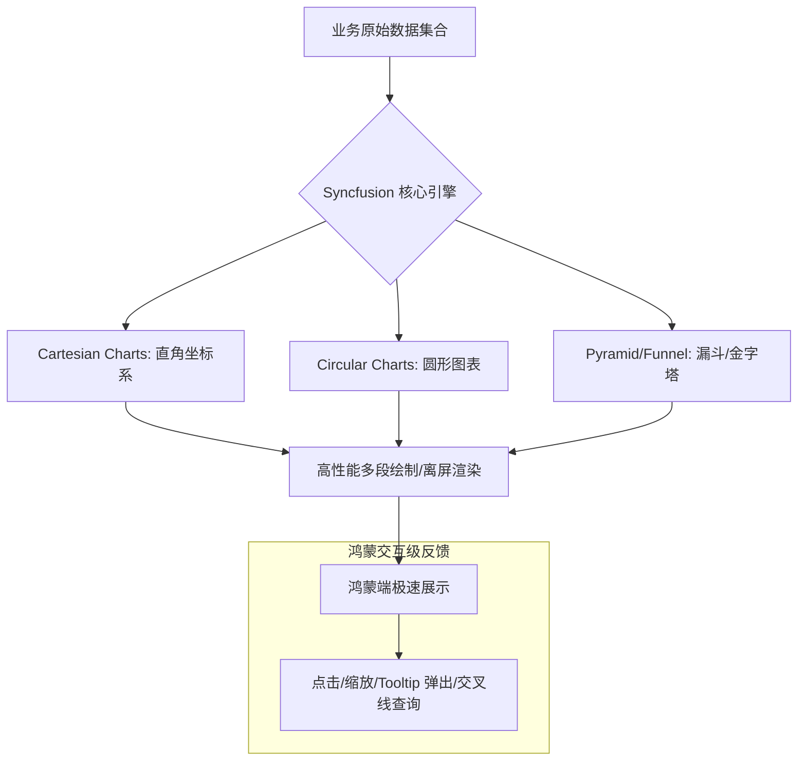

欢迎加入开源鸿蒙跨平台社区：[https://openharmonycrossplatform.csdn.net](https://openharmonycrossplatform.csdn.net)。

# Flutter for OpenHarmony：syncfusion_flutter_charts — 数字化视觉引擎（数据可视化底座）

## 前言

在华为鸿蒙（OpenHarmony）生态的企业级办公、金融理财及运动健康应用的开发中，如何将海量的、枯燥的数据转化为直观、生动且具备高度交互性的图表，是提升用户体验的分水岭。简单的饼图或折线图已无法满足现代生产力工具对“数据洞察”的要求：我们需要毫秒级的海量点渲染、丝滑的手势缩放以及符合商业审美的高质量预设。

`syncfusion_flutter_charts` 是一款由全球知名控件开发商 Syncfusion 打造的顶级图表引擎。它支持超过 30 种以上的图表类型（包括线图、柱图、瀑布图、雷达图、极坐标图等），并针对移动端性能进行了极致优化。在鸿蒙跨平台应用的开发中，它凭借卓越的渲染性能、丰富的定制化能力以及完善的交互反馈机制，成为了构建可视化看板、财务报表及健康趋势图的首选。

## 一、原理展示 / 概念介绍

### 1.1 基础概念

本库实现了数据模型到 Canvas 高性能绘图的高效转换。



### 1.2 核心要点解析

- **极致性能（Turbo-Performance）**：通过底层路径优化（Path Nesting）和选区渲染技术，即便在鸿蒙端实时展示数十万个数据点，依然能保持流畅的交互响应。
- **声明式配置**：通过 `SfCartesianChart` 等组件，以完全原生的 Flutter 方式声明图表系列（Series）、坐标轴（Axis）和交互行为。
- **金融级交互**：内置了缩放（Zooming）、平移（Panning）、缩略图轨道（Trackball）以及选择（Selection）等高级交互能力。

## 二、核心 API / 组件详解

### 2.1 依赖引入

在鸿蒙工程的 `pubspec.yaml` 中添加以下分工明确的依赖：

```yaml
dependencies:
  syncfusion_flutter_charts: ^21.1.0 # 建议参考最新商业版本
```

### 2.2 构建高性能折线图

展示鸿蒙手机 24 小时内的电量变化趋势：

```dart
import 'package:syncfusion_flutter_charts/charts.dart';

// ✅ 推荐做法：使用 SfCartesianChart 容纳直角坐标系图表
SfCartesianChart(
  title: ChartTitle(text: '鸿蒙电量分析 (单位: mAh)'),
  primaryXAxis: CategoryAxis(), // 💡 技巧：使用轴对应的时间线
  series: <ChartSeries<PowerData, String>>[
    LineSeries<PowerData, String>(
      dataSource: chartData,
      xValueMapper: (PowerData data, _) => data.time,
      yValueMapper: (PowerData data, _) => data.value,
      // 启用交互式 Tooltip
      enableTooltip: true, 
    )
  ],
)
```

### 2.3 动态数据实时更新

💡 **技巧**：利用 `UpdateDataSource` 方法，配合鸿蒙传感器的数据流实现实时的动态图表刷新。

## 三、场景示例

### 3.1 场景一：鸿蒙“运动健康”App 的步数分布

通过 `ColumnSeries`（柱状图）展示用户一周内的活跃度。利用 `Gradient` 背景和 `DataLabel`，让数据更具动感。

### 3.2 场景二：专业级“虚拟币”交易 K 线图

利用 `CandleSeries` 结合 `Trackball` 功能，提供精准的开盘、收盘及其最高最低点的细节查询，对焦专业投研用户。

## 四、OpenHarmony 平台适配挑战

### 4.1 高分辨率屏幕下的抗锯齿与性能平衡

鸿蒙平板（MatePad 系列）拥有极高的像素密度。在高频刷新图表时，过度的抗锯齿（Anti-aliasing）可能会带来额外的功耗。

✅ **适配策略建议**：
1. **控制点数密度**：对于非关键的长周期图表，建议在鸿蒙端进行数据降采样（Downsampling），确保视野内点数维持在 500-1000 以内。
2. **利用硬件加速**：确保图表组件运行在鸿蒙的高性能渲染管线下。

✅ **推荐方案**：
由于 Syncfusion 内部使用了大量的 `Canvas` 绘制，在鸿蒙端应开启 `Skia` 或 `Impeller` 支持，以获得最佳的矢量线条细腻度。

## 五、综合实战示例代码

以下是一个演示如何在鸿蒙端实现的“极简资源监控看板”实战：

```dart
import 'package:flutter/material.dart';
import 'package:syncfusion_flutter_charts/charts.dart';

class ChartsLabPage extends StatefulWidget {
  const ChartsLabPage({super.key});

  @override
  State<ChartsLabPage> createState() => _ChartsLabPageState();
}

class _ChartsLabPageState extends State<ChartsLabPage> {
  // 模拟鸿蒙系统 CPU 负载数据
  final List<_ChartData> _data = [
    _ChartData('09:00', 35), _ChartData('10:00', 28),
    _ChartData('11:00', 64), _ChartData('12:00', 32),
    _ChartData('13:00', 40),
  ];

  @override
  Widget build(BuildContext context) {
    return Scaffold(
      appBar: AppBar(title: const Text('Syncfusion 专业图表实验室')),
      body: Padding(
        padding: const EdgeInsets.all(16),
        child: Column(
          children: [
            Expanded(
              // 💡 实战技巧：构建具备 Tooltip 和动画效果的图表
              child: SfCartesianChart(
                primaryXAxis: CategoryAxis(),
                title: ChartTitle(text: '鸿蒙端侧 CPU 实时负载监测 (%)'),
                legend: Legend(isVisible: true),
                tooltipBehavior: TooltipBehavior(enable: true),
                series: <ChartSeries<_ChartData, String>>[
                  SplineAreaSeries<_ChartData, String>(
                    dataSource: _data,
                    xValueMapper: (_ChartData data, _) => data.x,
                    yValueMapper: (_ChartData data, _) => data.y,
                    name: 'CPU 负载',
                    color: Colors.blue.withOpacity(0.3),
                    borderColor: Colors.blue,
                    borderWidth: 2,
                    dataLabelSettings: const DataLabelSettings(isVisible: true),
                  )
                ],
              ),
            ),
            const SizedBox(height: 20),
            const Text("💡 提示：在图表上长按或平移可查看详细数值"),
          ],
        ),
      ),
    );
  }
}

class _ChartData {
  _ChartData(this.x, this.y);
  final String x;
  final double y;
}
```

## 六、总结

`syncfusion_flutter_charts` 是 OpenHarmony 高端数据展示应用的“定海神针”。它打破了移动端图表“只能看不中用”的局限，为开发者提供了具备工业级稳定性、丰富定制化以及极致流畅度的可视化支点。

✅ **核心建议**：
1. **合理配置交互**：不是所有图表都需要缩放。在手机端小屏幕上，合理的 Tooltip 提示往往比频繁的手势缩放更有价值。
2. **主题自适应**：利用鸿蒙系统的亮暗色切换。Syncfusion 支持自动应用 `ThemeData` 的语义色彩，让图表在不同风格下都能保持良好的对比度。
3. **分层绘制**：对于背景复杂的图表，建议利用 `annotations` 将文字或辅助线层分离开，提高渲染效率。

📦 **完整代码已上传至 AtomGit**：[open-harmony-example/syncfusion_charts](https://atomgit.com/dragonbady/open-harmony-example/tree/main/examples/syncfusion_charts)

🌐 **欢迎加入开源鸿蒙跨平台社区**：[开源鸿蒙跨平台开发者社区](https://openharmonycrossplatform.csdn.net)
