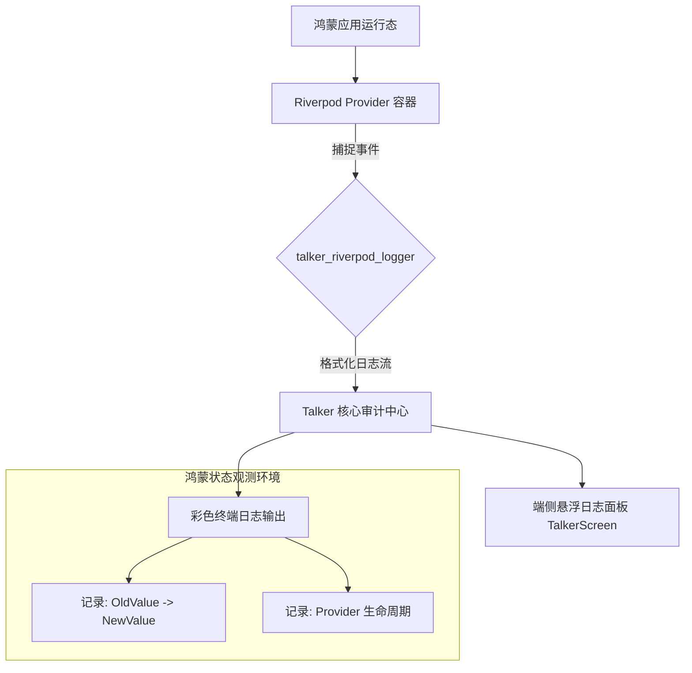

欢迎加入开源鸿蒙跨平台社区：[https://openharmonycrossplatform.csdn.net](https://openharmonycrossplatform.csdn.net)。

# Flutter for OpenHarmony：talker_riverpod_logger — 状态的监控探针（日志审计底座）

## 前言

在华为鸿蒙（OpenHarmony）生态的复杂业务应用开发中，使用 Riverpod 进行状态管理能带来极佳的架构稳定性。然而，随着应用规模扩大，状态的变动链路会变得错综复杂：一个 UserProvider 的更新可能是由 AuthProvider 引起的，也可能是由一个异步网络请求的回调触发的。如果仅依赖普通的 `print` 调试，很难追踪到状态变动的“前因后果”。

`talker_riverpod_logger` 是一款专为 Riverpod 设计的、集成于强大 Talker 日志系统的观测件。它通过 Riverpod 的 `ProviderObserver` 机制，自动捕捉每一个 Provider 的初始化、更新、错误以及销毁事件，并以极具视觉冲击力、色彩分明的方式在鸿蒙控制台进行展示。在构建鸿蒙平台的专业金融应用（状态变动审计）、重负载社交 App（异步流追踪）或是在进行复杂 Bug 排查时，它是实现“状态透明化”的核心诊断利器。

## 一、原理展示 / 概念介绍

### 1.1 基础概念

本库实现了状态管理引擎到专业日志系统的无缝对接。



### 1.2 核心要点解析

- **自动差异比对（Diffing）**：日志会自动显示 Provider 更新前后的值，帮助开发者瞬间定位是非法的状态覆盖还是正常的业务流转。
- **自定义过滤机制**：支持通过配置，仅观察那些关键的、高频变动的核心 Provider，避免日志被无用信息淹没。
- **集成 Talker 生态**：可以将状态日志与网络请求、崩溃日志统一聚合在鸿蒙端的 Talker 仪表盘上。

## 二、核心 API / 组件详解

### 2.1 依赖引入

在鸿蒙工程的 `pubspec.yaml` 中添加以下分工明确的依赖：

```yaml
dependencies:
  riverpod: ^2.0.0
  talker_flutter: ^4.0.0
  talker_riverpod_logger: ^4.0.0 # 💡 状态日志观测件
```

### 2.2 注入观测器

在鸿蒙应用的入口层配置全局监听：

```dart
import 'package:flutter_riverpod/flutter_riverpod.dart';
import 'package:talker_flutter/talker_flutter.dart';
import 'package:talker_riverpod_logger/talker_riverpod_logger.dart';

void main() {
  // 1. 初始化 Talker 引擎
  final talker = TalkerFlutter.init();

  runApp(
    ProviderScope(
      observers: [
        // ✅ 推荐做法：在根作用域注入 Logger 观测器
        TalkerRiverpodObserver(
          talker: talker,
          settings: TalkerRiverpodLoggerSettings(
            printProviderAdded: true,
            printProviderUpdated: true, // 💡 技巧：开启更新详情打印
          ),
        ),
      ],
      child: const HarmonyApp(),
    ),
  );
}
```

### 2.3 自定义日志展示

💡 **技巧**：在鸿蒙端区分不同业务模块的日志颜色。

## 三、场景示例

### 3.1 场景一：鸿蒙端“支付流程”的实时追踪

在涉及金钱、订单的状态流转中，利用该 Logger 监控 `OrderProvider`。一旦状态由于异常逻辑突变为 `Error`，控制台会自动弹出带有红色标记的详细堆栈和前序状态值。

### 3.2 场景二：解决“过度重绘”优化

通过观察日志中 Provider 的更新频率。如果发现一个非交互性质的 Provider 正在以每秒数次的速度频繁刷新，即可判定此处存在无效的状态依赖，从而在鸿蒙端实现性能调优。

## 四、OpenHarmony 平台适配挑战

### 4.1 日志输出对性能的回踩

过多的彩色日志输出（尤其是包含巨大 JSON 内容时）会占用鸿蒙设备的 IO 带宽及 CPU。

✅ **适配策略建议**：
1. **环境条件编译**：建议仅在 `kDebugMode`（调试模式）下开启 `TalkerRiverpodObserver`，并在正式发布的鸿蒙版本中彻底移除，保护华为麒麟芯片的运行效能。
2. **文本截断处理**：针对超大型的状态对象（如万行的省市区列表），在 `TalkerRiverpodLoggerSettings` 中配置最大字符数限制，防止由于单条日志过大导致的鸿蒙日志缓冲区溢出。

## 五、综合实战示例代码

以下是一个演示如何在鸿蒙端实现的“可视化状态监控中心”：

```dart
import 'package:flutter/material.dart';
import 'package:flutter_riverpod/flutter_riverpod.dart';
import 'package:talker_flutter/talker_flutter.dart';

// 定义一个示例 Provider
final harmonyCounterProvider = StateProvider<int>((ref) => 0);

class RiverpodLogLabPage extends ConsumerWidget {
  final Talker talker;
  const RiverpodLogLabPage({super.key, required this.talker});

  @override
  Widget build(BuildContext context, WidgetRef ref) {
    final count = ref.watch(harmonyCounterProvider);

    return Scaffold(
      appBar: AppBar(title: const Text('Riverpod 状态监控实验室')),
      body: Center(
        child: Column(
          mainAxisAlignment: MainAxisAlignment.center,
          children: [
            const Icon(Icons.troubleshoot, size: 80, color: Colors.green),
            const SizedBox(height: 30),
            Text('当前鸿蒙端状态量: $count', style: const TextStyle(fontSize: 24)),
            const SizedBox(height: 50),
            ElevatedButton(
              onPressed: () => ref.read(harmonyCounterProvider.notifier).state++,
              child: const Text('点击更新 Provider 状态'),
            ),
            const SizedBox(height: 20),
            ElevatedButton(
              style: ElevatedButton.styleFrom(backgroundColor: Colors.black12),
              onPressed: () => Navigator.of(context).push(
                MaterialPageRoute(builder: (c) => TalkerScreen(talker: talker)),
              ),
              child: const Text('打开鸿蒙端侧实时日志看板'),
            ),
          ],
        ),
      ),
    );
  }
}
```

## 六、总结

`talker_riverpod_logger` 为 OpenHarmony 的状态管理层披上了一层“透明的外壳”。它将原本隐藏在内存深处的数据流变为了可见、可查、可回溯的审计轨迹，是构建高品质、高可维护性鸿蒙跨平台应用的必备调试底座。

✅ **核心建议**：
1. **配合 `talker_dio_logger`**：将网络请求日志与状态日志结合，你能一眼看出是哪个 API 的响应导致了界面的不正常刷新。
2. **利用 `filter`**：对于那些自动刷新的动画或计时器 Provider，务必进行日志过滤，保持控制台的清爽度。
3. **日志本地存储**：结合 Talker 的本地存储功能，可以在鸿蒙 Beta 测试时让用户一键导出完整的状态变动日志，极大降低线上 Bug 的复现成本。

📦 **完整代码已上传至 AtomGit**：[open-harmony-example/riverpod_log](https://atomgit.com/dragonbady/open-harmony-example/tree/main/examples/riverpod_log)

🌐 **欢迎加入开源鸿蒙跨平台社区**：[开源鸿蒙跨平台开发者社区](https://openharmonycrossplatform.csdn.net)
