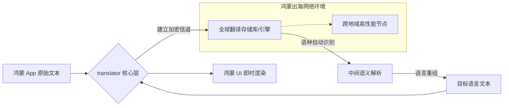

欢迎加入开源鸿蒙跨平台社区：[https://openharmonycrossplatform.csdn.net](https://openharmonycrossplatform.csdn.net)。

# Flutter for OpenHarmony：translator — 沟通无国界（多语言转换底座）

## 前言

在华为鸿蒙（OpenHarmony）应用出海以及服务全球化（Glocalization）的浪潮中，应用不仅需要静态的界面翻译，更需要具备处理动态用户内容（如评论、聊天、资讯）的“即时翻译”能力。如果开发者手动集成各大厂商复杂的 API 协议，往往会因为认证流程繁琐、SDK 体积大而导致开发效率低下。

`translator` 是一款极其轻量、专注且优雅的 Dart 翻译库。它通过极简的异步接口，无缝接入了包括 Google Translate 在内的全球顶尖翻译引擎。在鸿蒙跨平台应用的开发中，它能让你以一行代码的代价，实现文本的自动语种识别与目标语言转换。在构建鸿蒙平台的跨国社交应用、旅游助手或全球新闻聚合器时，它是打破语言隔阂、提升应用包容性的核心技术插件。

## 一、原理展示 / 概念介绍

### 1.1 基础概念

本库实现了端侧文本到云端翻译大脑的高速传递。



### 1.2 核心要点解析

- **自动语种识别（Auto-detection）**：无需指定源语言，引擎能自动判断输入是中文、德语还是阿拉伯语。
- **丰富的语言支持**：支持超过 100 种以上的全球主流及小众语言，助力鸿蒙应用覆盖全球 99% 的地区。
- **纯 Dart 异步调用**：通过 `Future` 机制处理翻译过程，完美配合鸿蒙端的异步处理逻辑。

## 二、核心 API / 组件详解

### 2.1 依赖引入

在鸿蒙工程的 `pubspec.yaml` 中添加以下依赖：

```yaml
dependencies:
  translator: ^0.1.0 # 建议参考最新稳定版本
```

### 2.2 基础翻译调用

将一段中文动态即时转换为英文：

```dart
import 'package:translator/translator.dart';

void translateHello() async {
  final translator = GoogleTranslator();
  
  // ✅ 推荐做法：通过 translate 方法直接转换
  final Translation translation = await translator.translate(
    "鸿蒙系统让开发更简单", 
    to: 'en', // 💡 技巧：指定目标语言代码
  );
  
  print('翻译结果: ${translation.text}'); // Output: HarmonyOS makes development easier
}
```

### 2.3 获取源语言信息

💡 **技巧**：翻译结果包含了源语言的自动检测结论。

## 三、场景示例

### 3.1 场景一：鸿蒙端“全语通”聊天应用

在大规模出海的社交 App 中，收到外国友人的消息后，长按消息利用 `translator` 实时在消息下方显示翻译结果，极大降低沟通门槛。

### 3.2 场景二：跨境电商的商品详情页

当货物详情只有英文介绍时，通过在鸿蒙端实时调用翻译接口，为国内用户提供顺滑的中文阅读体验。

## 四、OpenHarmony 平台适配挑战

### 4.1 网络环境与域名可达性

由于翻译引擎（如 Google Translate）的官方域名在某些特定的鸿蒙网络环境下可能不稳定。

✅ **适配策略建议**：
1. **重试机制封装**：在调用翻译接口时，务必增加 `Timeout` 处理，并在弱网下提供“翻译失败，请点击重试”的 UI 操作，保护鸿蒙应用的响应式体验。
2. **流量控制**：机器翻译通常按调用次数计费（或有限额）。在鸿蒙端实现实时输入实时翻译时，务必配合 `debounce`（防抖）技术，避免用户每输入一个字母都发起网络请求，不仅节省流量及费用，还能降低鸿蒙设备的 CPU 功耗。

## 五、综合实战示例代码

以下是一个演示如何在鸿蒙端实现的“极简智能翻译器”组件：

```dart
import 'package:flutter/material.dart';
import 'package:translator/translator.dart';

class TranslatorLabPage extends StatefulWidget {
  const TranslatorLabPage({super.key});

  @override
  State<TranslatorLabPage> createState() => _TranslatorLabPageState();
}

class _TranslatorLabPageState extends State<TranslatorLabPage> {
  final _translator = GoogleTranslator();
  String _translatedText = "翻译结果将在此展示";
  final TextEditingController _controller = TextEditingController();

  void _doTranslate() async {
    if (_controller.text.isEmpty) return;

    setState(() => _translatedText = "正在穿越语言边界...");
    
    try {
      // 💡 实战技巧：转换文本到目标语言
      final res = await _translator.translate(_controller.text, to: 'en');
      setState(() {
        _translatedText = "✅ 翻译完成 (源语言: ${res.sourceLanguage}):\n${res.text}";
      });
    } catch (e) {
      setState(() => _translatedText = "❌ 翻译失败，请检查鸿蒙网络。");
    }
  }

  @override
  Widget build(BuildContext context) {
    return Scaffold(
      appBar: AppBar(title: const Text('多语言智能翻译实验室')),
      body: Padding(
        padding: const EdgeInsets.all(24),
        child: Column(
          children: [
            const Icon(Icons.g_translate, size: 80, color: Colors.blueAccent),
            const SizedBox(height: 30),
            TextField(
              controller: _controller,
              decoration: const InputDecoration(labelText: '输入要翻译的华为内容', border: OutlineInputBorder()),
            ),
            const SizedBox(height: 30),
            Container(
              width: double.infinity,
              padding: const EdgeInsets.all(16),
              decoration: BoxDecoration(color: Colors.blue[50], borderRadius: BorderRadius.circular(12)),
              child: Text(_translatedText, style: const TextStyle(fontSize: 16)),
            ),
            const Spacer(),
            ElevatedButton.icon(
              onPressed: _doTranslate,
              icon: const Icon(Icons.send),
              label: const Text('执行鸿蒙端云端翻译'),
              style: ElevatedButton.styleFrom(minimumSize: const Size.fromHeight(50)),
            ),
          ],
        ),
      ),
    );
  }
}
```

## 六、总结

`translator` 库虽然体积轻便，但却是鸿蒙应用全球化应用版图中的重要一环。它将复杂的 NLP 转换任务简化为一次异步调用，让每一位鸿蒙开发者都能轻松构建出具备“全球视野”的杰出应用。

✅ **核心建议**：
1. **缓存策略**：对于高频重复的短句（如“你好”、“订单已送达”），建议在鸿蒙端配合 `shared_preferences` 进行本地缓存，减少网络开销。
2. **UI 礼仪**：在使用机器翻译结果时，建议标注“由机器翻译驱动”，以提高用户对可能出现的语境偏差的包容度。
3. **安全审计**：在处理用户翻译请求前，建议在鸿蒙端进行敏感词过滤，确保翻译行为符合当地法律法规。

📦 **完整代码已上传至 AtomGit**：[open-harmony-example/translator](https://atomgit.com/dragonbady/open-harmony-example/tree/main/examples/translator)

🌐 **欢迎加入开源鸿蒙跨平台社区**：[开源鸿蒙跨平台开发者社区](https://openharmonycrossplatform.csdn.net)
