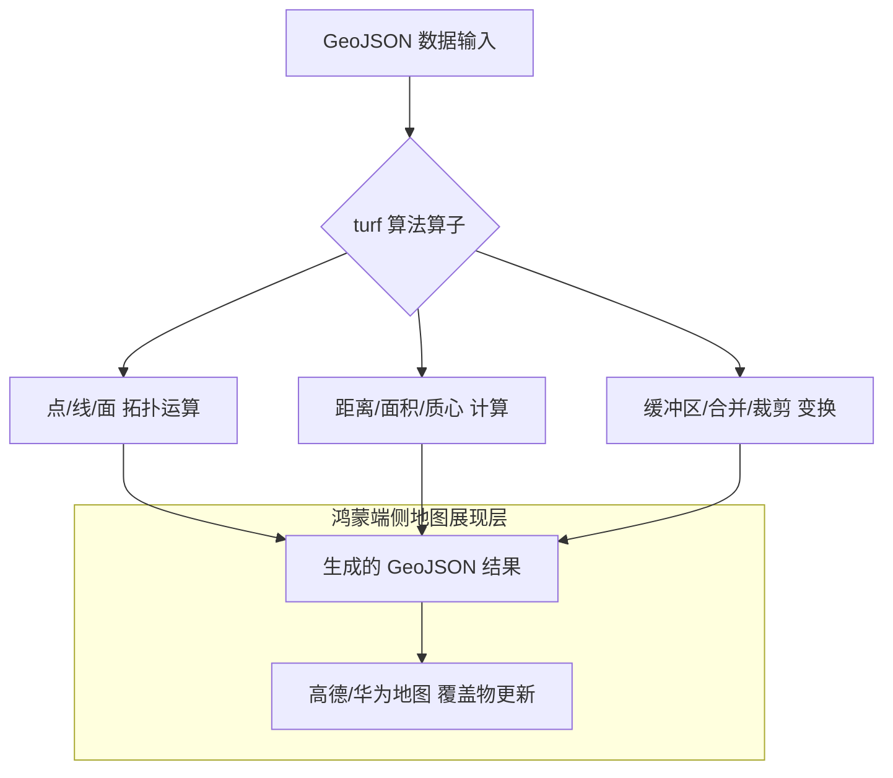

欢迎加入开源鸿蒙跨平台社区：[https://openharmonycrossplatform.csdn.net](https://openharmonycrossplatform.csdn.net)。

# Flutter for OpenHarmony：turf — 地理引擎之翼（GIS 分析底座）

## 前言

在华为鸿蒙（OpenHarmony）生态的智慧城市、外卖配送、地图导航以及地理围栏（Geofencing）等应用的开发中，仅仅显示地图是不够的。开发者需要具备在设备端实时计算“两点间距离”、“判断店面是否在配送区”、“合并两个复杂地块”以及“寻找多点中心位置”的能力。

`turf` 是一款极其成熟的、遵循 GeoJSON 标准的高性能地理空间运算库。其接口设计完全沿袭了著名的 JS 版 Turf.js，但在 Dart 平台下进行了极致的性能优化。在构建鸿蒙平台的专业 LBS（基于位置的服务）应用时，它是你进行复杂、离线地理空间分析的核心算法底座。

## 一、原理展示 / 概念介绍

### 1.1 基础概念

`turf` 实现了纯数学层面的各类空间位置计算。



### 1.2 核心要点解析

- **标准化结构**：所有操作均基于 `Feature`, `Point`, `Polygon` 等标准 GeoJSON 对象，极易与后端地图开放平台（如华为 Petal Maps API）无缝对接。
- **纯 Dart 实现**：不依赖任何原生底层 GIS 库，这意味着在任何鸿蒙设备架构上都能获得一致的计算精度。
- **丰富的算子**：涵盖了从基础的空间谓词（Within/Intersects）到复杂的空间变换（Transformation）近百种函数。

## 二、核心 API / 组件详解

### 2.1 依赖引入

在鸿蒙工程的 `pubspec.yaml` 中添加以下分工明确的依赖：

```yaml
dependencies:
  turf: ^0.1.0 # 请参考最新版本
```

### 2.2 计算两点间的“球面距离”

获取鸿蒙设备当前坐标与目的地之间的精准大圆距离：

```dart
import 'package:turf/turf.dart';

void calculateGap() {
  final from = Point(coordinates: Position(116.397, 39.908)); // 北京某点
  final to = Point(coordinates: Position(121.473, 31.230));   // 上海某点
  
  // ✅ 推荐做法：通过 distance 计算，单位支持千米、米等
  final km = distance(from, to, Unit.kilometers);
  print('空间直线距离: ${km.toStringAsFixed(2)} KM');
}
```

### 2.3 判断点是否在多边形内（地理围栏核心）

💡 **技巧**：这是实现鸿蒙应用“进入特定区域提醒”的基础算法。

```dart
bool checkInFence(Position userPos, Polygon fence) {
  // 💡 技巧：利用 booleanPointInPolygon 实现高效率判断
  return booleanPointInPolygon(Point(coordinates: userPos), fence);
}
```

## 三、场景示例

### 3.1 场景一：鸿蒙外卖配送区域自动检测

利用 `booleanWithin` 算子，在鸿蒙端实时判定用户的当前收货地址是否在商家的自定义配送多边形范围内。

### 3.2 场景二：智慧景区的“热力聚合”

当鸿蒙设备上传大量离散的人流坐标点时，利用 `centroid`（质心）或 `envelope`（包络面）算法，快速绘制景区热力中心。

## 四、OpenHarmony 平台适配挑战

### 4.1 大规模多边形运算的性能平衡

计算包含数千个顶点的复杂多边形合并（Union）时，运算量巨大。

✅ **适配策略建议**：
1. **异步计算流**：对于复杂的 GIS 任务，务必在鸿蒙端通过 `compute` 开启多核并发处理，防止地图手势操作时产生卡顿。
2. **座标系转换（GCJ-02 v.s. WGS-84）**：中国境内地图通常采用火星坐标系（GCJ-02），而 `turf` 库基于标准的 WGS-84。在计算前，请确保鸿蒙端获取的原始坐标已完成偏移纠正。

## 五、综合实战示例代码

以下是一个模拟鸿蒙手机“地理围栏监控器”的实战组件：

```dart
import 'package:flutter/material.dart';
import 'package:turf/turf.dart';

class TurfLabPage extends StatefulWidget {
  const TurfLabPage({super.key});

  @override
  State<TurfLabPage> createState() => _TurfLabPageState();
}

class _TurfLabPageState extends State<TurfLabPage> {
  // 定义一个模拟的鸿蒙生态园区围栏（多边形）
  final Polygon _harmonyZone = Polygon(coordinates: [
    [
      Position(114.05, 22.54),
      Position(114.07, 22.54),
      Position(114.07, 22.56),
      Position(114.05, 22.56),
      Position(114.05, 22.54), // 需要闭合
    ]
  ]);

  String _result = "正在检测位置...";

  void _testLocation(double lng, double lat) {
    // 💡 实战技巧：精确的拓扑关系判断
    final isInside = booleanPointInPolygon(
      Point(coordinates: Position(lng, lat)),
      _harmonyZone,
    );

    setState(() {
      _result = isInside 
          ? "🎉 欢迎！您已进入鸿蒙高度安全园区" 
          : "⚠️ 警告：您当前处于园区警戒线外";
    });
  }

  @override
  Widget build(BuildContext context) {
    return Scaffold(
      appBar: AppBar(title: const Text('Turf 地理空间实验室')),
      body: Center(
        child: Column(
          mainAxisAlignment: MainAxisAlignment.center,
          children: [
            const Icon(Icons.location_searching, size: 80, color: Colors.green),
            const SizedBox(height: 20),
            Text(_result, style: const TextStyle(fontWeight: FontWeight.bold, fontSize: 18)),
            const SizedBox(height: 40),
            ElevatedButton(
              onPressed: () => _testLocation(114.06, 22.55), 
              child: const Text('模拟在园区内坐标测试'),
            ),
            const SizedBox(height: 10),
            OutlinedButton(
              onPressed: () => _testLocation(114.08, 22.57), 
              child: const Text('模拟在园区外坐标测试'),
            ),
          ],
        ),
      ),
    );
  }
}
```

## 六、总结

`turf` 让 OpenHarmony 应用具备了“理解”空间地理关系的能力。它不仅是地图组件的补充，更是智慧出行应用逻辑的核心大脑。

✅ **核心建议**：
1. **精简坐标精度**：GeoJSON 坐标建议保留到小数点后 6 位，这能节省内存并提高 `turf` 的计算速度。
2. **注意多边形闭合**：在创建 `Polygon` 时，首尾坐标点必须完全一致，否则 `turf` 的部分算子会抛出异常。
3. **结合持久化存储**：复杂的业务围栏数据建议保存为本地 `.geojson` 文件，按需加载以降低鸿蒙 App 的启动时延。

📦 **完整代码已上传至 AtomGit**：[open-harmony-example/turf](https://atomgit.com/dragonbady/open-harmony-example/tree/main/examples/turf)

🌐 **欢迎加入开源鸿蒙跨平台社区**：[开源鸿蒙跨平台开发者社区](https://openharmonycrossplatform.csdn.net)
