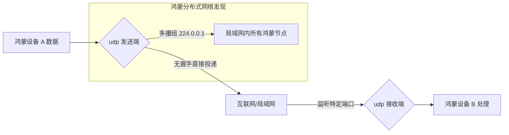

欢迎加入开源鸿蒙跨平台社区：[https://openharmonycrossplatform.csdn.net](https://openharmonycrossplatform.csdn.net)。

# Flutter for OpenHarmony：udp — 极速通讯引擎（底层连接底座）

## 前言

在华为鸿蒙（OpenHarmony）生态的分布式交互、物联网（IoT）控制以及实时游戏竞技场景中，对网络传输的“低延迟”和“轻量化”要求极高。相比于 TCP 繁琐的握手确认机制，UDP（User Datagram Protocol）以其不可靠但极致高效的非连接特性，成为了局域网设备发现、音视频原始流传输以及传感器数据对焦的首选。

`udp` 是一款专为 Dart 设计的轻量级 UDP 封装库。它通过极简的 API 屏障，让开发者能够轻松实现数据包的发送、监听、多播（Multicast）以及广播（Broadcast）。在构建鸿蒙平台的智能家居中控、分布式遥控器或多人在线实时对战应用时，它是你打通设备间“第一公里”快速通讯的核心利器。

## 一、原理展示 / 概念介绍

### 1.1 基础概念

UDP 实现了数据包的快速“投递”，不关注状态。



### 1.2 核心要点解析

- **非连接性**：发送端无需确认接收端是否在线，极大地降低了协议栈的内存占有和计算损耗。
- **多播与广播**：支持将数据一次性分发给鸿蒙局域网内的多个设备，是实现“分布式互联”发现协议的基础。
- **纯 Dart 封装**：高度兼容，无需在鸿蒙工程中手动编写 NAPI C++ Socket 代码，大幅提升跨平台开发效率。

## 二、核心 API / 组件详解

### 2.1 依赖引入

在鸿蒙工程的 `pubspec.yaml` 中添加：

```yaml
dependencies:
  udp: ^4.0.0 # 请参考最新版本
```

### 2.2 启动 UDP 监听

在鸿蒙端监听局域网特定的发现信号：

```dart
import 'package:udp/udp.dart';

void startListening() async {
  // ✅ 推荐做法：绑定本地固定端口进行监听
  final receiver = await UDP.bind(Endpoint.any(port: Port(12345)));
  
  // 💡 技巧：利用 Stream 进行响应式处理
  receiver.asStream().listen((datagram) {
    if (datagram != null) {
      final message = String.fromCharCodes(datagram.data);
      print('收到来自鸿蒙局域网的消息: $message');
    }
  });
}
```

### 2.3 发送广播包

```dart
void broadcastHarmonySignal() async {
  final sender = await UDP.bind(Endpoint.any());
  // 💡 技巧：发送到广播地址
  await sender.send(
    "OH_DISCOVERY_PAYLOAD".codeUnits,
    Endpoint.broadcast(port: Port(12345)),
  );
  sender.close();
}
```

## 三、场景示例

### 3.1 场景一：鸿蒙多端协同的设备发现

当鸿蒙手机进入客厅局域网，通过发送 UDP 广播报文，快速寻找并配对周围的鸿蒙智能电视或音响。

### 3.2 场景二：极速游戏操控同步

在鸿蒙平板上操作虚拟摇杆，利用 UDP 将位置坐标毫秒级同步给游戏主机，实现零感延迟的控制体验。

## 四、OpenHarmony 平台适配挑战

### 4.1 网络权限与多播管控

鸿蒙系统的安全策略对局域网扫描和多播权限有严格限制。

✅ **适配策略建议**：
1. **申请核心权限**：在 `module.json5` 中确保已申请 `ohos.permission.INTERNET`。如果涉及局域网通讯，需关注 `ohos.permission.GET_WLAN_INFO`（部分版本需要）。
2. **多播锁定（Multicast Lock）**：在部分移动设备休眠或鸿蒙低功耗模式下，系统可能会关闭多播接收功能。

✅ **推荐方案**：
在进行 UDP 大量监听前，可以结合鸿蒙原生插件层调起 `setWifiMulticastEnabled` 类似的系统底层接口，确保数据包不被过滤。

## 五、综合实战示例代码

以下是一个演示如何在鸿蒙端实现的“分布式简易聊天/控制台”：

```dart
import 'package:flutter/material.dart';
import 'package:udp/udp.dart';

class UdpLabPage extends StatefulWidget {
  const UdpLabPage({super.key});

  @override
  State<UdpLabPage> createState() => _UdpLabPageState();
}

class _UdpLabPageState extends State<UdpLabPage> {
  String _logs = "等待接收数据...";
  UDP? _receiver;

  @override
  void initState() {
    super.initState();
    _initReceiver();
  }

  void _initReceiver() async {
    // 💡 实战技巧：绑定监听
    _receiver = await UDP.bind(Endpoint.any(port: const Port(6666)));
    _receiver!.asStream().listen((d) {
      if (d != null) {
        setState(() => _logs += "\n📩 收取: ${String.fromCharCodes(d.data)}");
      }
    });
  }

  void _sendPing() async {
    final sender = await UDP.bind(Endpoint.any());
    // 模拟向局域网广播一个状态码
    await sender.send(
      "PING_FROM_OH_FLUTTER".codeUnits,
      Endpoint.broadcast(port: const Port(6666)),
    );
    sender.close();
  }

  @override
  void dispose() {
    _receiver?.close();
    super.dispose();
  }

  @override
  Widget build(BuildContext context) {
    return Scaffold(
      appBar: AppBar(title: const Text('UDP 局域网通讯实验室')),
      body: Column(
        children: [
          Expanded(
            child: SingleChildScrollView(
              padding: const EdgeInsets.all(16),
              child: Text(_logs, style: const TextStyle(fontFamily: 'monospace')),
            ),
          ),
          Padding(
            padding: const EdgeInsets.all(20),
            child: ElevatedButton.icon(
              onPressed: _sendPing,
              icon: const Icon(Icons.wifi_tethering),
              label: const Text('向鸿蒙局域网发送心跳广播'),
              style: ElevatedButton.styleFrom(minimumSize: const Size.fromHeight(50)),
            ),
          )
        ],
      ),
    );
  }
}
```

## 六、总结

在 OpenHarmony 这个万物智联的操作系统中，`udp` 是连接各孤立节点的“快速生命线”。虽然它不担保到达，但在速度和灵活性上的巨大优势，使其成为构建分布式体验、LBS 邻近通讯的最佳选择。

✅ **核心建议**：
1. **建立应用层重传**：对于关键指令（如开关灯），建议在 UDP 的基础上实现简单的 Ack 确认机制。
2. **包大小控制**：UDP 单包建议不要超过 1KB（防止 MTU 分段导致严重丢包），大数据传输应考虑切换为流式协议或分包。
3. **安全加密**：由于 UDP 是明文广播的，传输敏感信息时务必配合 `binarize` 进行二进制加密。

📦 **完整代码已上传至 AtomGit**：[open-harmony-example/udp](https://atomgit.com/dragonbady/open-harmony-example/tree/main/examples/udp)

🌐 **欢迎加入开源鸿蒙跨平台社区**：[开源鸿蒙跨平台开发者社区](https://openharmonycrossplatform.csdn.net)
